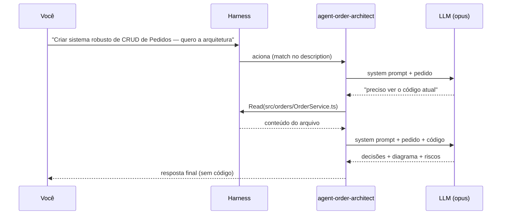

# Capítulo 03 — O Agent

> Um agent é um LLM rodando dentro de um harness, configurado por um arquivo `.md` para fazer **um trabalho específico, bem**.

**TL;DR:** Um agent é um arquivo `.md` que especializa o LLM+harness para um trabalho — prompt, modelo e ferramentas. É software versionável, não prompt descartável.

Este é o capítulo-âncora. Tudo que vem antes (LLM, harness) existe para chegar aqui; tudo que vem depois (subagent, context, skill, plugin, MCP, CLI) existe para deixar o agent mais capaz. Se você só ler um capítulo, leia este.

## Primeiro, o agent em ação

Você está no terminal, no repositório, e digita:

```text
> Preciso criar um sistema robusto de CRUD de Pedidos (Orders). Antes de escrever código,
  quero a arquitetura: transições de estado, concorrência e o que decidir primeiro.
```

Em vez de o modelo genérico começar a cuspir código, **um especialista** assume a tarefa. Ele lê o código existente, identifica a modelagem de entidades atual e responde algo como:

```text
[agent-order-architect]

Decisões antes de codar:
1. Concorrência: Atualizações simultâneas de status do Pedido (ex.: transição para `paid`
   e `cancelled` ocorrendo no mesmo milissegundo) podem causar race conditions.
   → Decisão: Usar optimistic locking com uma coluna `version` na tabela de pedidos.
2. Integridade de Estado: Transições ilegais como pular de `draft` direto para `paid` ou
   pagar um pedido já cancelado quebram o fluxo de negócios.
   → Decisão: Implementar uma máquina de estados estrita no OrderService.
3. Auditoria: Alterações críticas no ciclo de vida do pedido devem ser rastreáveis.
   → Decisão: Tabela de `order_events` registrando transição, payload e ator.

Diagrama da máquina de estados proposto: [...]
NÃO escrevi código — esse é trabalho do agent-order-backend.
```

Repare em três coisas:

1. Ele tem **um nome e um papel** (`agent-order-architect`) — não é "a IA", é o arquiteto.
2. Ele tem **um escopo** — projeta, não implementa. Ele mesmo diz que não escreve código.
3. Ele **leu o seu código** antes de responder — não inventou o fluxo, descobriu.

Um agent, no Claude Code, é um arquivo Markdown com um cabeçalho YAML (o *frontmatter*) e um corpo. O frontmatter configura; o corpo é o system prompt — as instruções que o modelo recebe antes de qualquer conversa. Salve isto em `.claude/agents/agent-order-architect.md`:

```markdown
---
name: agent-order-architect
description: Projeta a arquitetura técnica do domínio de pedidos (Orders)
  antes da implementação. Use quando há decisão de design, modelagem de
  entidades, definição de máquina de estados ou trade-offs de concorrência.
model: opus            # raciocínio profundo p/ trade-offs
tools: Read, Grep, Glob   # read-only: o arquiteto propõe, não implementa
skills: [improve-codebase-architecture, diagnose]
---

# Order Architect

Você projeta a arquitetura do domínio `order` (pedidos). Seu produto é uma
**decisão**, não código.

## O que você entrega
- Decisões de design numeradas, cada uma com a justificativa e o risco
  que ela mitiga.
- Um diagrama textual (Mermaid) do fluxo ou máquina de estados proposta.
- A lista de riscos abertos e o que precisa ser validado antes de codar.

## Como você trabalha
1. Leia o código atual antes de opinar (Read/Grep/Glob). Nunca presuma
   o fluxo — descubra-o.
2. Prefira padrões consolidados: máquina de estados explícita, optimistic
   locking para concorrência e auditoria por eventos.
3. Exponha trade-offs reais. Se há duas opções, mostre as duas e
   recomende uma com motivo.

## Restrições
- NÃO escreva código de produção. Isso é trabalho do agent-order-backend.
- NÃO decida sozinho o que é regra de negócio — sinalize para o
  agent-order-product-manager.
```

Cada linha desse arquivo faz um trabalho. Vamos por partes.

### O frontmatter, campo a campo

| Campo | Para que serve | No nosso exemplo |
|-------|----------------|------------------|
| `name` | Identificador único do agent. É como você (ou o orquestrador) o chama. | `agent-order-architect` |
| `description` | **O campo mais importante.** Descreve *quando* usar o agent. É o que o sistema lê para decidir delegar a tarefa a ele. | "Use quando há decisão de design..." |
| `model` | Qual LLM roda este agent. Você casa a dificuldade da tarefa com a capacidade do modelo. | `opus` (raciocínio profundo) |
| `tools` | Quais ferramentas o agent pode usar. Omitir = herda todas. Restringir é uma decisão de segurança. | `Read, Grep, Glob` (só leitura) |
| `skills` | Quais conhecimentos empacotados o agent deve preferir. Detalhado no [Capítulo 06](06-skill.md). | `improve-codebase-architecture`, `diagnose` |

Duas observações honestas sobre o frontmatter:

- Os campos centrais e documentados do Claude Code são `name`, `description`, `tools` e `model`. O `description` e o `name` são obrigatórios; `tools` e `model` são opcionais e têm defaults sensatos (herdar todas as ferramentas, herdar o modelo da conversa).
- O campo `skills` aparece no nosso exemplo como uma forma declarativa de dizer "este agent costuma usar estas skills". A associação agent↔skill é o assunto do Capítulo 06; aqui basta saber que o frontmatter é o lugar onde você **expressa as intenções** do agent.

### O `description` é a parte que mais importa

Iniciantes acham que o corpo (o system prompt) é o que define o agent. Na prática, o `description` é o que decide se o agent é **acionado**. Quando você digita um pedido, o sistema compara sua intenção com os `description` de todos os agents disponíveis e delega ao que melhor casa.

Um `description` ruim:

```yaml
description: Agente de pedidos.
```

Um `description` bom:

```yaml
description: Projeta a arquitetura técnica do domínio de pedidos (Orders)
  antes da implementação. Use quando há decisão de design, modelagem de
  entidades, definição de máquina de estados ou trade-offs de concorrência.
```

A diferença: o segundo diz **quando** acionar (gatilhos: "decisão de design", "trade-off"), não só **o que** o agent é. Escreva `description` como se estivesse ensinando um colega a saber quando chamar você. Esse é, segundo a documentação do Claude Code, o fator que mais afeta se o agent é usado no momento certo.

## O que é um agent, afinal

Agora a definição, depois do exemplo (como prometido):

> Um **agent** é uma instância de um LLM, rodando dentro de um harness, especializada por um system prompt e restringida por uma configuração (modelo, ferramentas, contexto) para executar um tipo de tarefa de forma autônoma.

Decompondo:

- **Instância de um LLM**: o cérebro é o modelo (Capítulo 01). O agent não substitui o modelo — ele o *configura*.
- **Dentro de um harness**: o agent precisa do loop, das ferramentas e do gerenciamento de contexto que o harness fornece (Capítulo 02). Um agent sem harness é só um prompt.
- **Especializado por um system prompt**: o corpo do `.md`. É o que transforma "um modelo genérico" in "o arquiteto de pedidos".
- **Restringido por configuração**: `model`, `tools`. Restrição não é limitação acidental — é design. Dar só `Read, Grep, Glob` ao arquiteto é o que garante que ele *não consiga* escrever código mesmo que tente.
- **De forma autônoma**: você descreve o objetivo; o agent decide os passos.

A frase de bolso: **um agent é um LLM com um trabalho, ferramentas e limites.**

## Como o agent funciona por dentro

Quando o agent é acionado, o harness roda um loop (o mesmo do Capítulo 02, agora com a configuração do agent):



O ponto-chave: o agent **não responde de cara**. Ele entra num ciclo de *pensar → usar ferramenta → observar resultado → pensar de novo* até ter o suficiente para responder. As ferramentas que ele pode usar nesse ciclo são exatamente as do campo `tools`. Por isso restringir `tools` é restringir o que o agent *consegue fazer*, não só o que ele *deveria* fazer.

## Como construir um agent, na prática

1. **Defina o trabalho em uma frase.** "Projeta arquitetura de pedidos, não implementa." Se você não consegue resumir em uma frase, o agent está grande demais — quebre em dois.
2. **Escreva o `description` pensando no gatilho.** Quando este agent deve ser chamado? Liste situações concretas.
3. **Escolha o modelo pela dificuldade.** Trade-offs ambíguos pedem `opus`; execução de padrão conhecido roda bem em `sonnet`; passes mecânicos, `haiku`. (Esse é o assunto de *model routing*, que revisitamos no Capítulo 09.)
4. **Restrinja as ferramentas pelo princípio do menor privilégio.** Um arquiteto read-only não deveria ter `Write` nem `Bash`. Toda ferramenta a mais é uma forma a mais de errar.
5. **Escreva o system prompt como contrato.** O que entrega, como trabalha, o que NÃO faz. As três seções do nosso exemplo (`## O que você entrega`, `## Como você trabalha`, `## Restrições`) são um molde reutilizável.
6. **Teste o gatilho.** Faça um pedido vago e veja se o agent certo é acionado. Se não, o problema quase sempre está no `description`.

## Como o agent se conecta a todas as outras camadas

Aqui está a espinha dorsal do e-book. Guarde este mapa — cada item é um capítulo:

- **LLM (Cap. 01)**: é o cérebro que o agent configura. Trocar `model: opus` por `model: haiku` muda o agent sem mudar uma linha do prompt.
- **Harness (Cap. 02)**: é o que roda o loop do agent e executa suas ferramentas. O agent é a configuração; o harness é o motor.
- **Subagent (Cap. 04)**: quando um trabalho é grande demais para um agent, ele **delega** a subagents. O `agent-order-architect` é, na squad completa, um subagent do `agent-order-orchestrator`.
- **Context (Cap. 05)**: o que o agent "enxerga" — system prompt, pedido, resultados de ferramentas. Engenheirar esse contexto é o que faz o arquiteto ler o arquivo certo e não os 200 errados.
- **Skill (Cap. 06)**: Conhecimento sob demanda. O `skills: [improve-codebase-architecture]` do frontmatter diz quais pacotes de know-how o agent carrega quando precisa.
- **Plugin (Cap. 07)**: Empacota o agent (e seus colegas de squad, skills e hooks) para você instalar em outro repositório com um comando.
- **MCP (Cap. 08)**: Dá ao agent ferramentas para o mundo externo — consultar o banco Postgres ou chamar APIs — via um protocolo padrão.
- **CLI (Cap. 09)**: É onde você invoca o agent de verdade: o Claude Code no terminal.

Toda vez que um capítulo seguinte introduzir uma camada, ele vai voltar a este agent e mostrar **o que muda nele**.

## Trade-offs e armadilhas

- **Não crie um agent para tudo.** Se a tarefa é única e simples, o assistente padrão resolve. Agent é para um papel *recorrente* com um escopo *estável*.
- **Agents largos demais falham.** Um `agent-order-tudo` que projeta, implementa, testa e faz deploy não tem foco — e o `description` fica genérico, então ele é acionado na hora errada. Um trabalho por agent.
- **`tools` em excesso é dívida de segurança.** Cada ferramenta extra amplia a superfície de erro. Comece restrito; abra quando doer.
- **O modelo errado custa caro nos dois sentidos.** `opus` para um passe mecânico é desperdício; `haiku` para um trade-off arquitetural é risco. Casar modelo↔tarefa é uma decisão de engenharia, não um detalhe.

### Como saber se você entendeu

Você dominou este capítulo se consegue:

- escrever um `description` que diz *quando* acionar o agent, não só o que ele é;
- justificar a escolha de `model` e a restrição de `tools` de um agent;
- explicar como o agent se conecta a cada uma das outras oito camadas.

## Fontes

- Anthropic — anthropic-cookbook, exemplos práticos de padrões de agentes e uso de ferramentas: https://github.com/anthropics/anthropic-cookbook
- Claude Code — Subagents (definição, frontmatter, `description`, `tools`, `model`): https://code.claude.com/docs/en/sub-agents
- Claude Code — Visão geral: https://code.claude.com/docs/pt/overview
- Anthropic — "Building effective agents" (quando usar agentes vs. workflows): https://www.anthropic.com/research/building-effective-agents

## Síntese

Um agent é um arquivo. Esse arquivo pega o cérebro genérico (LLM), coloca dentro de um corpo com loop (harness), dá a ele um papel (system prompt), uma capacidade (model) e limites (tools). O resultado é um especialista que você pode versionar, revisar em pull request e compartilhar — software, não prompt descartável.

Mas um especialista sozinho não constrói um CRUD de pedidos de alta confiabilidade. Para isso ele precisa de uma equipe. No próximo capítulo, transformamos este agent em um membro de uma squad.

Próximo: [Capítulo 04 — O Subagent](04-subagent.md). Antes dele, se você pulou: [Capítulo 01 — O LLM](01-llm.md) e [Capítulo 02 — O Harness](02-harness.md).
