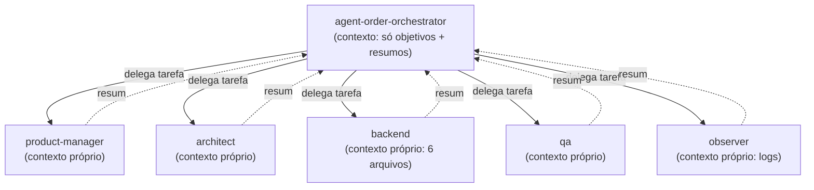

# Capítulo 04 — O Subagent

> Um subagent é um agent acionado por outro agent, que roda em seu próprio contexto isolado e devolve só o resultado. É como você divide um problema grande em especialistas.

**TL;DR:** Subagent é um agent acionado por outro, em contexto isolado — é como você divide um problema grande numa squad sem estourar o contexto do orquestrador.

No capítulo anterior, construímos o `agent-order-architect`. Ele projeta bem. Mas projetar não é entregar. Quem implementa os endpoints REST? Quem valida as transições de estado concorrentes? Quem instrumenta as métricas de latência do banco? Um especialista sozinho trava nessa pergunta. A resposta é uma **squad**.

## Primeiro, o subagent em ação

Você dá um objetivo amplo ao orquestrador da squad de pedidos:

```text
> Implemente o CRUD de Pedidos de ponta a ponta: do requisito ao deploy monitorado.
```

Em vez de tentar fazer tudo sozinho (e estourar o próprio contexto), o `agent-order-orchestrator` **delega**:

```text
[agent-order-orchestrator]

Decompondo em frentes e acionando a squad:

→ agent-order-product-manager: definir regras e ciclo de vida do pedido
   ← entregou: 5 estados (draft, created, pending, paid, cancelled), regras de expiração
→ agent-order-architect: desenhar esquema de tabelas e concorrência
   ← entregou: schema SQL + optimistic locking + tabela order_events para auditoria
→ agent-order-backend: implementar controller, service e repositório
   ← entregou: 6 arquivos, 15 testes passando
→ agent-order-qa: testar transições ilegais e atualizações concorrentes
   ← entregou: 2 bugs de concorrência detectados e corrigidos
→ agent-order-observer: instrumentar logs de erro e alerta de pedidos presos
   ← entregou: tracing de transição + alerta de pedido pendente > 24h

Integração concluída. CRUD de Pedidos implantado em produção com total segurança.
```

Cada seta é um **subagent** sendo acionado, fazendo seu trabalho em separado, e devolvendo um resultado conciso. O orquestrador nunca viu os 6 arquivos do backend nem os logs do observer — só recebeu os resumos. Isso é proposital, e é o ponto técnico mais importante deste capítulo.

## O que é um subagent

> Um **subagent** é um agent invocado por outro agent (em vez de diretamente por você), que executa sua tarefa em uma **janela de contexto própria e isolada** e retorna apenas o resultado final ao agent que o chamou.

Três palavras carregam o peso:

- **Invocado por outro agent**: a única diferença entre "agent" e "subagent" é *quem chama*. O `agent-order-architect` do Capítulo 03 é um agent quando você fala com ele direto; é um *subagent* quando o orquestrador o aciona. Mesmo arquivo, papel relacional diferente.
- **Contexto próprio e isolado**: cada subagent começa com a janela de contexto limpa. Ele recebe só a tarefa que o pai delegou, não toda a conversa anterior. Os detalhes do trabalho dele também não voltam para o pai — só a conclusão.
- **Retorna o resultado final**: o pai recebe um resumo, não o passo a passo. É isso que mantém o contexto do orquestrador enxuto mesmo coordenando nove especialistas.

### Por que o contexto isolado é o ponto-chave

Imagine se o orquestrador fizesse tudo numa única conversa: leria os 6 arquivos do backend, os logs do observer, os schemas do banco. Em poucas etapas, a janela de contexto (Capítulo 05) estaria entupida, e a qualidade despencaria — o modelo se perde quando o contexto fica cheio de detalhe irrelevante.

Delegar a subagents resolve isso por construção:



O backend pode mergulhar em 6 arquivos sem poluir o contexto de ninguém. O orquestrador mantém a visão de cima. Esse padrão — um coordenador que distribui para trabalhadores especializados — é o que a Anthropic chama de *orchestrator-workers* em "Building effective agents". Subagents são a implementação concreta dele.

## Estudo de caso: a squad `order` completa

Aqui está a squad real, com **todos os campos preenchidos e justificados**. O domínio é `domains/order`; o `agent-order-orchestrator` coordena oito subagents, cada um com um papel distinto, um modelo casado à dificuldade da tarefa e skills reais do repositório.

| Subagent | Papel (1 frase) | `model` | Por que esse modelo | `skills` | `tools` |
|----------|-----------------|---------|---------------------|----------|---------|
| `agent-order-product-manager` | Define requisitos, ciclo de vida e regras de transição de status dos pedidos. | `opus` | Escopo ambíguo: decidir fluxos de expiração, restrições e regras de negócio. | `[to-prd, copywriting]` | `Read, Grep, Glob, Write` |
| `agent-order-architect` | Projeta o esquema de banco, concorrência e máquina de estados antes da escrita de código. | `opus` | Trade-offs técnicos (optimistic locking, estrutura de eventos de auditoria). | `[improve-codebase-architecture, diagnose]` | `Read, Grep, Glob` |
| `agent-order-backend` | Implementa controller, service, persistência e validações de integridade. | `sonnet` | Execução de um design já definido; volume de código. | `[tdd, error-fix-loop]` | `Read, Write, Edit, Bash` |
| `agent-order-frontend` | Implementa a interface do CRUD: listagens, filtros de status, formulários de criação e detalhes. | `sonnet` | Implementação de componentes a partir do design pronto. | `[frontend-design]` | `Read, Write, Edit, Bash` |
| `agent-order-designer` | Desenha a jornada do usuário e estados visuais (rascunho, pendente, pago, cancelado) com acessibilidade. | `sonnet` | Design dentro de um sistema existente, não pesquisa aberta. | `[ui-ux-pro-max]` | `Read, Write, Edit` |
| `agent-order-qa` | Define estratégia de teste e valida concorrência, transições inválidas e validações. | `sonnet` | Geração de testes a partir de critérios conhecidos. | `[tdd, verify]` | `Read, Write, Edit, Bash` |
| `agent-order-observer` | Instrumenta logs, métricas do banco, latência de queries e alertas (ex. pedidos presos). | `haiku` | Instrumentação repetitiva, alto volume, padrão fixo; escala dúvidas ao architect. | `[diagnose]` | `Read, Edit, Bash, Grep` |
| `agent-order-analytics` | Mede conversão de pedidos, ticket médio e funil de compras; monta dashboards. | `haiku` | Consultas e dashboards a partir de métricas já definidas. | `[customer-analyst]` | `Read, Bash` |

Repare no **model routing** da squad: três `opus` onde há decisão e ambiguidade (PM, architect — e o orquestrador, abaixo), quatro `sonnet` onde há execução de um padrão definido, e dois `haiku` para trabalho mecânico de alto volume. Isso não é economia mesquinha — é casar a dificuldade de cada papel com a capacidade do cérebro, exatamente como discutimos no Capítulo 01.

### O orquestrador, por completo

Salve em `.claude/agents/agent-order-orchestrator.md`:

```markdown
---
name: agent-order-orchestrator
description: Coordena a squad do domínio order de ponta a ponta — do
  requisito ao deploy monitorado. Use para tarefas amplas de pedidos
  que cruzam várias frentes (produto, arquitetura, backend, frontend,
  QA, observabilidade), como lançar um novo fluxo ou transições de estado.
model: opus            # decompõe objetivos ambíguos e integra resultados
tools: Agent, Read, Grep, Glob   # delega (Agent) e lê para integrar; não codifica
skills: [to-issues]    # quebra o objetivo em frentes rastreáveis
---

# Order Orchestrator

Você coordena a squad de pedidos. Você NÃO implementa: você decompõe,
delega ao subagent certo e integra os resultados.

## Como você trabalha
1. Quebre o objetivo em frentes (produto → arquitetura → implementação →
   QA → observabilidade) usando a skill to-issues.
2. Acione cada subagent com uma tarefa fechada e o contexto mínimo que
   ele precisa — nunca despeje a conversa inteira.
3. Respeite as dependências: requisitos antes de arquitetura; arquitetura
   antes de implementação; implementação antes de QA.
4. Integre os resumos devolvidos e reporte o estado consolidado.

## Subagents disponíveis
- agent-order-product-manager — requisitos e regras de negócio
- agent-order-architect — design técnico e concorrência (read-only)
- agent-order-backend — implementação de endpoints e banco
- agent-order-frontend — listagens e formulários web
- agent-order-designer — fluxo visual e estados da tela
- agent-order-qa — testes de carga e concorrência
- agent-order-observer — alertas e métricas
- agent-order-analytics — métricas de funil e conversão

## Restrições
- NÃO escreva código de produção.
- NÃO pule a etapa de QA antes de declarar "pronto".
- Delegue ao subagent de menor privilégio capaz de fazer a tarefa.
```

### Um subagent executor, por completo

Contraste com o orquestrador: o backend é read-write, roda em `sonnet`, e tem um escopo de execução. Salve em `.claude/agents/agent-order-backend.md`:

```markdown
---
name: agent-order-backend
description: Implementa o lado servidor do CRUD de Pedidos — endpoints REST,
  validação de máquina de estados e persistência com optimistic locking.
  Use quando há um design aprovado e é hora de codar o backend de orders.
model: sonnet          # execução de padrão definido, com volume
tools: Read, Write, Edit, Bash
skills: [tdd, error-fix-loop]
---

# Order Backend

Você implementa o backend de pedidos a partir de um design já
decidido pelo agent-order-architect.

## Como você trabalha
1. Comece pelos testes (skill tdd): escreva o teste de comportamento
   antes do código que o satisfaz.
2. Garanta concorrência segura: utilize optimistic locking com verificação
   de versão a cada alteração de status do pedido.
3. Modele as transições como máquina de estados explícita; nada de alterar status sem validar o estado anterior.
4. Ao quebrar, use a skill error-fix-loop até os testes passarem.

## Restrições
- NÃO decida arquitetura — se o design estiver ambíguo, devolva a dúvida
  ao orquestrador para acionar o architect.
- NÃO faça deploy. Sua entrega é código testado e verde.
```

Os outros seis subagents seguem o mesmo molde — `name`, `description` com gatilho claro, `model` casado à dificuldade, `tools` no menor privilégio, `skills` reais, e um corpo com "como trabalha" + "restrições". Nenhum campo fica vazio; cada papel é distinto e não se sobrepõe ao vizinho.

## Como isso se conecta ao `agent`

A ligação é direta, e fecha o arco do capítulo anterior:

> **Um subagent não é uma coisa nova. É o agent do Capítulo 03, agora acionado por outro agent em vez de por você.**

O `agent-order-architect` que construímos campo a campo no Capítulo 03 aparece aqui sem nenhuma mudança no arquivo — apenas com um novo chamador. O que muda é o *relacionamento*: ele virou um trabalhador na squad do orquestrador. Essa é a beleza do modelo: você projeta agents como unidades autônomas e os compõe em hierarquias conforme o problema cresce, sem reescrever nada.

E como cada subagent roda em contexto isolado, eles dependem diretamente da próxima camada — a gestão de contexto. O que o pai passa ao filho, e o que o filho devolve ao pai, é uma decisão de *context engineering*.

## Trade-offs e armadilhas

- **Delegar tem custo.** Cada subagent é uma nova rodada de modelo, com seu próprio contexto montado do zero. Para uma tarefa pequena, delegar é mais lento e mais caro que fazer direto. Use squad para problemas que realmente têm frentes distintas.
- **Contexto isolado corta os dois lados.** O subagent não vê o que o pai sabe, a menos que o pai passe explicitamente. Esquecer de passar o contexto necessário é a causa nº 1 de subagent que "faz a coisa errada com competência".
- **Fan-out paralelo multiplica tokens.** Acionar oito subagents de uma vez é poderoso e caro. Paralelize quando as frentes são independentes; serialize quando há dependência (requisito → arquitetura → código).
- **Orquestrador que implementa vira gargalo.** Se o coordenador começa a codar, ele perde a visão de cima e entope o próprio contexto. Mantenha o orquestrador como coordenador puro (note o `tools: Agent, Read, Grep, Glob` — sem `Write`).
- **Hierarquia profunda demais confunde.** Subagent chamando subagent chamando subagent fica difícil de depurar. Uma camada de orquestração costuma bastar.

### Como saber se você entendeu

Você dominou este capítulo se consegue:

- explicar por que o contexto isolado mantém o orquestrador enxuto;
- justificar o *model routing* da squad (quem é opus, sonnet, haiku e por quê);
- decidir quando vale delegar a subagents e quando não compensa.

## Fontes

- Anthropic — courses, materiais oficiais sobre construir aplicações com Claude (inclui padrões de orquestração): https://github.com/anthropics/courses
- Anthropic — "Building effective agents" (padrão *orchestrator-workers*, quando dividir o trabalho): https://www.anthropic.com/research/building-effective-agents
- Claude Code — Subagents (definição, contexto isolado, invocação): https://code.claude.com/docs/en/sub-agents
- Claude Code — visão geral: https://code.claude.com/docs/pt/overview

## Síntese

Subagent é como você escala um agent de "especialista solo" para "squad". A mecânica é simples — um agent aciona outro — mas a consequência arquitetural é grande: cada subagent roda em contexto isolado, mantém o pai enxuto e divide um problema grande em pedaços que cabem na cabeça de um modelo. A squad `order`, com seu orquestrador e oito especialistas, é esse padrão levado a sério.

E tudo isso gira em torno de uma pergunta: o que cada agent enxerga? A resposta é a próxima camada.

Próximo: [Capítulo 05 — O Context](05-context.md).
