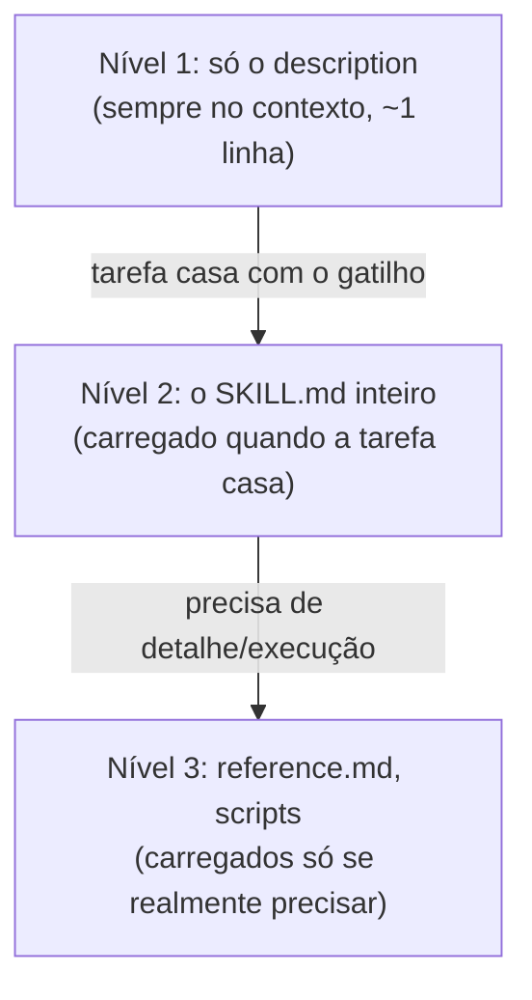

# Capítulo 06 — A Skill

> Uma skill é conhecimento empacotado, carregado sob demanda. Ela estende um agent sem inchar o contexto dele — só entra na janela quando é relevante.

**TL;DR:** Skill é conhecimento empacotado, carregado sob demanda por *progressive disclosure* — estende o agent sem inchar o system prompt.

No capítulo anterior vimos que o contexto é finito e que o system prompt do agent ocupa espaço o tempo todo. Surge um problema: e o conhecimento especializado que o agent só precisa às vezes? Colocar tudo no prompt incha a janela em toda chamada. Não colocar nada deixa o agent ignorante. A skill resolve esse dilema.

## Primeiro, a skill em ação

O `agent-order-architect` está desenhando o fluxo do CRUD de Pedidos (Orders) e chega no ponto crítico: concorrência e transições inválidas. Isso exige conhecimento específico — optimistic locking, controle de versão (`version`) e modelagem rígida de máquina de estados. Esse know-how **não está** no system prompt dele (que é curto). Ele está numa skill, que o agente carrega no momento certo:

```text
[agent-order-architect]

A tarefa envolve concorrência e integridade de transição de status.
→ Carregando skill: improve-codebase-architecture

  (a skill traz para o contexto: padrões de concorrência com optimistic locking,
   regras estritas de transições de máquina de estados e logs de auditoria)

Com esse material, a decisão fica:
- Concorrência = optimistic locking via verificação incremental do campo `version`.
- Transições válidas = draft -> created -> pending -> paid | cancelled.
- Auditoria = gravar transição na tabela order_events no mesmo transaction block.
```

Antes dessa tarefa, o conhecimento de padrões de concorrência e integridade **não ocupava** nenhum espaço no contexto do agente. Ele entrou só quando a tarefa pediu, e poderia sair depois. Esse carregamento sob demanda é a essência da skill.

## O que é uma skill

> Uma **skill** é uma capacidade empacotada — uma pasta com um arquivo `SKILL.md` (instruções + metadados) e, opcionalmente, recursos como scripts e documentos de referência — que o agente carrega **sob demanda**, quando a tarefa atual casa com a descrição da skill.

A anatomia mínima, no Claude Code:

```text
.claude/skills/improve-codebase-architecture/
├── SKILL.md            # frontmatter (name, description) + instruções
├── reference.md        # material aprofundado (carregado só se preciso)
└── scripts/
    └── analyze.ts      # código que a skill pode rodar (ex.: TypeScript CLI)
```

E o `SKILL.md` em si, no mesmo formato dos que já existem neste repositório:

```markdown
---
name: improve-codebase-architecture
description: Encontra oportunidades de aprofundar a arquitetura de um
  código. Use ao melhorar arquitetura, achar refatorações, consolidar
  módulos acoplados ou tornar o código mais testável. Inclui padrões
  de concorrência, máquina de estados e auditoria de eventos.
---

# improve-codebase-architecture

## Padrões de Concorrência
- Controle concorrente com optimistic locking via versão (`version` check).

## Máquina de Estados
- Modele transições válidas de forma explícita; barre transições proibidas (ex. de cancelado para pago).

## Quando NÃO aplicar
- ...
```

Note: o formato é exatamente o que você já viu nas skills do repo — frontmatter com `name` e `description`, e um corpo em Markdown. A skill é, literalmente, conhecimento escrito como documento, com metadados que dizem quando usá-lo.

## Progressive disclosure: o truque que torna skills baratas

Aqui está o mecanismo que faz skills funcionarem sem entupir o contexto — *progressive disclosure* (revelação progressiva), em três níveis:



- **Nível 1 — sempre presente, custo mínimo.** Só a `description` de cada skill fica no contexto o tempo todo. É como um índice: dezenas de skills custam pouquíssimos tokens, porque só os "títulos" estão carregados.
- **Nível 2 — sob demanda.** Quando a tarefa atual casa com a `description` de uma skill, o `SKILL.md` completo entra na janela. Foi o que aconteceu quando o architect chegou em "idempotência".
- **Nível 3 — só se necessário.** Arquivos de referência e scripts dentro da pasta só são lidos se a tarefa exigir aquele detalhe. O agente carrega o `reference.md` apenas se o resumo do `SKILL.md` não bastar.

É o mesmo princípio do Capítulo 05 (sinal sobre ruído) aplicado ao conhecimento: você pode ter centenas de skills disponíveis, mas só paga o contexto das que de fato usa, no momento em que usa. Por isso a `description` da skill é tão crítica quanto a do agent — é ela que decide se a skill é "descoberta" na hora certa.

## Skill, agent e subagent: quem é o quê

Esses três se confundem. A distinção:

| Conceito | É um… | Tem estado/loop? | Reutilizável por… |
|----------|-------|------------------|-------------------|
| **Agent** | trabalhador com um papel | sim (roda no harness) | — |
| **Subagent** | agent acionado por outro | sim | — |
| **Skill** | conhecimento/capacidade empacotada | não (é material, não trabalhador) | vários agents |

A frase de bolso: **um agent é quem faz; uma skill é o que ele sabe.** Uma mesma skill (`tdd`, por exemplo) pode ser usada pelo `agent-order-backend` e pelo `agent-order-qa` — o conhecimento é compartilhado, os trabalhadores são distintos.

### Skills vs Commands (Slash Commands)

Com a evolução das ferramentas CLI como o Claude Code, surge outra distinção vital: as **skills** vs. os **commands** (slash commands).
- **Skills:** São carregadas pelo harness de forma semântica e **implícita**. O agente lê o histórico de conversa, percebe a necessidade ("preciso de concorrência") e puxa o `SKILL.md` correspondente. É um fluxo transparente e orientado à cognição.
- **Commands (Slash Commands):** São chamados imperativos e **explícitos** disparados por você no terminal (ex.: `/goal`, `/schedule`, `/grill-me`). Eles iniciam fluxos de controle estruturados ou scripts determinísticos, sem depender do julgamento do modelo para ativação.

A frase de bolso: *Skills estendem a cognição do agente de forma implícita; Commands estendem a capacidade de operação da cabine (CLI) de forma explícita.*

### Skills Auto-Melhoráveis: O Próximo Nível

Uma categoria emergente do ecossistema são as **Skills Auto-Melhoráveis** (self-improving skills). Um exemplo real do repositório é o harness de feedback-loop (ex.: `skill-recursiva-feedback-loop-harness`).
Essas skills não contêm apenas instruções estáticas; elas contêm loops estruturados de auto-correção que instruem o agente a entrar em ciclos recursivos de:
1. Propor uma correção de código.
2. Rodar a suite de verificação/testes via tool (`Bash`).
3. Se falhar, consumir o log de erro, alimentar a própria memória de trabalho e ajustar recursivamente o código sem pedir intervenção humana.

Isso automatiza o fluxo de "Error Fix Loop" (EFL), minimizando a latência de desenvolvimento.

### Recomendação CRÍTICA: Evite a Explosão de Tokens

> [!IMPORTANT]
> **O desenvolvedor deve testar o uso sem skills primeiro para evitar a explosão de tokens.**
>
> Embora skills sejam úteis, toda skill ativa consome o limite da janela de contexto (RAM) com tokens adicionais. Para tarefas triviais ou mecânicas, confie na inteligência bruta do modelo e nas diretrizes simples do `CLAUDE.md`. Ative ou crie skills apenas quando houver necessidade real de know-how denso e reutilizável.

## Como isso se conecta ao `agent`

Lembra do frontmatter do Capítulo 03?

```yaml
skills: [improve-codebase-architecture, diagnose]
```

Agora essa linha tem significado completo:

> **A skill é como você estende o que um agent sabe fazer sem inchar o system prompt dele.**

1. **O agent declara afinidade com skills.** O campo `skills` diz quais pacotes de conhecimento aquele papel costuma precisar. É uma dica de quais skills são relevantes para o trabalho dele.
2. **O conhecimento fica fora do prompt.** Em vez de despejar "como projetar concorrência" no system prompt do architect (custando contexto em toda chamada), isso vive na skill e entra só quando a tarefa pede. O prompt do agent continua curto; a competência, sob demanda.
3. **Skills são compartilhadas entre agents.** A squad inteira do Capítulo 04 referencia skills reais (`tdd`, `frontend-design`, `ui-ux-pro-max`…). Cada subagent puxa o conhecimento de que precisa, sem duplicar nada.

Skill está para conhecimento como subagent está para trabalho: as duas camadas existem para manter cada agent **focado e enxuto**, delegando o que não precisa estar sempre presente.

## Trade-offs e armadilhas

- **A `description` é tudo.** Se ela não descreve bem *quando* usar a skill, a skill nunca é carregada — vira código morto. Escreva o gatilho com situações concretas, como no `description` do agent.
- **Skill não é agent.** Não tente colocar "comportamento autônomo" numa skill. Skill é material que um agent consome; quem age é o agent.
- **Excesso de skills polui o nível 1.** Cada skill custa sua `description` no contexto permanente. Centenas de skills mal descritas viram ruído de índice. Mantenha o catálogo curado.
- **Conhecimento desatualizado é pior que ausente.** Uma skill com um padrão obsoleto faz o agent errar com confiança. Skills precisam de manutenção como qualquer documentação.

### Como saber se você entendeu

Você dominou este capítulo se consegue:

- explicar os três níveis do *progressive disclosure*;
- diferenciar skill, command, agent e subagent;
- justificar por que testar sem skills primeiro é uma prática recomendada de economia de tokens.

## Fontes

- Anthropic — courses, exemplos oficiais de capacidades e padrões com Claude: https://github.com/anthropics/courses
- Claude Code — Skills (estrutura, `SKILL.md`, progressive disclosure): https://code.claude.com/docs/en/skills
- Anthropic — "Equipping agents for the real world with Agent Skills": https://www.anthropic.com/news/agent-skills
- Claude Code — visão geral: https://code.claude.com/docs/pt/overview

## Síntese

Skill é conhecimento como documento, carregado sob demanda por *progressive disclosure*: só a descrição fica sempre no contexto; o conteúdo entra quando a tarefa casa. Isso permite que um agent enxuto tenha acesso a muita competência sem pagar o contexto dela o tempo todo. O `skills: [...]` do agent é a ponte entre o trabalhador e o que ele sabe.

Já temos agents, subagents, contexto e skills. Mas como você empacota tudo isso — uma squad inteira com suas skills, hooks e conexões — para instalar em outro repositório com um comando? Essa é a próxima camada.

Próximo: [Capítulo 07 — O Plugin](07-plugin.md).
