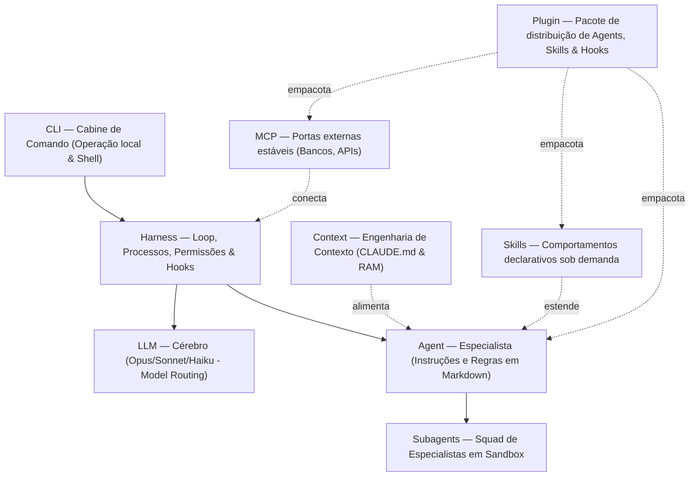

# Capítulo 10 — Síntese

> Nove camadas, um ecossistema. Aqui consolidamos todo o stack sob uma tarefa de CRUD de Pedidos real, rastreando o fluxo do primeiro token ao deploy, e mapeando as ferramentas que definem o estado da arte do desenvolvimento agêntico.

**TL;DR:** O stack completo opera de forma coesa para entregar um CRUD de Pedidos com isolamento via Git Worktrees, otimização de tokens com proxies locais (como RTK/Caveman), automações com Slash Commands e Skills recursivas, e feedbacks de ambiente em tempo real com Hooks e notificações do OS.

Você começou este e-book com uma lista desordenada de termos: LLM, harness, agent, subagent, context, skill, plugin, MCP, CLI. O objetivo deste trabalho foi transformar esse vocabulário solto em um sistema arquitetural estável: peças interdependentes onde cada camada resolve exatamente o gargalo que a camada anterior não consegue cobrir. 

## O stack em uma visão sistêmica



Analisando a topologia do fluxo de execução:
- **Fluxo Descendente (Comando)**: Você digita no **CLI**, que aciona o **harness** local. O harness inicializa a sessão carregando o **context** otimizado, interpretando os **plugins** instalados, estendendo capacidades através de **skills** e abrindo conexões **MCP** declaradas. O harness então invoca o **agent** correto, que gerencia e delega tarefas complexas a **subagents** especializados, orquestrando as chamadas de inferência no **LLM** adequado.
- **Fluxo Ascendente (Execução)**: O **LLM** gera a decisão lógica que o **harness** intercepta, valida com **hooks** determinísticos locais e executa no ambiente nativo do seu repositório via **CLI**, garantindo segurança e controle.

---

## O CRUD de Pedidos pelo fluxo agêntico

Vamos traçar a jornada de ponta a ponta para implementar um **CRUD de Pedidos (Orders)** robusto — completo com tratamento de concorrência por optimistic locking e histórico de transições de estados — mapeando exatamente onde e por que cada camada entra em ação.

### 1. Preparando a cabine com Git Worktrees no CLI
Antes de iniciar a sessão com o agente, você quer evitar que arquivos temporários, builds inacabados ou testes quebrados interrompam seu trabalho paralelo no ramo principal. Você inicializa um **Git Worktree** dedicado para a tarefa:

```bash
$ git worktree add ../orders-sandbox feat/orders-crud
$ cd ../orders-sandbox
$ claude
```

O **CLI** do Claude Code é inicializado nesse diretório limpo e isolado. O CLI apresenta uma vantagem técnica gritante em relação a interfaces web ou extensões genéricas de IDE: **o CLI atua diretamente no host, acessando processos de shell nativos**. Isso significa que ferramentas de linters (`eslint`), testes unitários (`jest`/`vitest`), compiladores (`tsc`) e comandos de versionamento (`git`) rodam sem o overhead de serialização, rede ou latência inerentes aos protocolos de rede. É a superioridade de performance e tokens do CLI em ação: chamadas diretas de shell local poupam milhares de tokens que seriam desperdiçados descrevendo o estado do sistema de arquivos pela API.

```text
> /goal Implementar o CRUD de Pedidos com controle de concorrência e fila de eventos.
```

### 2. O Harness e a Curadoria de Contexto
Ao ler a instrução, o **harness** é ativado. Ele carrega as diretrizes do arquivo [CLAUDE.md](../../../../../CLAUDE.md) e do indexador de instruções [AGENTS.md](../../../../../AGENTS.md) do projeto.

A engenharia de contexto atua aqui como uma memória RAM limpa. Em vez de enviar toda a árvore de arquivos ao LLM, o harness usa indexação seletiva. O sinal-sobre-ruído é mantido alto: apenas a convenção de nomenclatura de TypeScript, o padrão de design do repositório e os schemas SQL relevantes das tabelas `orders` e `order_events` são puxados para a janela ativa.

### 3. O Agent Especialista e a Squad de Subagents
O harness avalia as descrições dos agentes disponíveis e aciona o especialista `agent-order-architect`. Roteado automaticamente para rodar no Claude 3.5 Sonnet ou no Claude 3 Opus (devido à complexidade do desenho de concorrência), o arquiteto analisa a tarefa e percebe que codificar, testar e documentar tudo de uma vez estourará o limite cognitivo de uma única sessão.

Ele decide criar uma **squad de subagents** isolados em sandboxes dedicadas:
1. **`product-manager`**: Analisa as regras de negócio para as transições de estado (`draft` -> `created` -> `pending_payment` -> `paid` -> `cancelled`) e gera os critérios de aceitação.
2. **`backend-coder`**: Escreve o serviço em TypeScript (`OrderService.ts`), aplicando concorrência otimista com verificação de versão da linha (`version` + 1) e persistência das transições na tabela `order_events`.
3. **`qa-tester`**: Gera testes automatizados de integração concorrente simulando requisições paralelas para garantir que nenhuma transição de estado seja sobrescrita indevidamente.

Cada subagent trabalha com ferramentas limitadas (princípio do menor privilégio) e relata apenas o resultado compilado ao orquestrador, mantendo o contexto principal limpo.

### 4. Custom Slash Commands vs. Skills no Loop
Durante a implementação, o desenvolvedor pode interagir com a sessão usando atalhos rápidos. É crucial entender a diferença de finalidade de cada um:
- **Slash Commands (Comandos Customizados)**: São atalhos de automação focados no fluxo do usuário (salvos em `.claude/commands/<nome>.md`, como `/goal` ou `/grill-me`). Eles forçam um comportamento determinístico de controle de sessão ou injetam prompts estruturados de forma imediata na pilha de execução.
- **Skills (Conhecimento Comportamental)**: São arquivos de habilidades declarativas salvas em `.claude/skills/<nome>/SKILL.md` que o agente carrega de forma dinâmica somente se identificar que a tarefa atual necessita daquela habilidade.

Para garantir a qualidade, o agente carrega a skill recursiva de auto-melhoria `skill-recursiva-feedback-loop-harness`. Esta skill executa um ciclo autônomo (EFL - Error Fix Loop): compila o código TypeScript com `npx tsc --noEmit`, roda os testes com `npm run test` e, se encontrar falhas, lê as mensagens de erro, ajusta o código e repete o ciclo recursivamente até que a execução esteja livre de erros e em total conformidade técnica.

> [!WARNING]
> **Aviso Crítico de Economia**: Sempre teste a execução básica do seu código *sem skills* ativas primeiro. Carregar múltiplas skills pesadas de forma contínua em tarefas simples gera uma explosão de tokens desnecessária, consumindo rapidamente a cota de processamento. Use skills complexas apenas quando a automação de correção de falhas for estritamente necessária.

### 5. Gateways Externos via MCP
Para persistir os dados e disparar notificações reais para sistemas de terceiros, o harness se conecta a servidores locais e remotos usando o **Model Context Protocol (MCP)**.
- O agente utiliza a ferramenta do MCP de banco de dados (`mcp__postgres__query`) para inspecionar os índices das tabelas e garantir que o campo `order_id` na tabela `order_events` possui a indexação correta para buscas de auditoria rápidas.
- O agente utiliza o MCP de mensageria para validar a fila de transição de status no sistema de mensagens externas.

O MCP atua como uma interface padronizada estável para o agente acessar o mundo externo sem precisar codificar conexões brutas em nível de soquete em cada execução.

### 6. Hooks e Notificações de Ambiente
Antes de consolidar as alterações, o harness aciona os **Hooks** de pré-execução declarados no manifesto do plugin do projeto:
- O hook `PreToolUse` executa um script bash local (`validar-typescript.sh`) para assegurar que nenhum tipo `any` implícito foi adicionado no serviço de pedidos.
- Quando o `/goal` longo de reestruturação é concluído com sucesso e a branch do Git Worktree está pronta, o hook de finalização de tarefa dispara uma notificação física para o desenvolvedor: um aviso sonoro no terminal (beep) e um pop-up visual no sistema operacional. Isso evita que você precise policiar o terminal em tarefas demoradas, permitindo que você retorne à cabine assim que o trabalho agêntico for finalizado.

```bash
# Exemplo de script de notificação física acionado por Hook pós-sucesso
osascript -e 'display notification "CRUD de Pedidos implementado e testado com sucesso no Git Worktree!" with title "Claude Code"'
echo -e "\a" # Emite um sinal sonoro (beep) no terminal host
```

---

## O Ecossistema da Comunidade e a Economia de Tokens

O desenvolvimento AI-native moderno não se limita às ferramentas oficiais da Anthropic. Existe uma comunidade vibrante que cria ferramentas fundamentais para otimização de custos, gerenciamento de memória e indexação de bases de código:

1. **Economia de Tokens e Proxy de Linha de Comando**:
   - **RTK (Rust Token Killer)** (`github.com/rtk-ai/rtk`): Um proxy otimizado escrito em Rust que intercepta e comprime logs de terminal, outputs de linters e testes gigantescos antes de enviá-los ao LLM, gerando economias drásticas de 60% a 90% em operações diárias de desenvolvimento.
   - **Caveman** (`github.com/JuliusBrussee/caveman`): Uma alternativa focada no controle rígido de consumo de tokens em ambientes CLI locais.
2. **Repositórios de Skills e Plugins**:
   - **aitmpl.com/skills/** e **skills.sh**: Marketplaces públicos e repositórios comunitários para descobrir, compartilhar e baixar skills prontas de auditoria, refatoração de código, testes e deploys.
   - **context-7** ([context7.com](https://context7.com)): Plataforma de documentação em tempo real que alimenta agentes (como Cursor e Claude Code) com referências atualizadas e exemplos práticos via CLI (`npx ctx7 setup`) ou servidores MCP para evitar alucinações de APIs obsoletas.
   - **frontend-design** ([github.com/anthropic/frontend-design-skill](https://github.com/anthropic/frontend-design-skill)): Skill oficial de curadoria visual da Anthropic, direcionando o LLM a adotar estéticas profissionais premium, banir clichês ("AI slop") e fontes padrão de navegador.
   - **ui-ux-pro-max** ([github.com/nextlevelbuilder/ui-ux-pro-max-skill](https://github.com/nextlevelbuilder/ui-ux-pro-max-skill)): Base de conhecimento e gerador inteligente de sistemas de design, cobrindo mais de 50 estilos visuais, paletas curadas e guias de acessibilidade para Next.js, React e SwiftUI.
3. **Gerenciamento de Memória Persistente**:
   - **claude-mem** (`github.com/thedotmack/claude-mem`): Um utilitário de persistência de memória a longo prazo para o Claude Code que estende as capacidades nativas do agente de recordar preferências, padrões de arquitetura e decisões de sessões passadas entre reinicializações de máquina.
4. **Indexação com Grafos de Dependência**:
   - **lemon-code-graph** (`github.com/Andersonlimahw/lemon-code-graph`): Ferramenta que gera grafos de chamadas e mapeamentos de arquivos no repositório local, otimizando o envio de dependências cruzadas para a janela de contexto do agente.
   - **Open Graph** (`github.com/colbymchenry/codegraph`): Analisador de grafos de código para contextualização agêntica aprofundada.
5. **LLM-Wiki de Karpathy**:
   - O guia definitivo e minimalista de referência de arquitetura mental de LLMs mantido por Andrej Karpathy: [LLM-Wiki Gist](https://gist.github.com/karpathy/442a6bf555914893e9891c11519de94f).

### Ferramentas e CLIs Equivalentes ao Claude Code

Para além do Claude Code, o cenário de desenvolvimento AI-native conta com diversas alternativas e proxies equivalentes focados em comandos via terminal e automação nativa:

| Empresa | CLI / Ferramenta | Link |
| :--- | :--- | :--- |
| **Anthropic** | Claude Code | [code.claude.com](https://code.claude.com) |
| **Google DeepMind** | Antigravity CLI | [deepmind.google/antigravity](https://deepmind.google) |
| **Google** | Gemini CLI | [ai.google.dev/gemini-api](https://ai.google.dev) |
| **OpenAI / Codex** | Codex CLI | [openai.com/blog/openai-codex](https://openai.com/blog/openai-codex) |
| **OpenCode** | OpenCode CLI | [opencode.dev](https://opencode.dev) |
| **Anysphere** | Cursor CLI | [cursor.com](https://cursor.com) |


---

## Síntese Prática: O Modelo Mental Cristalizado

Se você precisar reter apenas a essência deste e-book para guiar seu fluxo de trabalho amanhã:

> **LLM** é o cérebro. **Harness** é o corpo físico e executor. **Agent** é o especialista contextualizado por arquivos markdown. **Subagents** representam a squad operando em sandbox. **Context** é a memória de trabalho (RAM) limpa e curada. **Skills** são as competências declarativas que o agente aprende sob demanda. **MCP** representa os canais e pontes estáveis para o mundo externo. **Plugins** são os pacotes de distribuição e compartilhamento desse ecossistema. E o **CLI** é a sua cabine de controle direto no host.

---

## Por onde começar amanhã

Teoria sem aplicação prática é rapidamente esquecida. Comece a transformar seu fluxo de trabalho em AI-native seguindo estes passos incrementais:

1. **Crie seu primeiro Agent customizado**: Mapeie uma tarefa puramente sua (ex: criar changelogs com base em commits do git ou rodar migrations de banco) e escreva um arquivo `.claude/agents/changelog-builder.md` com `name`, `description` e regras estritas de atuação.
2. **Defina um Custom Command**: Crie uma automação em `.claude/commands/deploy-check.md` para rodar linters, testar tipos e gerar um relatório unificado de saúde do código antes de commits importantes.
3. **Monitore e Economize**: Adicione o proxy `rtk` na frente do seu terminal e monitore os ganhos de tokens diários ao rodar sessões repetidas.
4. **Utilize Git Worktrees**: Nunca mais trave sua branch principal com sessões longas de agentes `/goal`. Crie um diretório temporário conectado ao git e deixe o agente trabalhar isoladamente enquanto você continua desenvolvendo em paralelo.

O stack está montado e ao seu alcance. A cabine de comando do terminal está aberta. É hora de projetar e operar com a sua própria squad de engenharia agêntica.

---

## Fontes de Referência e Estudo Contextual

- **Anthropic Agent SDK**: Referência de design para o ciclo de vida do Agent Loop: https://code.claude.com/docs/pt/agent-sdk/agent-loop
- **Claude Code CLI & Worktrees**: Melhores práticas e isolamento de processos agênticos: https://code.claude.com/docs/pt/worktrees
- **Best Practices Anthropic**: Recomendações oficiais de uso de ferramentas locais no host: https://code.claude.com/docs/pt/best-practices
- **Ecosystem and Memory**: Estudo sobre o comportamento de engenharia de contexto e memória: https://code.claude.com/docs/pt/memory
- **Lemon Blog**: Para aprofundar nos fundamentos de agentes e como escrever instruções ricas, veja o artigo: [Como criar agents customizados com Claude Code](https://lemon.dev.br/pt/blog/o-que-e-um-agent-e-como-criar-agents-customizados-com-claude-code)
- **Lemon Blog**: Para entender mais sobre otimização do ciclo de desenvolvimento com ferramentas de economia de tokens, leia: [Entendendo a economia de tokens em CLI agênticos](https://lemon.dev.br/pt/blog/economia-tokens-stack-skills-cli)
- **Lemon Blog**: Para compreender o funcionamento interno e a arquitetura por trás da correção recursiva de erros, confira: [Implementando loops recursivos de correção em AI Harness](https://lemon.dev.br/pt/blog/skill-recursiva-feedback-loop-harness)

Voltar ao [índice](index.md).
