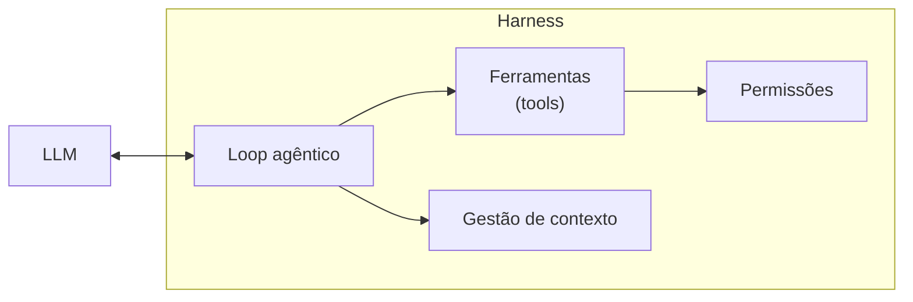
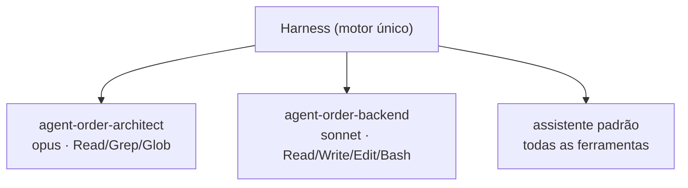

> O harness é o programa que dá olhos, mãos e um loop ao LLM. Sem ele, o modelo só fala. Com ele, o modelo age.

**TL;DR:** O harness envolve o LLM com um loop, ferramentas e permissões — é o que transforma um previsor de tokens num agente que age.

No capítulo anterior, o LLM puro respondeu sobre o CRUD de Pedidos de forma genérica e não pôde tocar no seu código. Agora vamos dar um corpo a ele e ver a diferença.

## Primeiro, o harness em ação

Mesma pergunta de antes — mas agora dentro do Claude Code, no terminal, dentro do repositório:

```text
> Como eu crio uma API de CRUD de Pedidos (Orders) no meu sistema?
```

Desta vez a sequência é outra. Em vez de responder de cara, o sistema **age**:

```text
• Procurando arquivos de pedido…
  grep "Order" → src/orders/OrderService.ts
• Lendo src/orders/OrderService.ts (110 linhas)
• Lendo src/orders/types.ts
• Rodando os testes existentes… 8 passaram

Encontrei. Seu OrderService gerencia pedidos na memória. Para virar um CRUD persistente de verdade, precisamos conectá-lo a um banco de dados (ex. PostgreSQL) e expor os endpoints REST. Antes de eu propor o código, há uma decisão de arquitetura aqui — quer que eu acione o arquiteto de pedidos para desenhar as transições de estado e persistência?
```

A diferença não está no cérebro — é o mesmo LLM. A diferença é que agora ele:

1. **enxergou** o seu código (`grep`, depois `Read`);
2. **agiu** no seu ambiente (rodou os testes);
3. **decidiu sozinho a sequência** de passos (procurar → ler → testar → responder).

Quem deu esses olhos e mãos ao modelo, e quem rodou esse ciclo de passos, foi o **harness**.

## O que é um harness

> Um **harness** é o programa que envolve o LLM e o torna útil: ele monta o contexto, oferece ferramentas, executa as ferramentas que o modelo pede, devolve os resultados ao modelo e repete esse ciclo até a tarefa terminar — tudo sob um modelo de permissões.

O nome vem de "arreio/cabresto": é o equipamento que controla e direciona um cavalo. Aqui, o cavalo é o LLM. O Claude Code é um harness. O Cursor é um harness. Um script TypeScript que chama a API da Anthropic num loop `while` com tool use também é, em miniatura, um harness.

A frase de bolso: **o LLM é o cérebro; o harness é o corpo e o sistema nervoso.**

## O loop agêntico: o coração do harness

A peça mais importante de um harness é o loop. Em TypeScript/JavaScript moderno:

```typescript
interface Message {
  role: 'system' | 'user' | 'assistant' | 'tool';
  content: string;
  toolCallId?: string;
}

async function runAgentLoop(
  systemPrompt: string,
  userMessage: string,
  availableTools: Record<string, Function>
): Promise<string> {
  const context: Message[] = [
    { role: 'system', content: systemPrompt },
    { role: 'user', content: userMessage }
  ];

  while (true) {
    // 1. O LLM analisa o contexto e decide o próximo passo
    const response = await llm.complete(context, Object.keys(availableTools));

    if (response.wantsToUseTool) {
      // 2. O harness intercepta e executa a ferramenta de forma síncrona/assíncrona
      const toolResult = await availableTools[response.toolName](response.arguments);
      
      // 3. O harness atualiza o contexto com o pedido e o resultado
      context.push({ role: 'assistant', content: response.text });
      context.push({ role: 'tool', toolCallId: response.toolCallId, content: JSON.stringify(toolResult) });
      
      // 4. Loop continua (pensar -> agir -> observar)
      continue;
    } else {
      // O LLM decidiu que concluiu a tarefa
      return response.text;
    }
  }
}
```

Releia o exemplo do CRUD de Pedidos com esse loop na cabeça:

1. O modelo recebe o pedido e decide: "preciso achar onde os pedidos são criados ou armazenados" → pede `Grep`.
2. O harness executa o `Grep`, devolve o caminho do arquivo `OrderService.ts`.
3. O modelo decide: "preciso ler esse arquivo" → pede `Read`.
4. O harness lê, devolve o conteúdo de `OrderService.ts`.
5. O modelo decide: "vou validar a suite rodando os testes" → pede `Bash`.
6. O harness roda os testes locais, devolve a saída.
7. O modelo conclui que tem o necessário para a decisão arquitetural e responde — saindo do loop.

Cada volta no `while` é uma decisão do modelo seguida de uma ação do harness. É essa alternância **pensar → agir → observar** que diferencia um agente de um chat.

## As quatro responsabilidades do harness



**1. Ferramentas (tools).** São as funções que o modelo pode chamar: `Read`, `Write`, `Edit`, `Bash`, `Grep`, `Glob`, busca na web, e outras. Cada ferramenta tem um nome, uma descrição e um schema de argumentos. O modelo não executa nada — ele *pede* ao harness para executar. (Mais ferramentas, para sistemas externos, chegam via MCP no [Capítulo 08](/ebook-ai-native-developer/08-mcp/).)

**2. Permissões.** Antes de executar uma ferramenta sensível — editar um arquivo, rodar um comando — o harness aplica uma política: pergunta ao usuário, ou consulta uma allowlist, ou bloqueia. É a fronteira de segurança entre "o modelo quer fazer X" e "X acontece de verdade". Restringir as `tools` de um agent (Capítulo 03) é uma forma de definir essa fronteira por design.

**3. Gestão de contexto.** A janela de contexto é finita (Capítulo 01). O harness decide o que entra: quais arquivos, quanto do histórico, resultados de quais ferramentas. Quando a conversa fica longa demais, ele **compacta** — resume o que passou para liberar espaço. Boa gestão de contexto é o que separa um harness que se perde de um que mantém o fio. É o tema do [Capítulo 05](/ebook-ai-native-developer/05-context/).

**4. Loop agêntico.** O `while` que vimos. É o que transforma uma resposta única numa sequência autônoma de passos.

### Hooks: estendendo o loop de forma determinística

Além das quatro responsabilidades fundamentais, harnesses modernos como o Claude Code trazem suporte a **Hooks**. 
Um hook é um script ou comando de terminal que o harness executa de forma automática em resposta a eventos específicos do ciclo de vida agêntico — como antes de rodar uma ferramenta (`PreToolUse`), após a execução (`PostToolUse`), ou ao encerrar a sessão (`Stop`).

Isso abre portas para controles e automações determinísticas fora da rede neural:
- **Hooks de som / feedback sonoro:** Disparar um áudio no terminal informando se o build ou teste que o agente rodou quebrou. Exemplo de hook disparado após `PostToolUse` com comando `Bash`:
  ```bash
  # Se o comando executado pelo agente falhar, toca um som de erro no macOS
  if [ $EXIT_CODE -ne 0 ]; then
    say "Build falhou" || afplay /System/Library/Sounds/Basso.aiff
  fi
  ```
- **Notificação via OS/Terminal:** Mandar alertas visuais no desktop para o desenvolvedor saber que o agente concluiu uma sub-tarefa longa enquanto ele estava em outra aba.
  ```bash
  # Notifica o OS usando osascript (macOS)
  osascript -e 'display notification "O agente completou o CRUD de Pedidos!" with title "Claude Code"'
  ```

Hooks deixam você injetar política e automação sem mudar o modelo. Voltamos a eles no Capítulo 07.

## Como isso se conecta ao `agent`

Esta é a relação mais importante do e-book, então vale a pena ser explícito:

> **O agent é a configuração. O harness é o motor que roda essa configuração.**

Quando você cria o `agent-order-architect` (Capítulo 03) com `tools: Read, Grep, Glob` e `model: opus`, você não está construindo um programa novo. Você está dando ao harness uma configuração: "quando este papel for acionado, monte o contexto com *este* system prompt, ofereça *estas* ferramentas, e rode o loop com *este* modelo".

O mesmo harness roda o `agent-order-architect`, o `agent-order-backend` e o assistente padrão. O que muda entre eles é só a configuração — o prompt, as ferramentas, o modelo. Por isso um agent é tão barato de criar: ele reaproveita todo o motor que já existe.



## Trade-offs e armadilhas

- **O harness define a superfície de risco.** Dar `Bash` sem política de permissão é dar ao modelo um shell. As permissões existem por isso — não as desligue por conveniência.
- **Loop sem limite gasta tokens e tempo.** Um bom harness tem teto de iterações e sabe parar. Tarefa mal definida vira loop caro.
- **Contexto mal gerido degrada tudo.** Encher a janela de arquivos irrelevantes piora a resposta. O harness escolher *o que* o modelo vê é metade do resultado.
- **Harness não conserta um cérebro ruim.** Se o modelo é fraco para a tarefa, mais ferramentas não salvam. Casar modelo↔tarefa (Capítulo 01) continua valendo.

### Como saber se você entendeu

Você dominou este capítulo se consegue:

- descrever o loop pensar → agir → observar com as suas próprias palavras;
- listar as quatro responsabilidades do harness;
- explicar a frase "o agent é a configuração; o harness é o motor".

## Fontes

- Yao et al., "ReAct: Synergizing Reasoning and Acting in Language Models" (2022) — o padrão de raciocínio + ação que fundamenta o loop do harness: https://arxiv.org/abs/2210.03629
- Claude Code — visão geral (o harness de referência deste e-book): https://code.claude.com/docs/pt/overview
- Anthropic — "Building effective agents" (o loop de ferramentas, agentes vs. workflows): https://www.anthropic.com/research/building-effective-agents
- Anthropic — uso de ferramentas (tool use) na API: https://docs.anthropic.com/en/docs/build-with-claude/tool-use

## Síntese

O harness é o que transforma um previsor de tokens num agente que faz coisas. Ele dá ferramentas, aplica permissões, gerencia o contexto e roda o loop pensar→agir→observar. O Claude Code é exatamente isso: um harness operado pelo terminal.

Mas até aqui temos um harness genérico, que faz um pouco de tudo. O próximo passo é especializá-lo para um trabalho — dar a ele um papel, um modelo e limites. Isso é o agent.

Próximo: [Capítulo 03 — O Agent](/ebook-ai-native-developer/03-agent/).
