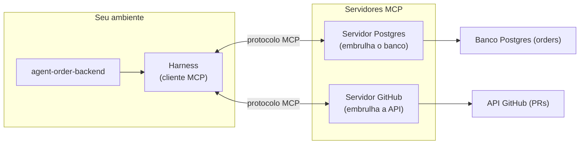

> MCP (Model Context Protocol) é o padrão aberto que conecta o agente ao mundo externo — o banco de dados Postgres, APIs externas e sistemas legados — por uma interface única, em vez de uma integração ad hoc para cada sistema.

**TL;DR:** MCP é o padrão aberto que dá ao agente uma porta única para sistemas externos — um servidor embrulha o Postgres ou APIs externas e expõe ferramentas ao loop do agente.

Até aqui, as ferramentas do agente agiam na sua máquina: `Read`, `Edit`, `Bash`, `Grep`. Mas o `agent-order-backend` precisa saber se as tabelas do banco de dados *de verdade* estão com o schema correto em produção, e o `agent-order-analytics` precisa consultar dados consolidados de pedidos. Isso é fora da máquina local. Como o agente alcança esses sistemas? Com MCP.

## Primeiro, o MCP em ação

O `agent-order-architect` quer validar uma suposição: o schema da tabela de pedidos no banco de dados local ou de staging já suporta optimistic locking? Em vez de você abrir um cliente SQL e rodar queries, o agente consulta direto, por uma ferramenta MCP:

```text
[agent-order-architect]

Verificando o schema da tabela de pedidos no banco de dados…
→ mcp__postgres__describe_table(table_name: "orders")
  ← columns: [
      { name: "id", type: "uuid" },
      { name: "status", type: "varchar" },
      { name: "version", type: "integer" }
    ]

Confirmado: a tabela possui a coluna "version" necessária para a implementação do optimistic locking no service do backend.
```

A chamada `mcp__postgres__describe_table()` não é um arquivo local nem um comando de shell direto. É uma ferramenta exposta por um **servidor MCP** que embrulha a conexão ao banco Postgres. Para o agente, ela aparece como mais uma ferramenta no loop do Capítulo 02 — ele pede, o harness executa, o resultado volta para a janela de contexto. A diferença é que, por baixo, isso falou com o banco de dados por um protocolo padronizado.

## O que é o MCP

> O **MCP (Model Context Protocol)** é um padrão aberto, publicado pela Anthropic em novembro de 2024, para conectar aplicações de LLM a fontes de dados e ferramentas externas. Ele define como um *cliente* (o harness) conversa com *servidores* que expõem ferramentas, dados e prompts de forma uniforme.

A analogia que a própria Anthropic usa: **MCP é como uma porta USB-C para aplicações de IA.** Antes do USB-C, cada aparelho tinha seu conector; integrar N ferramentas a M aplicações dava N×M integrações sob medida. Com um padrão, cada lado implementa a interface uma vez e tudo conversa. MCP faz isso para conectar agentes a sistemas: o Postgres expõe um servidor MCP uma vez, e qualquer harness compatível passa a usá-lo — sem código de integração específico.

### Como funciona: cliente e servidor



- **Cliente MCP**: o harness (Claude Code). Ele descobre quais ferramentas cada servidor oferece e as apresenta ao modelo.
- **Servidor MCP**: um processo que expõe capacidades por três tipos de primitiva:
  - **Tools** — ações que o modelo pode chamar (ex.: `run_query`, `describe_table`). É o que mais usamos.
  - **Resources** — dados que o servidor disponibiliza para leitura (ex.: logs ou schemas de banco).
  - **Prompts** — modelos de prompt reutilizáveis que o servidor sugere.
- **Transporte**: cliente e servidor falam por `stdio` (processo local) ou HTTP (servidor remoto). O protocolo é o mesmo; muda só o canal.

### Como você conecta um servidor

A configuração vive num arquivo (`.mcp.json`), e o plugin do Capítulo 07 pode trazê-la pronta:

```json
{
  "mcpServers": {
    "postgres": {
      "command": "npx",
      "args": ["-y", "@modelcontextprotocol/server-postgres"],
      "env": { "PG_CONNECTION_STRING": "${PG_CONNECTION_STRING}" }
    }
  }
}
```

Conectado o servidor, suas ferramentas aparecem para o agente com o prefixo `mcp__<servidor>__<ferramenta>` — foi de onde veio o `mcp__postgres__describe_table` do exemplo. Do ponto de vista do agente, são apenas mais ferramentas no loop.

## Como isso se conecta ao `agent`

A relação amarra de volta ao Capítulo 02 (ferramentas) e ao Capítulo 03 (o campo `tools`):

> **MCP estende o conjunto de ferramentas do agent para além da máquina local. O que `Read` e `Bash` são para arquivos e shell, as ferramentas MCP são para sistemas externos.**

1. **As ferramentas MCP entram no loop como qualquer outra.** O agente não sabe (nem precisa saber) que `mcp__postgres__run_query` fala com um servidor remoto. Para ele, é uma ferramenta — pensar → chamar → observar, igual ao Capítulo 02.
2. **O `tools` do agent controla o acesso.** Você pode dar ao `agent-order-analytics` acesso ao servidor MCP do Postgres (leitura), mas negar a ele ferramentas de alteração. O princípio do menor privilégio do Capítulo 03 vale também — e principalmente — para ferramentas que tocam sistemas reais.
3. **O plugin distribui a conexão.** A squad `order` empacotada (Capítulo 07) já vem com o `.mcp.json` do database inspector. Quem instala o plugin ganha o agente *e* a porta para o banco de dados que ele precisa.

### MCP vs CLI: Raciocinando sobre Performance e Economia de Tokens

Uma dúvida frequente é se devemos expor uma capacidade local como um **servidor MCP** ou como uma ferramenta **CLI nativa** executada via shell (`Bash`).

Aqui reside uma regra de ouro de performance e token economy: **Use o CLI local para operações locais de desenvolvimento (compilar, rodar testes, lint).**
- **Explosão de contexto e latência:** Embrulhar um compilador (como o `tsc`) em um servidor MCP adiciona camadas de serialização JSON, latência de IPC local, e inunda a janela de contexto com o overhead do protocolo de metadados do MCP.
- **Superioridade do CLI:** Deixar o agente rodar os testes e linters diretamente via terminal/shell (`tools: Bash`) aproveita o processo do OS nativo. É infinitamente mais rápido, consome menos recursos, e preserva a janela de contexto mantendo apenas a saída essencial.
- **Quando usar o MCP:** O MCP brilha na conexão de sistemas **externos** (como APIs de terceiros, painéis SaaS, bancos de dados corporativos) que não possuem uma interface CLI local acessível de forma trivial ou segura.

A frase de bolso: *O CLI é para as ferramentas do próprio desenvolvedor no ambiente de trabalho local; o MCP é a porta USB-C para o ecossistema externo.*

Em uma frase: **MCP é como o agent deixa de raciocinar só sobre o seu código e passa a agir sobre o seu negócio.**

## Trade-offs e armadilhas

- **Conectar um servidor MCP é conceder acesso.** Um servidor com credenciais de escrita no banco de produção pode apagar dados. Trate credenciais de MCP como você trata qualquer segredo de produção: menor privilégio, escopo restrito, rotação.
- **Injeção de prompt via resultado de ferramenta.** O texto que um servidor MCP devolve entra na janela de contexto e o modelo pode segui-lo como instrução. Um servidor comprometido (ou um dado malicioso no banco) pode tentar "instruir" o agente. Não confie cegamente no que volta de uma ferramenta externa.
- **Latência e disponibilidade.** Cada chamada MCP é uma ida à rede ou a outro processo. Servidor lento ou fora do ar trava o loop do agente. Considere timeouts e fallback.
- **Confiança no servidor.** Use servidores MCP oficiais ou auditados. Um servidor de terceiro roda no seu ambiente e vê o que você passa a ele.

### Como saber se você entendeu

Você dominou este capítulo se consegue:

- explicar a relação cliente (harness) ↔ servidor MCP;
- justificar a diferença entre usar uma ferramenta CLI local vs. um servidor MCP;
- citar dois riscos de segurança de conectar um servidor MCP.

## Fontes

- Model Context Protocol — servidores de referência (implementações oficiais open source): https://github.com/modelcontextprotocol/servers
- Anthropic — anúncio do MCP (novembro de 2024): https://www.anthropic.com/news/model-context-protocol
- Especificação e documentação do MCP (padrão aberto): https://modelcontextprotocol.io
- Claude Code — MCP (configurar servidores, `.mcp.json`): https://code.claude.com/docs/en/mcp

## Síntese

MCP é o padrão aberto que dá ao agente uma porta única para o mundo externo: em vez de uma integração sob medida para cada sistema, um servidor MCP embrulha o Postgres ou APIs externas e expõe ferramentas que entram no loop do agente como qualquer outra. É o que transforma um agente que conhece o seu código num agente que opera o seu banco de dados — com todo o cuidado de segurança que essa ponte exige.

Temos agora todas as camadas conceituais. Falta o lugar concreto onde você opera tudo isso, no dia a dia, no terminal.

Próximo: [Capítulo 09 — O CLI](/09-cli/).
