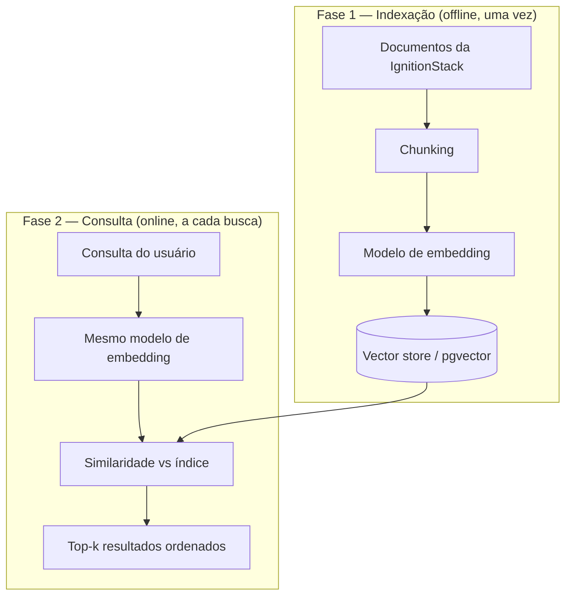
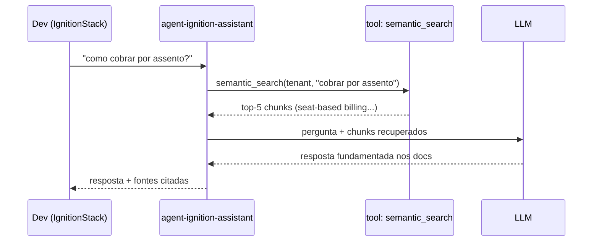

> Um embedding é a tradução de um texto em um ponto no espaço. Textos com significados próximos viram pontos próximos — e "próximo" passa a ser uma conta de geometria, não uma busca por palavra exata.

**TL;DR:** Embeddings convertem texto em vetores; buscar por similaridade entre esses vetores é buscar por significado. É a fundação técnica do RAG, da memória e de quase toda recuperação que alimenta um agente.

Aqui começa a **Parte II — AI Native em Produção**. Até o Capítulo 10 o fio condutor foi um CRUD de Pedidos — um exemplo de ensino, deliberadamente simples. Agora subimos o nível: o caso de estudo passa a ser um produto real rodando em produção, a **IgnitionStack** ([ignitionstack.pro](https://www.ignitionstack.pro/pt)) — uma plataforma SaaS multi-tenant (autenticação, billing com Stripe, workspaces, convites, dashboard) onde a IA não é demo, é parte do fluxo de desenvolvimento. O domínio `order` dos capítulos anteriores é só uma das features que vivem dentro dela.

## Primeiro, o embedding em ação

Um desenvolvedor da IgnitionStack abre o assistente interno e digita:

```text
> como faço pra cobrar por assento em vez de por workspace?
```

A documentação interna nunca usou a palavra "assento". O termo lá dentro é **seat-based billing**, e o trecho relevante fala em "cobrança por usuário ativo no workspace". Uma busca por palavra-chave (`LIKE '%assento%'`) retornaria **zero resultados**. Mesmo assim, o assistente devolve o documento certo:

```text
[busca semântica]
  consulta: "cobrar por assento em vez de por workspace"
  → doc 0.89  billing/seat-based.md      "cobrança por usuário ativo..."
  → doc 0.81  billing/stripe-metered.md  "Stripe usage records por seat"
  → doc 0.62  workspaces/limits.md        "limite de membros por plano"
```

O número ao lado de cada documento é a **similaridade**. O sistema não procurou a palavra — procurou o *significado*. "Assento", "seat" e "usuário ativo" caem perto no espaço vetorial porque o modelo aprendeu que descrevem a mesma ideia. Essa é a mágica que vamos abrir.

## O que é um embedding

> Um **embedding** é um vetor de números (tipicamente 256 a 3072 dimensões) que representa o significado de um texto. Um modelo de embedding é treinado para que textos semanticamente próximos produzam vetores próximos no espaço.

Pense em cada texto como um ponto num espaço de centenas de dimensões. Você não consegue visualizar 1024 eixos, mas a intuição em 2D vale:

```text
        ▲ (eixo "dinheiro")
        │   • "seat-based billing"
        │  • "cobrar por assento"
        │       • "usage records Stripe"
        │
        │                    • "convidar membro"
        │                   • "enviar convite"
        └───────────────────────────────► (eixo "membros")
```

"Cobrar por assento" e "seat-based billing" ficam colados; "enviar convite" fica num bairro diferente. O modelo de embedding aprendeu essa geometria lendo bilhões de textos. Você não programa as regras — você herda o significado destilado no treino.

### Como se mede "próximo": cosine similarity

A métrica padrão é a **similaridade do cosseno** — o cosseno do ângulo entre dois vetores:

```text
cosine(A, B) = (A · B) / (‖A‖ · ‖B‖)

  =  1  → mesma direção  (significado quase idêntico)
  =  0  → perpendicular  (sem relação)
  = -1  → oposto
```

Usamos o ângulo, não a distância em linha reta (euclidiana), porque o que importa é a **direção** do significado, não a magnitude do vetor. A maioria das APIs já devolve vetores normalizados (‖A‖ = 1), então o cosseno vira um simples produto escalar — barato de calcular para milhões de vetores.

## Como a busca semântica funciona por dentro

Há duas fases distintas, e confundi-las é a fonte de metade dos bugs:



Três decisões definem a qualidade:

1. **Chunking** — você não indexa um arquivo de 4.000 linhas inteiro. Quebra em pedaços (*chunks*) de algumas centenas de tokens. Chunk grande demais dilui o sinal (um vetor tenta representar cinco assuntos); pequeno demais perde contexto (um parágrafo sem o título que o explica). Estratégias comuns: tamanho fixo com *overlap* (sobreposição de ~10-15% para não cortar uma ideia ao meio), quebra por estrutura (por `##` no Markdown) ou *semantic chunking* (corta onde o assunto muda).
2. **Mesmo modelo nas duas fases** — o vetor da consulta e o vetor dos documentos **precisam** vir do mesmo modelo. Trocar o modelo de embedding invalida o índice inteiro: você terá de reindexar tudo. Isso tem custo real, e voltaremos a ele.
3. **Nearest neighbors** — achar os k vizinhos mais próximos. Comparar a consulta com *todos* os vetores (busca exata, *brute force*) é O(n) e não escala para milhões. Por isso usamos **ANN** (Approximate Nearest Neighbors) — índices como **HNSW** (grafo navegável) ou **IVF** (partições) que trocam um pouco de precisão por uma busca ordens de magnitude mais rápida.

### Na prática: indexar e buscar com pgvector

A IgnitionStack já roda Postgres. Em vez de adicionar um banco vetorial dedicado, ela usa a extensão `pgvector` — menos infraestrutura, transações junto com os dados de negócio:

```sql
-- Indexação: uma coluna de vetor + índice ANN
CREATE EXTENSION IF NOT EXISTS vector;

CREATE TABLE doc_chunks (
  id          bigserial PRIMARY KEY,
  tenant_id   uuid NOT NULL,          -- multi-tenancy: isolamento por tenant
  source      text NOT NULL,
  content     text NOT NULL,
  embedding   vector(1024)            -- dimensão do modelo escolhido
);

-- HNSW: busca aproximada rápida, ótima para leitura intensiva
CREATE INDEX ON doc_chunks USING hnsw (embedding vector_cosine_ops);
```

```typescript
// Consulta: embeddar a pergunta e buscar os k vizinhos — sempre com filtro de tenant
async function semanticSearch(tenantId: string, query: string, k = 5) {
  const [vector] = await embed([query]); // mesmo modelo da indexação

  // <=> é o operador de distância de cosseno do pgvector (menor = mais próximo)
  return sql`
    SELECT source, content, 1 - (embedding <=> ${vector}::vector) AS score
    FROM doc_chunks
    WHERE tenant_id = ${tenantId}
    ORDER BY embedding <=> ${vector}::vector
    LIMIT ${k}
  `;
}
```

Repare no `WHERE tenant_id` antes da ordenação por similaridade: num SaaS multi-tenant, **vazar o chunk de um tenant para outro é um incidente de segurança**, não um bug de relevância. O filtro de isolamento vem primeiro; a busca semântica opera dentro dele.

## Quando embeddings funcionam — e quando falham

Embeddings brilham em **significado difuso** e tropeiam em **precisão literal**. Saber a diferença evita escolher a ferramenta errada:

| Funciona bem | Falha ou atrapalha |
|--------------|--------------------|
| Sinônimos e paráfrases ("assento" ↔ "seat") | Identificadores exatos (`ERR_BILLING_4012`, um SKU, um UUID) |
| Perguntas em linguagem natural | Negação ("workspaces **sem** billing" pode vir perto de "com billing") |
| Conceitos relacionados | Números e datas precisas |
| Cross-lingual (PT ↔ EN) com bons modelos | Acrônimos ambíguos fora de contexto |

A lição de produção: **busca semântica e busca por palavra-chave são complementares, não rivais.** Para um código de erro, um `WHERE code = ...` continua imbatível. Sistemas maduros fazem *hybrid search* — combinam o ranking lexical (BM25) com o vetorial — e é por isso que o próximo capítulo, sobre RAG, trata reranking como peça de primeira classe.

## Custos e trade-offs

Embeddings parecem grátis até a conta chegar. Os eixos de custo:

- **Geração** — você paga por token embeddado, na indexação e em *toda* consulta. É barato por unidade (ordens de magnitude abaixo da geração de texto), mas reindexar 10 milhões de chunks não é de graça.
- **Armazenamento** — um vetor `float32` de 1024 dimensões ocupa ~4 KB. Multiplique por milhões de chunks e o índice supera os dados originais. *Quantização* (guardar em `int8` ou binário) corta isso a 1/4 ou menos, com perda pequena de precisão.
- **Dimensionalidade** — mais dimensões captam mais nuance, mas custam mais armazenamento, mais memória no índice e buscas mais lentas. Modelos modernos suportam *Matryoshka* (truncar o vetor para menos dimensões com degradação suave) — você escolhe o ponto na curva.
- **A bomba-relógio da reindexação** — trocar de modelo de embedding obriga a recomputar **todo** o índice. Versione qual modelo gerou cada vetor; trate uma migração de modelo como migração de banco.

## Conectando ao Agent

Volte ao Capítulo 05: o context é finito e "o que não entra na janela não existe para o modelo". Embeddings são o mecanismo que decide **o que entra**. O agente não carrega a base inteira — ele usa a busca semântica como uma *ferramenta* (no sentido do Capítulo 02): formula uma consulta, recupera os k chunks mais relevantes e injeta só eles no contexto antes de raciocinar.



É a mesma curadoria de contexto do Capítulo 05, agora automatizada por geometria. O `tools: [semantic_search]` no frontmatter de um agent é o que lhe dá memória de longo prazo sem estourar a janela. Esse padrão — recuperar antes de responder — tem nome próprio e é o assunto do próximo capítulo.

## Trade-offs e armadilhas

- **Chunk errado, busca errada.** A maior parte das falhas de relevância nasce no chunking, não no modelo. Comece com chunks de ~300-500 tokens e overlap, e ajuste medindo.
- **Dois modelos, índice quebrado.** Embeddar consulta e documentos com modelos diferentes produz lixo silencioso — sem erro, só resultados ruins. Centralize a função `embed()`.
- **Semântica não é exatidão.** Não use embedding para buscar um UUID ou um valor de fatura. Para isso existe o `WHERE`.
- **Multi-tenancy não é opcional no filtro.** Sempre isole por `tenant_id` *antes* da similaridade. Relevância nunca justifica vazamento de dados.
- **Esquecer a freshness.** Um índice é uma foto do passado. Documento mudou e não foi reindexado? O agente responde com a versão velha, confiante. Reindexação incremental é parte do design, não um extra.

### Como saber se você entendeu

Você dominou este capítulo se consegue:

- explicar por que "assento" encontra "seat-based billing" sem nenhuma palavra em comum;
- justificar por que consulta e documentos exigem o mesmo modelo de embedding;
- decidir, para um caso dado, entre busca semântica, busca por palavra-chave ou híbrida.

## Fontes

- OpenAI — "New embedding models and API updates" (dimensões, Matryoshka, custo): https://openai.com/index/new-embedding-models-and-api-updates/
- pgvector — extensão de vetores para Postgres (HNSW, IVFFlat, operadores): https://github.com/pgvector/pgvector
- Malkov & Yashunin, "Efficient and robust approximate nearest neighbor search using HNSW" (2018): https://arxiv.org/abs/1603.09320
- Anthropic — "Effective context engineering for AI agents" (recuperação como curadoria de contexto): https://www.anthropic.com/engineering/effective-context-engineering-for-ai-agents

## Síntese

Um embedding transforma significado em geometria: textos próximos viram vetores próximos, e buscar por cosseno é buscar por sentido. Com chunking cuidadoso, o mesmo modelo nas duas pontas e um índice ANN, a IgnitionStack acha o documento certo mesmo quando o usuário usa outra palavra. Mas recuperar é só o primeiro passo — o agente ainda precisa *usar* o que recuperou para responder sem alucinar.

Próximo: [Capítulo 12 — RAG](/ebook-ai-native-developer/12-rag/).
