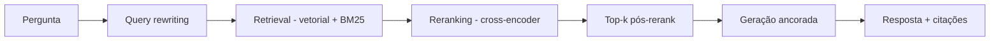
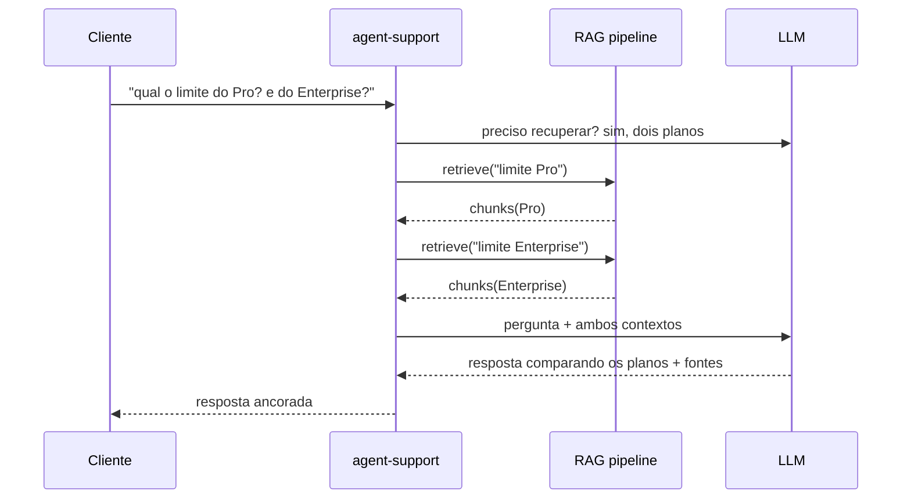

> RAG é dar ao modelo a fonte antes de pedir a resposta. Em vez de confiar no que ele "lembra" do treino, você recupera o trecho certo e manda junto com a pergunta.

**TL;DR:** RAG (Retrieval Augmented Generation) recupera conhecimento externo relevante e o injeta no contexto antes da geração. Resolve três problemas que o modelo sozinho não resolve: conhecimento privado, conhecimento atual e respostas citáveis.

No capítulo anterior demos ao agente a capacidade de *encontrar* o documento certo por significado. RAG é o que ele faz com esse documento: usá-lo como base de verdade para gerar a resposta. É a diferença entre um modelo que *acha* que sabe e um agente que *mostra de onde tirou*.

## Primeiro, o RAG em ação

Um cliente da IgnitionStack abre o chat de suporte:

```text
> qual o limite de workspaces no plano Pro?
```

Esse número não está nos pesos do modelo — ele mudou na semana passada, é específico da IgnitionStack, e varia por plano. Um LLM puro faria a pior coisa possível: **inventaria um número plausível**. Com RAG, o fluxo é outro:

```text
[1. retrieval]  busca "limite de workspaces plano Pro"
   → billing/plans.md#pro   "Pro: até 10 workspaces, 25 seats"   (0.91)
   → billing/limits.md      "limites são soft, com overage..."    (0.74)

[2. augment]    monta o prompt:
   "Contexto: <plans.md#pro + limits.md>. Pergunta: qual o limite..."

[3. generate]   LLM responde SÓ com base no contexto:
   "No plano Pro são até 10 workspaces (e 25 seats). Acima disso há
    cobrança de overage. Fonte: billing/plans.md."
```

Três etapas: **recuperar, aumentar, gerar**. O modelo deixou de ser a fonte da verdade e virou o *redator* de uma verdade que você forneceu. E entregou a fonte junto — auditável.

## O que é RAG

> **RAG** é um padrão que, antes de gerar uma resposta, recupera trechos relevantes de uma base de conhecimento externa e os adiciona ao contexto do modelo. A geração fica *ancorada* (grounded) nesses trechos, não apenas na memória paramétrica do treino.

A motivação é direta. Um LLM tem três limitações estruturais que RAG ataca:

- **Não conhece seus dados privados.** Os docs internos, as decisões de arquitetura e o changelog da IgnitionStack nunca estiveram no treino.
- **Está congelado no tempo.** O modelo tem um *cutoff* de conhecimento. O preço que você mudou ontem ele desconhece.
- **Não cita fontes.** Sem RAG, você não tem como saber se a resposta veio de um fato ou de uma alucinação confiante.

### "Mas e o contexto infinito?"

A objeção óbvia: se as janelas de contexto crescem (centenas de milhares de tokens), por que não jogar a base inteira no prompt e pular o retrieval? Porque contexto grande não é contexto de graça:

- **Custo.** Você paga por token de entrada em *toda* chamada. Despejar 200k tokens de docs para responder uma pergunta de uma linha é desperdício multiplicado por cada request.
- **Latência.** Quanto mais contexto, mais lenta a resposta. O usuário do suporte não espera 30 segundos.
- **Lost in the middle (Cap. 05).** O modelo aproveita mal a informação enterrada no meio de um contexto gigante. Cinco chunks certos batem cinquenta documentos despejados.
- **Freshness.** Mesmo com janela enorme, alguém precisa decidir *qual* versão dos docs entra. Esse alguém é o retrieval.

Contexto infinito muda o teto, não a disciplina. RAG continua sendo a forma de colocar **o sinal certo** na janela.

## Como o pipeline RAG funciona por dentro

RAG de produção raramente é "buscar e responder". A qualidade vem das etapas entre o retrieval bruto e a geração:



- **Query rewriting.** A pergunta do usuário ("e pra quem tá no plano de cima?") muitas vezes é vaga ou depende do histórico. Reescrevê-la numa consulta autônoma ("limite de workspaces no plano Enterprise") melhora o retrieval antes mesmo de buscar.
- **Retrieval híbrido.** Combinar busca vetorial (significado, Cap. 11) com lexical/BM25 (termos exatos como `Pro`, `Enterprise`). Um pega paráfrase, o outro pega o identificador. Juntos cobrem mais.
- **Ranking e reranking.** O retrieval traz, digamos, os 20 candidatos mais próximos — rápido, mas grosseiro. O *reranker* (um *cross-encoder* que lê pergunta e candidato **juntos**) reordena esses 20 e fica com os 5 melhores. É mais caro por par, mas roda sobre poucos candidatos, e é o que mais eleva a precisão final.
- **Geração ancorada.** O prompt instrui explicitamente: "responda **apenas** com base no contexto; se não estiver lá, diga que não sabe". Isso é o que transforma retrieval em resposta confiável.

### Freshness: o índice é uma foto, o produto é um filme

A armadilha silenciosa do RAG é o índice velho. O time da IgnitionStack muda um preço, atualiza um doc, lança um changelog — e o agente continua respondendo com a versão indexada na semana passada, com toda a confiança. Estratégias de produção:

- **Reindexação incremental** disparada por evento (doc salvo → reembedda só aquele chunk), não um *rebuild* noturno do índice inteiro.
- **Metadados de validade** (`updated_at`, `version`) no chunk, para filtrar ou priorizar o mais recente.
- **Invalidção em mudanças críticas** — alterou tabela de preços? O changelog e os docs de billing reindexam na hora.

```typescript
// RAG mínimo de produção: rewrite → retrieve híbrido → rerank → gerar ancorado
async function answer(tenantId: string, question: string) {
  const query = await rewriteQuery(question);          // consulta autônoma
  const candidates = await hybridSearch(tenantId, query, 20); // vetorial + BM25
  const top = await rerank(query, candidates, 5);      // cross-encoder
  const context = top.map((c) => `[${c.source}] ${c.content}`).join("\n\n");

  return generate({
    system:
      "Responda apenas com base no CONTEXTO. " +
      "Se a resposta não estiver nele, diga que não encontrou. Cite a fonte.",
    user: `CONTEXTO:\n${context}\n\nPERGUNTA: ${question}`,
  });
}
```

## RAG vs Fine-Tuning vs Prompt Engineering

Estas três técnicas resolvem problemas diferentes e são frequentemente confundidas. A regra prática: **prompt primeiro, RAG para conhecimento, fine-tuning para comportamento.**

| Critério | Prompt Engineering | RAG | Fine-Tuning |
|----------|--------------------|-----|-------------|
| O que ajusta | A instrução | O conhecimento disponível | Os pesos do modelo |
| Bom para | Formato, tom, raciocínio | Fatos privados e atuais | Estilo/comportamento consistente |
| Atualização | Instantânea (edita texto) | Reindexar (minutos) | Re-treinar (horas/dias + custo) |
| Cita fontes | Não | **Sim** | Não |
| Custo de mudança | ~Zero | Baixo | Alto |
| Risco | Frágil a variações | Retrieval ruim → resposta ruim | *Overfitting*, conhecimento congelado |

Para a IgnitionStack, "qual o limite do plano Pro" é trabalho de **RAG** (fato que muda). "Responda sempre em tom de suporte calmo e em PT-BR" é trabalho de **prompt** — e, se precisar ser absolutamente consistente em escala, de **fine-tuning**. Não são rivais; bons sistemas usam as três em camadas.

## Conectando ao Agent

No Capítulo 11, o retrieval era uma ferramenta que o agente chamava. RAG eleva isso a um *padrão de raciocínio*: o agente decide **se**, **o que** e **quando** recuperar — o chamado *agentic RAG*.



A diferença para um RAG "burro" (sempre busca uma vez): o agente pode **decompor** a pergunta, recuperar em rodadas, perceber que o retrieval voltou fraco e reformular a consulta. Isso reaproveita exatamente o loop do harness (Cap. 02) — pensar → usar ferramenta → observar → pensar de novo — só que a ferramenta é o retrieval. RAG, no fim, é context engineering (Cap. 05) com uma fonte externa.

## Trade-offs e armadilhas

- **Garbage in, garbage out.** RAG não conserta uma base ruim. Doc desatualizado ou errado indexado vira resposta errada com aparência de fonte confiável.
- **Reranking é o maior ganho por real gasto.** Pular o reranker é o erro mais comum; o retrieval bruto traz o relevante *e* o quase-relevante misturados.
- **"Responda só pelo contexto" precisa estar no prompt.** Sem essa âncora explícita, o modelo volta a misturar memória paramétrica e alucina por baixo do RAG.
- **Citações importam.** Sem fonte, você não consegue auditar nem o usuário consegue confiar. Faça o agente citar o `source` de cada afirmação.
- **Freshness é uma feature, não um cron.** Trate reindexação como parte do fluxo de publicação de conteúdo, não como manutenção esquecida.

### Como saber se você entendeu

Você dominou este capítulo se consegue:

- explicar por que contexto infinito não substitui retrieval;
- ordenar as etapas rewrite → retrieve → rerank → generate e dizer o que cada uma resolve;
- escolher entre prompt, RAG e fine-tuning para um requisito dado.

## Fontes

- Lewis et al., "Retrieval-Augmented Generation for Knowledge-Intensive NLP Tasks" (2020) — o paper que nomeou RAG: https://arxiv.org/abs/2005.11401
- Anthropic — "Contextual Retrieval" (melhorando precisão de retrieval com contexto nos chunks): https://www.anthropic.com/news/contextual-retrieval
- Cohere — Rerank (cross-encoder para reordenação de resultados): https://docs.cohere.com/docs/rerank-overview
- Liu et al., "Lost in the Middle" (por que despejar contexto não basta): https://arxiv.org/abs/2307.03172

## Síntese

RAG é a ponte entre o que o modelo aprendeu e o que a IgnitionStack precisa que ele saiba *agora*: recupera o trecho certo, ancora a geração nele e devolve a resposta com fonte. Com query rewriting, retrieval híbrido e reranking, a precisão sobe; com reindexação incremental, a resposta não envelhece. Mas tanto embeddings quanto RAG são memória de *fatos*. Falta a memória do *relacionamento* — o que o agente lembra de você, deste tenant, desta conversa.

Próximo: [Capítulo 13 — Memory](/ebook-ai-native-developer/13-memory/).
