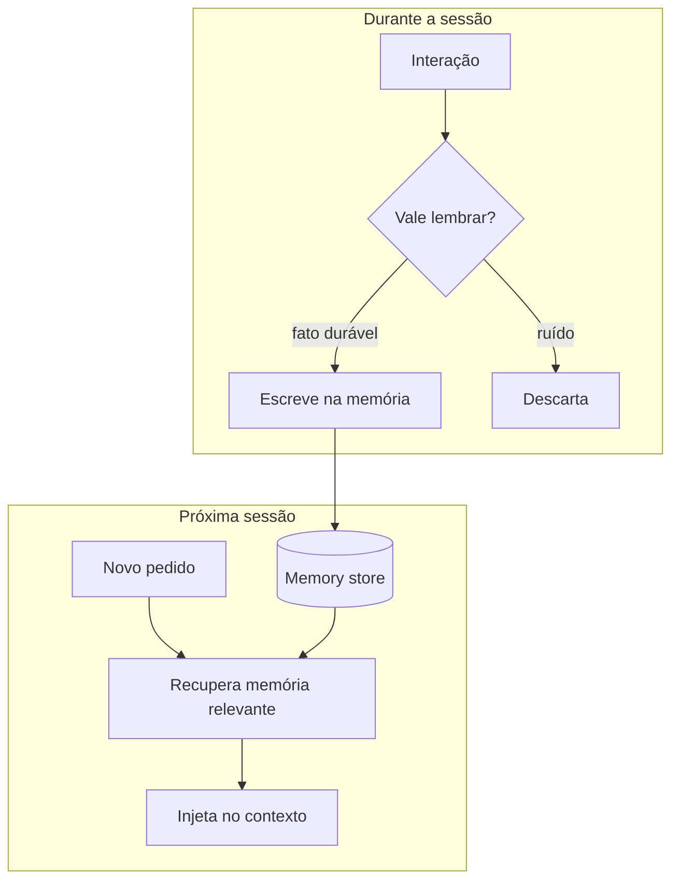
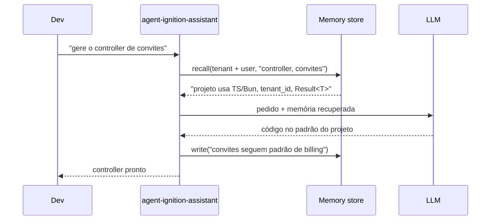

> O modelo não tem memória. Cada chamada começa do zero. Tudo que parece "lembrança" é, na verdade, alguém recolocando a informação certa de volta na janela de contexto.

**TL;DR:** Memory é a disciplina de persistir o que importa entre chamadas e sessões — e descartar o resto. Sem ela, todo agente é amnésico; com ela mal feita, vira um risco de privacidade e um buraco de custo.

Embeddings e RAG (Caps. 11-12) deram ao agente memória de *fatos do mundo*. Falta a memória do *relacionamento*: o que este tenant configurou, o que este usuário prefere, o que ficou decidido na conversa de ontem. É isso que transforma uma ferramenta que responde perguntas num assistente que conhece você.

## Primeiro, a memória em ação

Compare duas sessões com o assistente de desenvolvimento da IgnitionStack, com uma semana de intervalo.

**Sem memória** — toda sessão recomeça do zero:

```text
Segunda:
> gere o controller de billing
< Em qual linguagem? Qual framework? Como vocês tratam multi-tenancy?

Sexta (mesma pessoa, mesmo projeto):
> gere o controller de convites
< Em qual linguagem? Qual framework? Como vocês tratam multi-tenancy?
```

**Com memória** — o que foi estabelecido persiste:

```text
Segunda:
> gere o controller de billing
< [recupera memória do projeto: TS + Bun.serve, multi-tenant por tenant_id,
   erros via Result<T>]
  Pronto, seguindo o padrão do tenant_id e Result<T> do projeto.

Sexta:
> gere o controller de convites
< Mesmo padrão de billing (tenant_id, Result<T>). Aqui está.
```

A diferença não é inteligência — é **persistência**. Na segunda interação o agente não perguntou de novo porque o fato "este projeto usa TS, Bun e tenant_id" foi *lembrado*. A pergunta de engenharia é: lembrado **onde**, por **quanto tempo**, e **com qual consentimento**.

## O que é memória em sistemas de IA

> **Memória** é qualquer mecanismo que reintroduz informação relevante no contexto do modelo ao longo do tempo, já que o modelo em si é *stateless* entre chamadas.

A memória de trabalho do Capítulo 05 (a janela) é volátil: acabou a chamada, sumiu. Memória, neste capítulo, é o que sobrevive a isso. Ela se divide em tipos com propósitos distintos:

| Tipo | O que guarda | Exemplo na IgnitionStack | Tempo de vida |
|------|--------------|--------------------------|---------------|
| **Short-term** | A conversa atual | o que você pediu há 3 mensagens | a sessão |
| **Long-term** | Fatos persistentes | "este projeto usa Bun + tenant_id" | indefinido |
| **Episodic** | Eventos e interações passadas | "na sessão de 02/06 decidimos optimistic locking" | longo, com decay |
| **Semantic** | Conhecimento generalizado | "padrões de billing recorrentes deste time" | longo |
| **User memory** | Preferências da pessoa | "responde em PT-BR, prefere código comentado" | indefinido |

Repare que **episodic** e **semantic** se relacionam como o diário e o aprendizado: a memória episódica guarda *o que aconteceu* (eventos brutos); a semântica destila *o que isso ensina* (padrões). Consolidar episódios em conhecimento semântico — e jogar fora os episódios crus — é como a memória escala sem inchar.

## Como a memória funciona por dentro

Memória não é um campo mágico — é um *loop de escrita e leitura* em volta do agente, e a parte difícil não é guardar, é **decidir o que guardar e o que recuperar**.



Três planos de memória que a IgnitionStack mantém separados — porque misturá-los é erro de design e de privacidade:

1. **Memória de usuário** — preferências da pessoa. Atravessa projetos, pertence ao indivíduo. ("prefere PT-BR, código comentado.")
2. **Memória de projeto/tenant** — convenções e decisões daquele workspace. Atravessa sessões, pertence ao tenant. ("padrão tenant_id, Result<T>, Postgres.")
3. **Memória do agente** — o que o próprio agente aprendeu a fazer melhor (padrões que funcionam, armadilhas recorrentes).

No Claude Code você já viu o plano de projeto na prática: o `CLAUDE.md` é memória de projeto carregada em toda sessão (Cap. 05), e arquivos de memória dedicados guardam fatos de longo prazo. O mesmo princípio, generalizado, vale para qualquer produto de IA.

### O que lembrar e o que esquecer

Memória sem critério de esquecimento é um vazamento — de tokens, de custo e de privacidade. As heurísticas que importam:

- **Salience (relevância).** Guarde decisões e fatos duráveis ("usamos optimistic locking"), não trivialidades transitórias ("rode o teste agora").
- **Decay (decaimento).** Memórias episódicas perdem peso com o tempo, a menos que reforçadas. O que não é reusado, envelhece e some.
- **Consolidação.** Periodicamente, resuma muitos episódios em poucos fatos semânticos. Dez sessões dizendo "ele sempre quer testes" viram uma preferência ("escreve testes por padrão").
- **Esquecimento ativo.** Algumas coisas devem ser apagadas *por obrigação*, não por economia — e aqui entra a lei.

```typescript
// Escrita seletiva: nem toda interação merece virar memória
async function maybeRemember(scope: MemoryScope, turn: Turn) {
  const fact = await extractDurableFact(turn); // null se for ruído transitório
  if (!fact) return;

  await memory.write({
    scope,                 // 'user' | 'tenant' | 'agent' — nunca misturados
    tenantId: turn.tenantId,
    content: fact.text,
    embedding: await embed([fact.text]),  // recuperável por significado (Cap. 11)
    salience: fact.salience,
    expiresAt: fact.ttl,                   // decay explícito
    containsPII: fact.pii,                 // marca para política de privacidade
  });
}
```

## Privacidade, LGPD e custo

Memória é dado pessoal acumulado ao longo do tempo — o terreno exato onde a **LGPD** (Lei Geral de Proteção de Dados) morde. Num SaaS multi-tenant, não é detalhe jurídico, é requisito de arquitetura:

- **Finalidade e consentimento.** Você só pode reter o que tem base legal para reter. "Lembrar para ajudar" não autoriza guardar dado sensível indefinidamente. Memória de usuário precisa de opção de *opt-out*.
- **Direito ao esquecimento.** O usuário pode exigir exclusão. Sua memória precisa de um botão de *delete* real — incluindo os vetores no índice, não só a linha original.
- **Isolamento entre tenants.** Memória do tenant A jamais pode vazar para o B. O `scope` + `tenant_id` do exemplo acima é a fronteira; um recall sem esse filtro é incidente de segurança, igual ao do Capítulo 11.
- **PII no contexto.** Marcar `containsPII` permite redigir ou excluir seletivamente, e evita mandar dado sensível para logs ou para um modelo externo sem necessidade.
- **Custo.** Memória cresce para sempre se você deixar. Cada fato é armazenamento + embedding + tokens de contexto a cada recall. Consolidação e TTL não são só higiene — são controle de custo (assunto do Cap. 17).

## Conectando ao Agent

Lembre da frase do Capítulo 05: *"o agent é, em boa parte, uma decisão de context engineering congelada em um arquivo."* Memória é a versão **dinâmica** disso. O system prompt é a memória estática do agente (sempre presente); o memory store é a memória dinâmica (recuperada conforme a relevância).



O loop fecha: o agente **lê** memória antes de agir e **escreve** memória depois de aprender algo durável. É o mesmo mecanismo do RAG (Cap. 12), mas a fonte é o histórico do relacionamento, não a base de documentos. Tecnicamente, memória *é* RAG aplicado à sua própria interação.

## Trade-offs e armadilhas

- **Lembrar de tudo é não lembrar de nada.** Memória sem curadoria infla o contexto com ruído e degrada a resposta (lost in the middle, Cap. 05). Escreva seletivamente.
- **Memória errada é pior que ausência.** Um fato obsoleto guardado como verdade ("o projeto usa REST" quando migrou para gRPC) faz o agente errar com confiança. Memória precisa de atualização e invalidação.
- **Misturar escopos vaza dados.** Preferência de usuário ≠ convenção de tenant ≠ aprendizado do agente. Separe na origem; um recall que cruza escopos é bug ou incidente.
- **Esquecer o esquecimento.** Sem TTL e sem delete real, você viola LGPD e acumula custo silenciosamente.
- **Memória implícita engana o usuário.** Se o agente "lembra" algo, deixe rastreável de onde veio — como nas citações do RAG. Memória opaca destrói confiança.

### Como saber se você entendeu

Você dominou este capítulo se consegue:

- distinguir short-term, long-term, episodic, semantic e user memory com um exemplo de cada;
- explicar por que consolidação e decay são necessários, não opcionais;
- desenhar como o direito ao esquecimento (LGPD) se implementa num memory store com embeddings.

## Fontes

- Anthropic — Memory tool e gerenciamento de memória de agentes: https://docs.anthropic.com/en/docs/build-with-claude/tool-use/memory-tool
- Claude Code — memória (`CLAUDE.md`, memória de projeto e de usuário): https://code.claude.com/docs/en/memory
- Park et al., "Generative Agents: Interactive Simulacra of Human Behavior" (2023) — memória episódica, reflexão e recuperação por relevância: https://arxiv.org/abs/2304.03442
- ANPD — Lei Geral de Proteção de Dados (LGPD), texto e guias: https://www.gov.br/anpd/pt-br

## Síntese

O modelo é amnésico; memória é o que reintroduz o passado relevante no presente. Separada por escopo (usuário, tenant, agente), curada por salience e decay, e governada por LGPD, ela transforma uma ferramenta de perguntas num assistente que conhece o contexto do relacionamento. Mas tudo que vimos até aqui — recuperar, lembrar, responder — produz *texto*. Para o agente *agir* no produto (criar um workspace, provisionar um plano), o texto não basta: ele precisa emitir dados estruturados e chamar ferramentas.

Próximo: [Capítulo 14 — Structured Outputs & Tool Calling](/ebook-ai-native-developer/14-tool-calling/).
