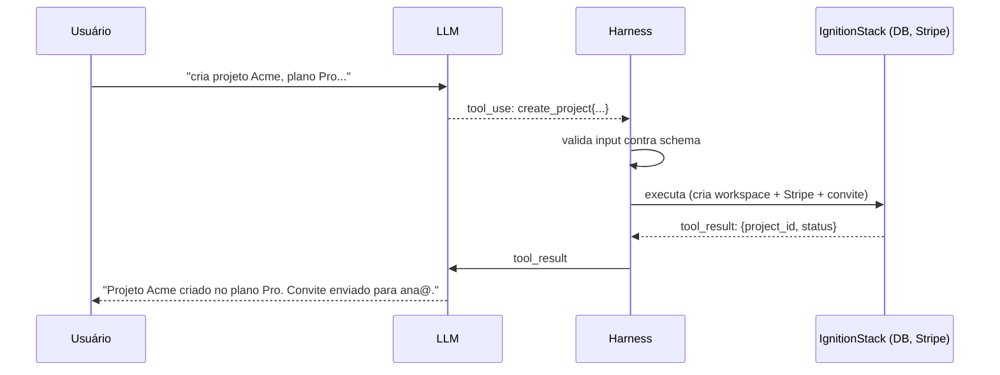
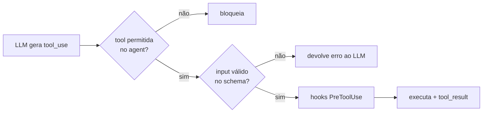

> Texto livre é ótimo para humanos lerem e péssimo para máquinas executarem. Structured outputs e tool calling são como o modelo deixa de *descrever* uma ação e passa a *disparar* uma.

**TL;DR:** Structured outputs forçam o modelo a responder num formato validável (JSON Schema); tool calling deixa o modelo invocar funções do seu sistema. Juntos, são a ponte entre a linguagem e a execução — e o ponto onde a confiabilidade de um produto de IA se decide.

Os capítulos anteriores produziram *texto*: respostas, fatos recuperados, memórias. Mas a IgnitionStack não vende texto — ela provisiona workspaces, cria produtos no Stripe, gera código. Para o agente *fazer* essas coisas, a saída precisa ser uma instrução estruturada que o sistema executa sem adivinhar.

## Primeiro, o tool calling em ação

Um usuário no onboarding da IgnitionStack digita, em linguagem natural:

```text
> cria um projeto SaaS chamado Acme, plano Pro, billing mensal, e já convida
  ana@acme.com como admin
```

Um LLM "normal" responderia com um texto: *"Claro! Para criar o projeto Acme..."* — bonito e **inútil** para automação. Com tool calling, o modelo emite uma chamada de ferramenta estruturada que o sistema executa de fato:

```json
{
  "tool": "create_project",
  "input": {
    "name": "Acme",
    "plan": "pro",
    "billing_cycle": "monthly",
    "invites": [{ "email": "ana@acme.com", "role": "admin" }]
  }
}
```

O harness (Cap. 02) recebe esse JSON, **valida** contra um schema, e só então executa: cria o workspace, registra o produto no Stripe, dispara o convite. A linguagem natural virou uma transação. E porque a saída é estruturada, ela é *determinística de consumir*: o código que provisiona não precisa interpretar prosa.

## Os três níveis de estrutura

Há um espectro de quão "amarrada" é a saída do modelo, e escolher o nível certo é uma decisão de engenharia:

| Nível | O que é | Quando usar | Risco |
|-------|---------|-------------|-------|
| **Texto livre** | String sem garantia de forma | resposta para humano ler | impossível de parsear com confiança |
| **JSON estruturado** | Saída conforme um JSON Schema | extrair dados, preencher formulário | schema fraco → campos faltando |
| **Tool calling** | Modelo escolhe e chama uma função | executar ações, orquestrar | chamar ferramenta errada / demais |

A diferença entre os dois últimos: **structured output** garante o *formato* da resposta (você quer um objeto com estes campos); **tool calling** dá ao modelo *agência* para decidir qual função invocar e com quais argumentos. Todo tool call é structured output por baixo (os argumentos seguem um schema), mas nem todo structured output é uma ação.

### JSON Schema é o contrato

O que torna a saída confiável não é pedir "responda em JSON" — é declarar um **JSON Schema** e fazer o modelo aderir a ele. O schema é o contrato:

```typescript
// O contrato da ferramenta. enums e required são o que evitam alucinação de campo.
const createProjectTool = {
  name: "create_project",
  description:
    "Cria um novo projeto SaaS na IgnitionStack. Use quando o usuário " +
    "pede para criar/provisionar um workspace ou produto.",
  input_schema: {
    type: "object",
    properties: {
      name: { type: "string", minLength: 1, maxLength: 80 },
      plan: { type: "string", enum: ["free", "pro", "enterprise"] }, // fechado!
      billing_cycle: { type: "string", enum: ["monthly", "yearly"] },
      invites: {
        type: "array",
        items: {
          type: "object",
          properties: {
            email: { type: "string", format: "email" },
            role: { type: "string", enum: ["admin", "member", "viewer"] },
          },
          required: ["email", "role"],
        },
      },
    },
    required: ["name", "plan", "billing_cycle"],
  },
} as const;
```

Os `enum` são o detalhe que separa um sistema robusto de um frágil. Sem eles, o modelo pode inventar `plan: "premium"` — um plano que não existe. Com o enum fechado, `"premium"` é impossível de gerar. **Você restringe o espaço de saída no schema, não numa validação depois.**

## Como funciona por dentro

Tool calling não é o modelo executando código — é uma negociação em rodadas entre modelo e harness:



Pontos cruciais:

1. **O modelo nunca toca o sistema.** Ele *pede* uma ferramenta; o harness decide se executa. Essa indireção é onde entram permissões, validação e os hooks do Capítulo 07 — sua camada de segurança.
2. **O resultado volta para o modelo.** Depois de executar, o `tool_result` (sucesso, ID gerado, ou erro) retorna ao contexto, e o modelo continua o raciocínio. É o loop do harness (Cap. 02) de novo, agora com ferramentas que mudam o mundo.
3. **Validação é obrigatória, não opcional.** Mesmo com schema, valide o input antes de executar. O modelo erra; o schema reduz a chance, a validação garante a regra.

### Determinismo: o que dá e o que não dá para garantir

Aqui está a verdade honesta que muitos produtos ignoram: **o LLM é não-determinístico, mas o consumo da saída pode ser determinístico.** Você não controla *se* o modelo vai chamar `create_project` numa borda ambígua — controla que, *se* chamar, o input estará conforme o schema ou será rejeitado. O determinismo mora na fronteira (schema + validação + idempotência), não no miolo (a geração).

Por isso ações que mudam estado precisam de **idempotência**: se o modelo, por algum motivo, emitir `create_project` duas vezes, uma chave de idempotência evita criar dois workspaces Acme.

```typescript
// A fronteira determinística: valida → idempotência → executa
async function runTool(call: ToolCall, ctx: Ctx) {
  const input = validate(createProjectTool.input_schema, call.input); // lança se inválido
  return withIdempotencyKey(call.id, () => createProject(ctx.tenantId, input));
}
```

## Falhas reais e como mitigar

Tool calling falha de formas específicas. As que mais aparecem em produção na IgnitionStack — e a mitigação de cada uma:

| Falha | Sintoma | Mitigação |
|-------|---------|-----------|
| **Campo alucinado** | `plan: "premium"` (não existe) | `enum` fechado no schema |
| **Argumento faltando** | sem `billing_cycle` | `required` + validação que rejeita e pede de novo |
| **JSON malformado** | string cortada, vírgula sobrando | structured outputs nativos (constrained decoding), não regex |
| **Over-calling** | chama 5 ferramentas quando 1 bastava | `description` precisa de *quando* usar; instrução de parcimônia |
| **Wrong tool** | usa `delete_project` em vez de `archive` | descriptions distintas e exemplos; nomes sem ambiguidade |
| **Ação dupla** | cria dois workspaces | idempotência por `call.id` |

A mitigação transversal: **trate o erro de validação como um turno a mais, não como crash.** Devolva ao modelo "faltou `billing_cycle`, escolha entre monthly/yearly" e deixe-o corrigir. O loop do harness foi feito exatamente para isso.

## Conectando ao Harness e ao Agent

Tool calling é onde o agent (Cap. 03) e o harness (Cap. 02) se encontram de forma mais concreta. Releia o frontmatter do agente:

```yaml
tools: Read, Grep, Glob   # o que o agent PODE pedir
```

Esse campo é, precisamente, **a lista de ferramentas que o modelo pode emitir como tool calls**. Restringir `tools` (princípio do menor privilégio do Cap. 03) é restringir quais funções o modelo consegue invocar — não importa o que ele "queira". O harness é o porteiro: recebe o tool call, confere se está na lista permitida, valida o input contra o schema, aplica hooks, e só então executa.



Em uma frase: **structured outputs dão forma ao que o modelo diz; tool calling dá ação ao que o agent faz; o harness garante que essa ação seja segura, validada e reversível.** É a tríade que transforma um chat num produto.

## Trade-offs e armadilhas

- **Schema fraco é a raiz de quase toda falha.** Campos sem `enum`, sem `required`, sem limites — cada folga é uma alucinação possível. Aperte o schema antes de culpar o modelo.
- **Validar não é opcional, mesmo com structured outputs.** O modo nativo reduz JSON inválido, não elimina regra de negócio. Valide sempre na fronteira.
- **Ações que mudam estado exigem idempotência.** Sem ela, um retry vira um efeito colateral duplicado.
- **`description` da ferramenta é tão importante quanto a do agent.** É o que o modelo lê para decidir *quando* chamar. Vago → over-calling ou wrong tool.
- **Não dê `delete`/`charge` de graça.** Ferramentas destrutivas ou que mexem em dinheiro merecem confirmação humana ou hook de aprovação. O Stripe não tem "ctrl+Z".

### Como saber se você entendeu

Você dominou este capítulo se consegue:

- explicar a diferença entre texto livre, structured output e tool calling com um caso de uso de cada;
- mostrar por que `enum` e `required` no schema previnem classes inteiras de falha;
- localizar onde o determinismo é possível (fronteira) e onde não é (geração).

## Fontes

- Anthropic — Tool use (definição, `input_schema`, ciclo de tool_use/tool_result): https://docs.anthropic.com/en/docs/build-with-claude/tool-use
- OpenAI — Structured Outputs (constrained decoding, JSON Schema garantido): https://platform.openai.com/docs/guides/structured-outputs
- JSON Schema — especificação oficial (`enum`, `required`, `format`): https://json-schema.org/
- Anthropic — "Building effective agents" (ferramentas como interface agente↔mundo): https://www.anthropic.com/research/building-effective-agents

## Síntese

Structured outputs e tool calling são a fronteira onde a linguagem vira execução: o modelo emite JSON conforme um schema, o harness valida e executa, o resultado volta ao loop. Com `enum`, `required`, validação e idempotência, a IgnitionStack transforma "cria um projeto Acme" numa transação confiável — apesar de o modelo ser, por natureza, não-determinístico. Mas como você sabe que o agente chama a ferramenta *certa* na maioria das vezes? Como medir que a v2 não regrediu? Isso exige medição sistemática.

Próximo: [Capítulo 15 — Evals](/ebook-ai-native-developer/15-evals/).
