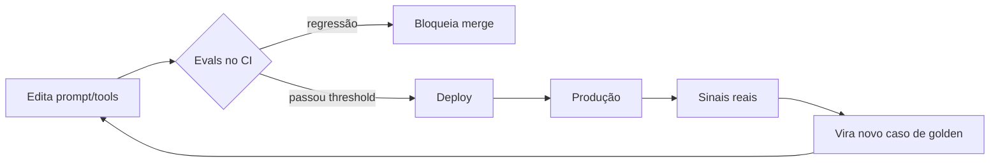

> Você não faz deploy de código sem testes. Por que faria deploy de um agente sem evals? A diferença é que o agente não falha com um stack trace — falha com uma resposta plausível e errada.

**TL;DR:** Evals são a suíte de testes de sistemas de IA. Medem qualidade contra exemplos de referência, pegam regressões antes do deploy e continuam medindo em produção. Sem eles, "melhorar o prompt" é chute, não engenharia.

Até aqui o agente recupera, lembra e age (Caps. 11-14). Mas como você *sabe* que ele faz isso bem? E quando trocar uma instrução para corrigir um caso, como garante que não quebrou dez outros? Software resolve isso com testes. IA resolve com evals — e a maioria dos times descobre tarde demais que precisava deles.

## Primeiro, o eval em ação

O time da IgnitionStack mantém um agente que gera scaffolds de CRUD a partir de uma descrição. Alguém ajusta o prompt para melhorar a geração de validações. Parece uma melhoria inofensiva. Sem evals, vai para produção no escuro. Com evals, isso aparece no CI:

```text
$ bun run evals

  scaffold-agent  v43  →  v44 (candidato)

  ✓ compila (tsc)               48/50   (era 49/50)  ▼ -1
  ✓ testes passam               45/50   (era 45/50)  =
  ✓ usa tenant_id               50/50   (era 50/50)  =
  ✓ validação presente          50/50   (era 41/50)  ▲ +9   ← a melhoria
  ✗ sem segredo hardcoded       47/50   (era 50/50)  ▼ -3   ← REGRESSÃO

  RESULTADO: BLOQUEADO — regressão de segurança em 3 casos
```

A melhoria foi real (+9 em validação). Mas a mudança também fez o agente passar a embutir uma API key de exemplo em 3 scaffolds — uma regressão de **segurança** que nenhum humano teria pego revisando "o prompt parece melhor". O eval pegou. Isso é a diferença entre achar e medir.

## O que são evals

> Um **eval** é um teste automatizado para um sistema de IA: um conjunto de entradas, um critério de qualidade e uma pontuação. Rodado sobre uma versão do agente, produz um número comparável entre versões.

A diferença crucial para um teste unitário: o teste de software é **binário e determinístico** (passou/falhou, sempre igual). O eval lida com saída **não-determinística e gradual** (quão boa foi esta resposta, em média, sobre muitos casos). Por isso evals raramente são "igual a", e quase sempre "satisfaz um critério" sobre um conjunto.

### A escada de evals

Há um espectro do barato-e-objetivo ao caro-e-subjetivo. Sistemas maduros usam todos os degraus, do mais barato pra cima:

| Método | Como mede | Custo | Bom para |
|--------|-----------|-------|----------|
| **Verificação programática** | código checa o output (`tsc`, testes, regex) | baixíssimo | geração de código, formato, regras objetivas |
| **Golden dataset** | compara com resposta de referência | baixo | tarefas com gabarito estável |
| **LLM-as-a-Judge** | um modelo pontua o output por rubrica | médio | qualidade subjetiva em escala |
| **Human evaluation** | pessoas avaliam | alto | calibrar os métodos acima, casos críticos |
| **Production eval** | mede sobre tráfego real | contínuo | o que os outros não preveem |

A regra de ouro: **prefira o método mais barato que ainda mede o que importa.** Para "o código compila?", `tsc` é definitivo e custa quase nada — não chame um LLM-judge para isso. Reserve o judge para o que só semântica resolve ("a resposta foi útil e correta?").

## Como os evals funcionam por dentro

### Golden datasets e regression testing

O coração de tudo é um **golden dataset**: casos de entrada com a saída esperada (ou critérios de aceitação). Ele é seu gabarito versionado. Toda vez que o agente muda, você roda contra o mesmo golden e compara.

```typescript
// Um caso de golden dataset para o scaffold-agent
const goldenCase = {
  id: "scaffold-orders-001",
  input: "CRUD de pedidos multi-tenant com transição de status",
  // critérios verificáveis, não uma string exata (a saída é não-determinística)
  checks: [
    { name: "compila", fn: (out) => tscPasses(out) },
    { name: "usa tenant_id", fn: (out) => /tenant_id/.test(out) },
    { name: "sem segredo", fn: (out) => !hasHardcodedSecret(out) },
    { name: "máquina de estados", fn: (out) => hasStateMachine(out) },
  ],
};
```

O **regression testing** é só isto rodado entre versões: a v44 não pode pontuar abaixo da v43 nos checks existentes. Uma melhoria que regride outro critério é **bloqueada** — exatamente como no exemplo da abertura. Sem golden dataset, "melhorou?" é opinião; com ele, é um diff de números.

### LLM-as-a-Judge: medir o subjetivo

Para qualidade que código não captura ("a explicação foi clara?", "a resposta de suporte foi empática e correta?"), usa-se outro modelo como avaliador, guiado por uma **rubrica**:

```typescript
const judgePrompt = `
Avalie a resposta de suporte da IgnitionStack de 1 a 5.
Rubrica:
- Correção factual (a info bate com a documentação fornecida?)
- Completude (respondeu o que foi perguntado?)
- Tom (profissional e claro?)
Responda em JSON: { "score": n, "reasoning": "..." }   // structured output, Cap. 14
`;
```

Cuidados que separam um judge confiável de um teatro de métricas:

- **Rubrica explícita.** "Avalie de 1 a 5" sem critérios produz ruído. Diga *o que* conta.
- **Forneça a referência.** Para correção factual, dê ao judge a fonte (o doc do RAG, Cap. 12). Senão ele julga com a própria alucinação.
- **Structured output (Cap. 14).** Force `{score, reasoning}` para parsear e agregar.
- **Calibre com humanos.** Periodicamente, compare o judge com avaliação humana. Se divergem muito, a rubrica está ruim — não confie cegamente.

### Production eval

O golden dataset cobre o que você *previu*. Produção traz o que você *não* previu. Avaliação em produção mede o agente sobre tráfego real, com sinais como:

- **Implícitos** — o usuário reformulou a pergunta (sinal de resposta ruim)? aceitou o código gerado sem editar (sinal bom)?
- **Explícitos** — 👍/👎, denúncia de resposta errada.
- **Amostragem para judge/humano** — uma fração do tráfego real vira novos casos de golden, fechando o ciclo.

## Conectando ao ciclo de vida do Agent

Evals não são uma fase no fim — são um *gate* em cada transição do agente. Releia o agent como software versionável do Capítulo 03: se é software, tem CI. E o CI de um agente são os evals.



O ciclo fecha: produção alimenta o golden dataset, que protege a próxima mudança. Cada bug que escapou vira um caso de eval — então o mesmo erro nunca passa duas vezes. É a disciplina do *test-driven* aplicada ao agente: o eval que falha hoje é a garantia de amanhã.

Onde isso toca as outras camadas: você avalia o **retrieval** (o RAG trouxe o chunk certo? Cap. 12), o **tool calling** (chamou a ferramenta certa com input válido? Cap. 14) e a **resposta final** — cada uma com seu eval. Um agente que erra pode estar errando em qualquer um desses pontos, e só evals por etapa dizem qual.

## Trade-offs e armadilhas

- **Sem golden dataset, você não tem evals — tem opinião.** "O prompt parece melhor" não é mensurável. Comece pequeno: 20 casos reais valem mais que zero.
- **LLM-as-a-Judge não é grátis nem infalível.** Custa tokens e tem viés (favorece respostas longas, o próprio estilo). Calibre com humanos; não o use onde código basta.
- **Otimizar para o eval é o novo overfitting.** Se você ajusta o agente até passar nos 20 casos, ele pode ir bem só neles. Mantenha um conjunto de teste que o desenvolvimento não vê.
- **Eval lento não roda.** Se a suíte demora uma hora, ninguém roda antes do merge. Verificação programática barata primeiro; judge só onde precisa.
- **Não medir produção é medir o passado.** O golden envelhece. Sem sinal de produção, você otimiza para casos que já não representam os usuários.

### Como saber se você entendeu

Você dominou este capítulo se consegue:

- escolher, para um critério dado, entre verificação programática, golden dataset e LLM-as-a-Judge;
- explicar por que regression testing exige um golden dataset versionado;
- desenhar o ciclo em que sinais de produção viram novos casos de eval.

## Fontes

- Anthropic — "Building evals and test cases" (golden datasets, classificadores, judges): https://docs.anthropic.com/en/docs/test-and-evaluate/develop-tests
- OpenAI Evals — framework aberto para avaliação de modelos e agentes: https://github.com/openai/evals
- Anthropic — "A statistical approach to model evals" (rigor estatístico em avaliação): https://www.anthropic.com/research/statistical-approach-to-model-evals
- Zheng et al., "Judging LLM-as-a-Judge with MT-Bench and Chatbot Arena" (2023): https://arxiv.org/abs/2306.05685

## Síntese

Evals são o CI dos agentes: golden datasets pegam regressões, verificação programática mede o objetivo de graça, LLM-as-a-Judge mede o subjetivo em escala, e produção revela o que você não previu. Para a IgnitionStack, é o que impede que melhorar a validação introduza um vazamento de segredo sem ninguém notar. Mas evals dizem *que* algo regrediu — não *por quê* nem *onde* no fluxo de múltiplos passos. Para isso, você precisa enxergar o agente por dentro enquanto ele roda.

Próximo: [Capítulo 16 — Observability](/ebook-ai-native-developer/16-observability/).
