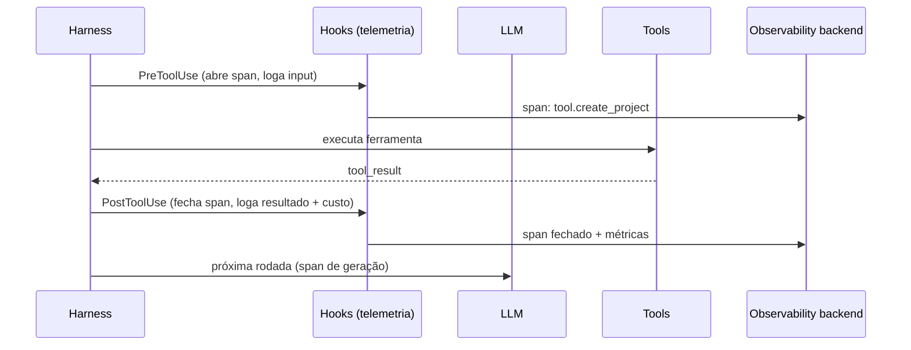

> Quando um agente falha em produção, não há stack trace. Há uma decisão estranha no meio de dez passos. Observabilidade é o que transforma "às vezes ele erra" em "no passo 4 o retrieval voltou vazio".

**TL;DR:** Observabilidade agêntica é instrumentar o agente para responder, depois do fato, o que ele fez, por que decidiu, quanto custou e onde falhou. Sem traces, prompts versionados e tracking de custo, todo bug vira adivinhação.

Evals (Cap. 15) dizem *que* o agente regrediu. Observabilidade diz *onde* e *por quê*. São complementares: um mede qualidade antes do deploy; o outro explica comportamento depois. Num sistema de múltiplos passos — recuperar, lembrar, chamar ferramenta, gerar — saber em qual passo a coisa desandou é a diferença entre corrigir em minutos e chutar por dias.

## Primeiro, a observabilidade em ação

Um cliente da IgnitionStack reclama: "o assistente respondeu errado sobre meu limite de plano". Sem observabilidade, a investigação é um interrogatório frustrante. Com um *trace* do agente, é leitura direta:

```text
trace_id: 7f3a...  agent: support  tenant: acme  custo: $0.011  latência: 4.2s

├─ [span] query_rewrite        120ms   "limite do meu plano" → "limite workspaces plano Pro"
├─ [span] retrieval            340ms   3 chunks  ⚠ score top=0.48 (baixo!)
├─ [span] rerank               210ms   reordenou, top ainda 0.51
├─ [span] llm.generate        3.4s    in:2.1k out:180 tokens  model: sonnet-4-6
└─ [output] "Pro permite 5 workspaces"   ✗ (correto: 10)
```

O trace conta a história inteira: o retrieval voltou com **score 0.48** — fraco. O agente recuperou o chunk errado (provavelmente uma versão antiga do doc de planos), e o modelo, fiel ao contexto ruim, respondeu "5". O bug não está no modelo nem no prompt — está no **índice desatualizado** (freshness, Cap. 12). Sem o trace, você teria culpado o LLM e ajustado o prompt em vão.

## O que é observabilidade agêntica

> **Observabilidade** é a capacidade de explicar o comportamento interno de um sistema a partir do que ele emite — logs, métricas e traces. Para agentes, acrescenta-se uma dimensão: *por que* o modelo decidiu o que decidiu, e *quanto* custou.

Os três pilares clássicos, aplicados a agentes:

- **Tracing** — a sequência de passos de uma execução, como *spans* aninhados (rewrite → retrieval → tool call → geração). É o que reconstrói a "linha de raciocínio".
- **Logging** — o registro detalhado de cada passo: o prompt exato enviado, a resposta crua, os argumentos do tool call, o erro.
- **Metrics** — agregados: latência p95, taxa de erro, tokens por request, custo por tenant, taxa de tool call malsucedido.

A esses, a observabilidade *agêntica* soma três que software tradicional não tem:

- **Prompt tracking** — qual versão do prompt/agent gerou esta resposta (você muda prompts toda semana; precisa correlacionar).
- **Agent telemetry** — decisões do agente: qual ferramenta escolheu, quantas rodadas do loop, quando desistiu.
- **Cost tracking** — tokens de entrada/saída e custo por chamada, por sessão, por tenant. Custo é uma métrica de primeira classe (e o assunto do Cap. 17).

## Observabilidade tradicional vs agêntica

A diferença não é cosmética — muda o que você precisa registrar e como interpreta:

| Dimensão | Tradicional | Agêntica |
|----------|-------------|----------|
| Determinismo | mesma entrada → mesma saída | mesma entrada → saídas diferentes |
| Unidade de falha | exceção, status 500 | decisão plausível e errada |
| O que rastrear | request → response | rewrite → retrieve → rerank → tool → gerar |
| Custo | desprezível por request | **dominante** — precisa ser métrica |
| Reprodução | re-rodar com a mesma entrada | precisa de prompt + contexto + seed + versão |
| "Causa raiz" | linha de código | passo do pipeline (retrieval? prompt? modelo?) |

A consequência prática: num sistema tradicional, você loga a borda (entrou, saiu). Num agente, você precisa logar o **miolo** — porque a falha mora lá dentro, num passo intermediário que parecia ok.

## Como instrumentar, na prática

O padrão da indústria é **OpenTelemetry** com as convenções semânticas de GenAI — assim seus traces de IA entram nas mesmas ferramentas (Grafana, Datadog, Langfuse) que o resto do stack já usa. A unidade é o *span*: cada passo do agente abre um, anota seus atributos e fecha.

```typescript
// Instrumentar uma chamada ao LLM como um span com atributos de GenAI
async function tracedGenerate(ctx: Ctx, prompt: Prompt) {
  return tracer.startActiveSpan("llm.generate", async (span) => {
    span.setAttributes({
      "gen_ai.system": "anthropic",
      "gen_ai.request.model": ctx.model,         // ex.: claude-sonnet-4-6
      "gen_ai.prompt.version": ctx.promptVersion, // prompt tracking
      "ignition.tenant_id": ctx.tenantId,         // correlação por tenant
    });
    try {
      const res = await llm.generate(prompt);
      span.setAttributes({
        "gen_ai.usage.input_tokens": res.usage.input,
        "gen_ai.usage.output_tokens": res.usage.output,
        "ignition.cost_usd": estimateCost(ctx.model, res.usage), // cost tracking
      });
      return res;
    } catch (err) {
      span.recordException(err);          // logging do erro no trace
      throw err;
    } finally {
      span.end();
    }
  });
}
```

Quatro disciplinas que tornam o trace útil em vez de barulhento:

1. **Correlacione tudo por `trace_id` e `tenant_id`.** Uma execução = um trace; todo span carrega o tenant. É o que permite filtrar "todos os erros do tenant Acme".
2. **Versione o prompt no span.** Sem `prompt.version`, você não consegue dizer se o bug nasceu na mudança de ontem.
3. **Registre tokens e custo em cada chamada.** Custo invisível é custo descontrolado (Cap. 17).
4. **Nunca logue PII ou segredo cru.** O prompt pode conter dado pessoal (Cap. 13, LGPD) e o tool result pode conter uma chave. Redija antes de persistir.

## Conectando ao Harness

Onde a observabilidade se conecta ao agente é o **harness** (Cap. 02) — e especificamente os **hooks** (Cap. 07). O harness é quem intercepta cada passo do loop; logo, é o ponto natural para emitir telemetria sem poluir a lógica do agente.



A beleza do padrão: o agente (o `.md` do Cap. 03) não sabe que está sendo observado. Os hooks `PreToolUse`/`PostToolUse` do harness emitem os spans automaticamente. Observabilidade vira uma propriedade da **plataforma**, não uma responsabilidade que cada agente precisa lembrar de implementar — exatamente como deveria ser num SaaS multi-tenant como a IgnitionStack, onde dezenas de agentes compartilham a mesma instrumentação.

E fecha o ciclo com o capítulo anterior: os sinais de produção que alimentam os evals (Cap. 15) *saem* daqui. O trace que mostrou "retrieval com score 0.48" vira um novo caso de golden dataset. Observabilidade não só explica o passado — abastece a próxima rodada de qualidade.

## Trade-offs e armadilhas

- **Logar a borda não basta.** "Entrou X, saiu Y" não diz em qual dos dez passos a coisa desandou. Instrumente o miolo.
- **Trace sem versão de prompt é um trace cego.** Você muda prompts toda semana; sem correlacionar, não sabe o que causou o quê.
- **Custo não medido é custo descontrolado.** Se você não registra tokens por chamada, a primeira vez que vê o número é na fatura.
- **PII no log é incidente de privacidade.** Prompts e resultados carregam dado pessoal e segredo. Redija na origem, antes de persistir.
- **Telemetria demais é seu próprio custo.** Logar cada token de cada request em alto volume tem custo de storage e de processamento. Amostre o que for caro; mantенha 100% só no que importa (erros, custo).
- **Observabilidade não conserta nada — só mostra.** Ela aponta o passo culpado; corrigir ainda é com você.

### Como saber se você entendeu

Você dominou este capítulo se consegue:

- ler um trace de agente e localizar em qual span a falha nasceu;
- listar o que a observabilidade agêntica registra além dos três pilares clássicos;
- explicar por que os hooks do harness são o lugar certo para emitir telemetria.

## Fontes

- OpenTelemetry — Semantic Conventions for Generative AI (spans, atributos `gen_ai.*`): https://opentelemetry.io/docs/specs/semconv/gen-ai/
- Anthropic — uso da API e tracking de `usage` (input/output tokens): https://docs.anthropic.com/en/api/messages
- Langfuse — observabilidade open-source para aplicações LLM (traces, custo, prompt management): https://langfuse.com/docs
- Honeycomb — "Observability: a Manifesto" (os fundamentos de traces e cardinalidade): https://www.honeycomb.io/blog/observability-a-manifesto

## Síntese

Observabilidade agêntica torna o agente legível depois do fato: traces reconstroem a sequência de decisões, prompt tracking correlaciona comportamento a versão, cost tracking impede surpresas na fatura. Emitida pelos hooks do harness, vira propriedade da plataforma — todo agente da IgnitionStack instrumentado de graça. Foi o trace que revelou o retrieval fraco, não o palpite. E uma das métricas que esse trace expõe — o custo por chamada, por usuário, por tenant — é tão central que merece um capítulo só dela.

Próximo: [Capítulo 17 — Cost Engineering](/ebook-ai-native-developer/17-cost-engineering/).
