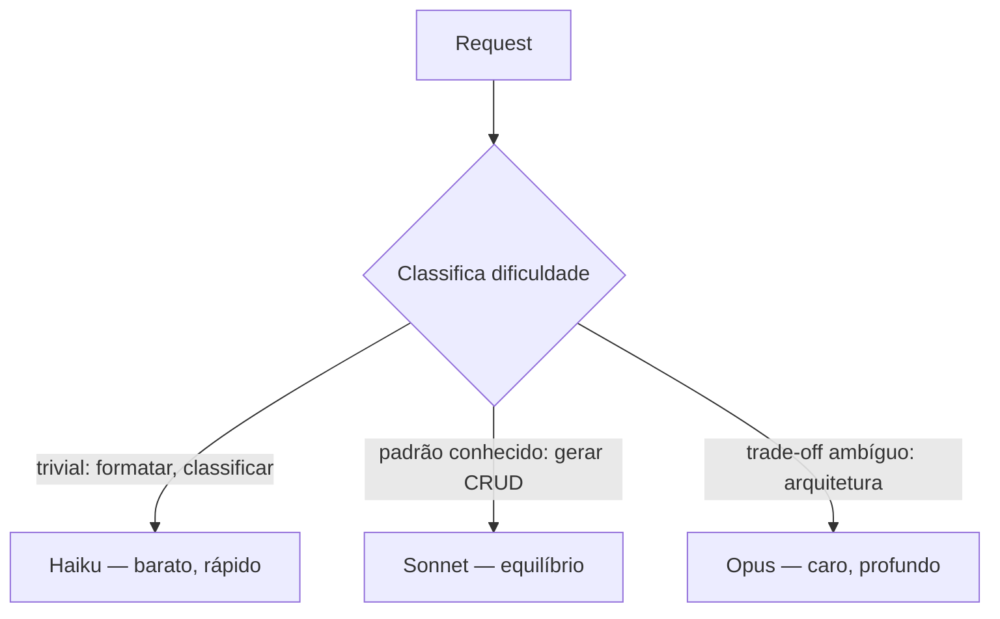
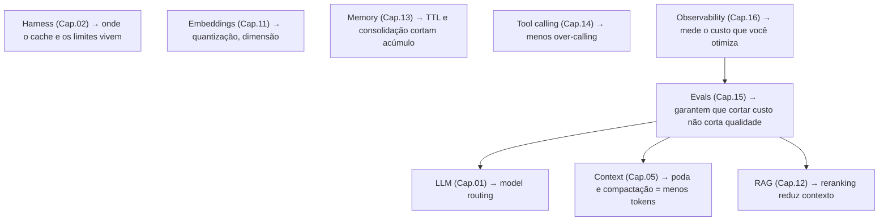

> Um produto de IA que não fecha a conta de custo não é um produto — é um experimento subsidiado. Cost engineering é o que separa uma feature de IA que escala de uma que quebra a margem no primeiro mês de tração.

**TL;DR:** Cost engineering é tratar custo de inferência como uma métrica de produto: medir por request/usuário/agente e atacar com cache, batching, model routing e otimização de tokens — sem degradar a qualidade que os evals (Cap. 15) protegem.

Este capítulo fecha a Parte II amarrando tudo. Você já sabe fazer o agente recuperar, lembrar, agir, medir e observar. Falta a pergunta que decide se ele *sobrevive* em produção: **isso fecha a conta?** Num SaaS multi-tenant como a IgnitionStack, onde milhares de usuários disparam agentes o dia todo, custo não é detalhe de fim de mês — é uma decisão de arquitetura desde o primeiro span.

## Primeiro, o custo em ação

A IgnitionStack lançou um assistente de código. Sucesso de uso, desastre de margem. A observabilidade (Cap. 16) revelou o porquê:

```text
ANTES (ingênuo)                          unit economics
─────────────────────────────────────────────────────────
toda request → opus, contexto cheio
  custo médio/request:   $0.090
  requests/usuário/mês:  400
  custo/usuário/mês:     $36.00
  preço do plano Pro:    $29.00
  margem:                −$7.00   ✗  perde dinheiro por usuário ativo
```

Cada usuário Pro engajado **dava prejuízo**. A reação errada seria cortar a feature ou subir o preço. A reação de engenharia foi atacar o custo por partes — cache, routing, batching, poda de contexto — sem mexer no preço nem (segundo os evals) na qualidade:

```text
DEPOIS (engenheirado)                    unit economics
─────────────────────────────────────────────────────────
routing + prompt cache + contexto podado
  custo médio/request:   $0.011    ▼ 88%
  custo/usuário/mês:     $4.40
  margem (plano $29):    +$24.60   ✓  feature lucrativa
```

Mesmo produto, mesma qualidade nos evals, **8x mais barato**. Nada disso foi mágica — foi medir e aplicar quatro alavancas conhecidas.

## O que é cost engineering

> **Cost engineering** é a disciplina de medir e otimizar o custo de inferência de um sistema de IA como uma propriedade de produto — em termos de unidade de negócio (request, usuário, agente, tenant), não só de tokens.

O erro mental mais comum é pensar em "preço por milhão de tokens". O número que importa é o **custo por unidade de negócio**:

| Unidade | Pergunta que responde | Por que importa |
|---------|------------------------|-----------------|
| **Custo por request** | quanto custa uma interação? | otimização técnica |
| **Custo por usuário/mês** | esse usuário dá lucro? | viabilidade do plano |
| **Custo por agente** | qual agente é caro demais? | onde otimizar primeiro |
| **Custo por tenant** | esse cliente é rentável? | pricing e limites |

Sem mapear custo para essas unidades (o que a observabilidade do Cap. 16 torna possível), você "economiza tokens" no lugar errado e ignora o agente que está sangrando a margem.

## As quatro alavancas

### 1. Cache — não pague duas vezes pelo mesmo contexto

Grande parte do prompt de um agente é **estável**: o system prompt, as definições de ferramentas, os exemplos, os docs do RAG. *Prompt caching* faz o provedor reusar o processamento desse prefixo — leituras de cache custam uma fração do preço normal de entrada.

```typescript
// Marca o prefixo estável como cacheável: system + tools + contexto reusável
const message = {
  system: [
    { type: "text", text: SYSTEM_PROMPT },
    { type: "text", text: TOOL_DEFINITIONS, cache_control: { type: "ephemeral" } },
  ],
  // só a parte variável (a pergunta do usuário) paga preço cheio de entrada
  messages: [{ role: "user", content: userQuestion }],
};
```

Na IgnitionStack, onde milhares de requests compartilham o mesmo system prompt e as mesmas tool definitions, o cache sozinho cortou boa parte do custo de entrada. Regra: **o que se repete entre chamadas deve ser cacheado.**

### 2. Model routing — o modelo certo para a tarefa certa

Você viu no Capítulo 03 que casar `model` ↔ dificuldade é design. Em custo, é a maior alavanca. Modelos diferem em ordens de magnitude de preço, e usar o topo de linha para tudo é desperdício:



A maioria das requests é mais simples do que parece. Classificar pedidos triviais ("isso é uma pergunta de FAQ?") com Haiku, deixar geração de CRUD no Sonnet e reservar Opus para decisões de arquitetura é o que derrubou o custo médio no exemplo de abertura — sem que os evals (Cap. 15) acusassem queda de qualidade nas tarefas que importam. **Faça o roteamento provar-se no eval**, não no achismo.

### 3. Batching — desconto por não ter pressa

Nem toda tarefa é interativa. Reindexar embeddings (Cap. 11), rodar a suíte de evals (Cap. 15), gerar resumos noturnos — nada disso precisa de resposta em tempo real. APIs de *batch* processam esse trabalho assíncrono com desconto expressivo (tipicamente ~50%) em troca de latência maior. **Trabalho que pode esperar não deve pagar preço de tempo real.**

### 4. Token optimization — menos tokens, mesma resposta

Cada token na janela é pago e processado (Cap. 05). Reduzir tokens sem perder sinal é economia pura:

- **Poda de contexto.** Não despeje 20 chunks quando 5 (pós-rerank, Cap. 12) bastam. O reranking é também uma alavanca de custo.
- **Compactação.** Resuma histórico antigo da conversa em vez de carregá-lo inteiro (Cap. 05).
- **Saída enxuta.** Tokens de *saída* costumam custar mais que os de entrada. Peça respostas concisas; use structured output (Cap. 14) em vez de prosa quando a saída é consumida por máquina.
- **Proxies de compressão.** Ferramentas que comprimem outputs verbosos de terminal/logs antes de mandar ao modelo (o padrão RTK citado no Cap. 10) cortam tokens em tarefas de desenvolvimento.

## Comparando provedores

A escolha de provedor é parte do cost engineering — mas o eixo certo é **custo × qualidade × latência**, não preço isolado. Um modelo "barato" que erra e exige retry sai caro; um "caro" que resolve de primeira pode ser o mais econômico por tarefa resolvida.

| Família | Perfil de custo | Força | Quando faz sentido |
|---------|-----------------|-------|--------------------|
| **Claude** (Opus/Sonnet/Haiku) | premium no topo, Haiku competitivo | raciocínio, código, tool use, prompt caching | agentes de produção, código |
| **GPT** | amplo leque de tiers | ecossistema, structured outputs | uso geral, integração ampla |
| **Gemini** | agressivo em contexto longo | janelas enormes, multimodal | grandes volumes de contexto |
| **Modelos locais** (Llama, etc.) | sem custo por token; custo de infra | privacidade, dado nunca sai | alto volume previsível, dado sensível (LGPD, Cap. 13) |

> Preços absolutos mudam toda hora — por isso este livro evita cravá-los. O que **não** muda é o método: meça custo por unidade de negócio, e escolha o modelo que minimiza custo *por tarefa resolvida no eval*, não por milhão de tokens na tabela.

Modelos locais merecem nota: eliminam custo por token e mantêm o dado dentro de casa (resolvendo de uma vez parte da LGPD do Cap. 13), mas trocam isso por custo de GPU, ops e, em geral, qualidade menor. Faz sentido em volume alto e previsível, ou quando o dado não pode sair — raramente como primeira escolha de um time pequeno.

## Conectando ao stack inteiro

Cost engineering não é uma camada — é uma lente sobre todas as nove. Cada capítulo deste livro tem uma alavanca de custo embutida:



Note a dupla central: **observabilidade mede** o custo (Cap. 16) e **evals garantem** que a otimização não degrada qualidade (Cap. 15). Sem esses dois, "cost engineering" vira corte cego — você economiza e quebra o produto sem perceber. Com eles, vira o que foi no exemplo de abertura: 88% mais barato, mesma qualidade medida. **Custo é uma feature de arquitetura, e como toda feature, precisa de teste e de telemetria.**

## Trade-offs e armadilhas

- **Otimizar custo sem eval é cortar qualidade às cegas.** Toda economia precisa passar pela suíte do Cap. 15. Barato e errado é o pior dos mundos.
- **O modelo mais barato nem sempre é o mais econômico.** Se erra e exige retry ou intervenção humana, o custo total por tarefa resolvida sobe. Meça por resultado, não por token.
- **Cache mal desenhado não economiza.** Se a parte cacheável muda a cada request, não há reuso. Estruture o prompt com o estável no prefixo.
- **Custo invisível é custo descontrolado.** Sem o tracking do Cap. 16, você descobre o problema na fatura. Instrumente antes de escalar.
- **Premature optimization também vale aqui.** Não roteie nem cacheie no MVP de 10 usuários. Otimize quando a observabilidade mostrar onde dói — primeiro meça, depois corte.
- **Pricing precisa caber no custo.** Se o plano não cobre o custo por usuário, nenhuma otimização salva para sempre. Cost engineering informa o pricing, não só a infra.

### Como saber se você entendeu

Você dominou este capítulo se consegue:

- calcular o custo por usuário/mês e dizer se um plano é rentável;
- escolher entre cache, routing, batching e poda de tokens para um gargalo dado;
- explicar por que toda otimização de custo precisa passar pelos evals.

## Fontes

- Anthropic — Prompt caching (como cachear prefixos estáveis e o impacto no custo): https://docs.anthropic.com/en/docs/build-with-claude/prompt-caching
- Anthropic — Message Batches API (processamento assíncrono com desconto): https://docs.anthropic.com/en/docs/build-with-claude/batch-processing
- Anthropic — Models overview (tiers Opus/Sonnet/Haiku e trade-offs de capacidade): https://docs.anthropic.com/en/docs/about-claude/models
- Anthropic — "Building effective agents" (simplicidade e parcimônia como princípio de custo): https://www.anthropic.com/research/building-effective-agents

## Síntese

Cost engineering fecha a Parte II porque fecha a conta: medir custo por unidade de negócio e atacá-lo com cache, model routing, batching e otimização de tokens é o que torna a IA da IgnitionStack lucrativa em vez de subsidiada — 88% mais barata, mesma qualidade nos evals. Custo é uma feature de arquitetura, medida pela observabilidade (Cap. 16) e protegida pelos evals (Cap. 15).

Com isso, a Parte II fecha a conta: a **Parte I** montou o sistema agêntico — do LLM ao CLI, com o agent no centro. A **Parte II** colocou esse sistema em produção — recuperando conhecimento (embeddings, RAG), lembrando do relacionamento (memory), agindo com segurança (tool calling), e provando-se confiável, observável e econômico (evals, observability, cost). Um agente é um arquivo; um *produto* de IA é esse arquivo cercado pela disciplina destes sete capítulos.

Ainda falta a disciplina que faz esse produto **melhorar sozinho sob controle** — ciclos de hipótese, métrica e rollback. Isso é a Parte III.

Próximo: [Capítulo 18 — Engenharia de Loop](/ebook-ai-native-developer/18-loop-engineer/).
