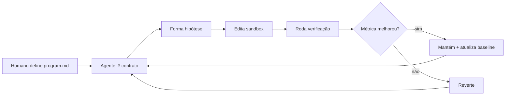
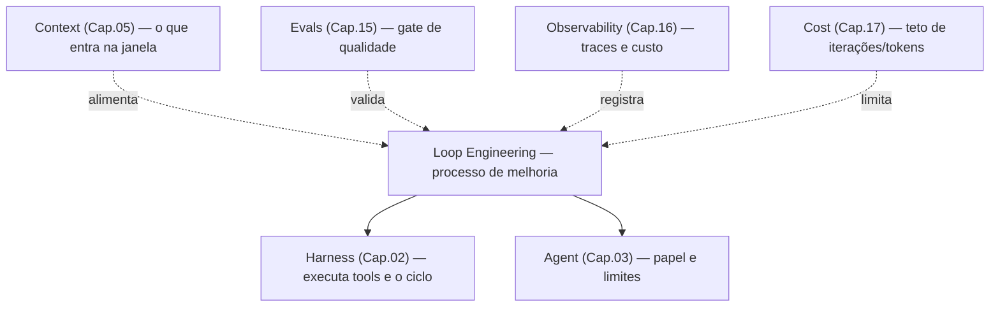

> A Engenharia de Loop muda o foco de "como escrever um bom prompt" para "como criar um ciclo em que o agente propõe uma ideia, testa o resultado, avalia a própria falha e tenta de novo".

**TL;DR:** Prompt Engineering aprimora uma interação isolada. Engenharia de Loop cria um ecossistema: o agente age dentro de um ciclo com objetivo, escopo, métrica, verificação e rollback — e só mantém a mudança se a métrica melhorar.

Até a Parte II, você montou o stack e o colocou em produção: recuperar, lembrar, agir, medir, observar e fechar a conta de custo. Falta a disciplina que transforma o agente de *executor de pedidos* em *operador de melhoria contínua*. Com o *autoresearch* de Andrej Karpathy, o papel do engenheiro deixa de ser "operar prompts" e passa a ser **desenhar o sistema de trabalho** no qual o agente itera sozinho — com limites e critério.

## Primeiro, o loop em ação

Imagine um app Next.js com homepage em **312 kB** de bundle inicial. Em vez de pedir "otimize o bundle" e torcer, você desenha o contrato:

```text
objetivo:     reduzir bundle da homepage ≥ 8%
baseline:     312 kB
arquivos OK:  app/**, components/**, lib/**
proibido:     infra/**, .github/**, secrets
verificação:  lint + typecheck + test + build + analyze
aceite:       bundle < baseline E suite verde
política:     1 hipótese por iteração; diff pequeno; rollback se piorar
```

O agente roda sozinho:

```text
iter 1  hipótese: lazy-load do chart lib
        build ✓  bundle 298 kB  (−4.5%)  → MANTER  baseline=298

iter 2  hipótese: remover lodash monólito, usar lodash-es seletivo
        build ✓  bundle 271 kB  (−9.0% vs original)  → MANTER  baseline=271

iter 3  hipótese: inline de CSS crítico + purge agressivo
        build ✗  typecheck falhou em 2 arquivos  → REVERTER

RESULTADO: 271 kB (−13%), 2 hipóteses boas, 1 descartada, suite verde
```

Ninguém reescreveu o prompt a cada rodada. O **loop** — hipótese → patch → medir → manter/reverter — fez o trabalho. O humano desenhou o tabuleiro; o agente jogou as partidas.

## O que é Engenharia de Loop

> **Engenharia de Loop** (Loop Engineering) é a disciplina de projetar o ciclo no qual um agente trabalha: objetivo, contexto, permissões, métrica, verificação, política de aceite/rejeição, critério de parada e rastreabilidade.

O agente bem configurado não recebe só uma instrução. Ele recebe um **ambiente operacional completo**. Sem isso, você tem conversa. Com isso, você tem experimentação comparável.

| Disciplina | Pergunta | Unidade de trabalho | Papel do humano |
|------------|----------|---------------------|-----------------|
| **Prompt Engineering** | Como peço isso bem? | Interação isolada | Escrever a instrução |
| **Context Engineering** (Cap. 05) | Qual contexto fornecer? | Setup de informação | Curar arquivos, docs, memória |
| **Loop Engineering** | Qual ciclo garante melhoria verificável? | Hipótese → execução → avaliação | Desenhar regras, métricas e limites |

As três se complementam. Sem prompt claro, o agente interpreta mal. Sem contexto, trabalha no escuro. Sem loop, pode acertar uma vez — e não convergir.

## O experimento Autoresearch de Karpathy

No projeto [*autoresearch*](https://github.com/karpathy/autoresearch), Karpathy deu a um agente um setup mínimo de treino de LLM e o deixou trabalhar à noite. O fluxo é linear e disciplinado:

1. Lê as diretrizes em `program.md`.
2. Modifica só o arquivo de treino (`train.py`).
3. Roda um treino curto (budget fixo, ex.: 5 min).
4. Mede a métrica de validação (`val_bpb` — menor é melhor).
5. **Mantém** se a métrica melhorar; **reverte** se piorar.
6. Repete.

O segredo não é "deixar a IA solta". É fechar o ciclo de feedback com **uma métrica objetiva**, **escopo mínimo** e **rollback barato**.

### Os três arquivos do contrato

| Arquivo | Papel | Agente edita? |
|---------|-------|---------------|
| `prepare.py` | Infraestrutura fixa: dados, tokenizer, avaliação | Não — estabiliza o tabuleiro |
| `train.py` | Sandbox: arquitetura, hiperparâmetros, loop de treino | Sim — único playground |
| `program.md` | Contrato operacional: objetivo, limites, métrica, parada | Não (só o humano) |

Restringir a mudança a um arquivo (ou a um conjunto minúsculo) torna o diff auditável e o rollback preciso. É o mesmo princípio de *diff cirúrgico* que o resto deste e-book já defende.



## Anatomia de um loop bem desenhado

Todo loop maduro tem as mesmas peças — independente de treinar modelo ou reduzir bundle:

1. **Objetivo único** — uma frase mensurável ("reduzir bundle ≥ 8%", não "melhorar performance").
2. **Baseline** — número de partida; sem baseline não há comparação.
3. **Escopo de arquivos** — o que pode e o que é proibido tocar.
4. **Comandos de verificação** — lint, typecheck, testes, build, analyze — determinísticos.
5. **Métrica de sucesso** — um número (ou pass/fail composto) comparável entre iterações.
6. **Política de aceite** — manter só se a métrica melhorar *e* a suite passar.
7. **Critério de parada** — teto de iterações, tempo ou "meta atingida".
8. **Log por iteração** — hipótese, diff, antes/depois, decisão. É a memória do loop (e amarra com Cap. 13 e 16).

### Um `program.md` mínimo

```markdown
# Loop Program — bundle homepage

## Objetivo
Reduzir o bundle inicial da homepage em ≥ 8% sem quebrar fluxos críticos.

## Baseline
312 kB (npm run analyze — chunk da rota /)

## Arquivos permitidos
- app/**/*
- components/**/*
- lib/**/*

## Arquivos proibidos
- infra/**/*
- .github/**/*
- secrets e envs

## Verificação
- bun run lint
- bun run typecheck
- bun test
- bun run build && bun run analyze

## Aceite
bundle < baseline E todos os comandos exit 0

## Política
- uma hipótese por iteração
- diff pequeno
- registrar baseline → resultado → manter|reverter
- parar em 20 iterações ou ao atingir −8%
```

Esse arquivo é o *system prompt do processo* — não do modelo. É o artefato que o engenheiro otimiza.

## Como isso se conecta ao stack

A Engenharia de Loop não é uma décima camada solta: ela **orquestra** as camadas que você já conhece.



- **Harness (Cap. 02):** o motor do loop pensar → agir → observar. Sem tools e permissões, não há patch nem benchmark.
- **Agent (Cap. 03):** o papel ("você é o otimizador de bundle") e o `tools` mínimo — não um agent-tudo.
- **Context (Cap. 05):** o `program.md`, o baseline e os logs recentes; nada de despejar o monorepo inteiro a cada iteração.
- **Evals (Cap. 15):** a métrica do loop *é* um eval barato e programático. O golden dataset vira o critério de aceite.
- **Observability (Cap. 16):** cada iteração é um span: hipótese, comando, métrica, decisão.
- **Cost (Cap. 17):** teto de iterações e model routing — loops sem budget viram fatura.

## Aplicações práticas

O padrão nasceu no treino de modelos, mas o valor está em **qualquer domínio com métrica objetiva e feedback rápido**. Abaixo, os loops que mais aparecem em times reais — do mais mecânico ao mais próximo de produto.

### 1. Loop de performance (bundle, build, latência)

**Objetivo:** reduzir custo de entrega sem regressão funcional.

| Métrica | Como medir |
|---------|------------|
| Bundle inicial | `analyze` / Lighthouse |
| Tempo de build | wall-clock do CI |
| Latência p95 de endpoint | benchmark ou APM |

Fluxo: identificar gargalo → mudança pequena (lazy load, tree-shake, cache) → medir → manter/reverter. É o exemplo da abertura. Candidato ideal para a **primeira** automação: feedback em minutos, rollback barato.

### 2. Loop de qualidade (testes, types, lint)

**Objetivo:** suite verde e dívida zero no módulo sob ataque.

Métricas: testes passando, erros de TypeScript, lint, cobertura do pacote alvo. O agente não "escreve testes até cansar" — ele itera até o gate do Cap. 15 ficar verde, com o mesmo rigor de um CI local. Skills de *error-fix loop* (Cap. 06) são a versão embutida: propor → rodar → ler log → ajustar.

### 3. Loop de segurança

**Objetivo:** reduzir achados sem abrir superfície nova.

Métricas: SAST, dependências vulneráveis, secret scanning, testes de auth. Escopo apertado (só o pacote afetado). **Human-in-the-loop** obrigatório antes de merge em auth, pagamento ou dados pessoais (Cap. 13 / LGPD).

### 4. spec-loop: QA orientado por especificação

O [spec-loop](https://andersonlimahw.github.io/spec-loop/) formaliza loops de QA a partir de specs e fluxos críticos. Em vez de o agente "testar o que achar", ele opera dentro de `.specloop/`: cenários, runbooks e relatórios versionados.

| Peça | Função no loop |
|------|----------------|
| Spec / critérios de aceite | Objetivo e casos |
| `.specloop/` | Contexto isolado e rastreável |
| Scripts de verificação | Métrica pass/fail |
| Relatório markdown | Log de iteração |

Útil quando o produto já tem critérios de aceite e você quer **consistência e auditoria**, não só "o agente clicou em botões".

### 5. Chrome QA Loop (UI real via DevTools / MCP)

O [Chrome QA Loop com Claude DevTools](https://lemon.dev.br/pt/blog/chrome-qa-loop-claude-devtools) fecha o ciclo na interface do usuário: o agente navega via MCP (Cap. 08), levanta hipóteses de falha, exercita fluxos e grava achados em markdown no disco.

Diferença para o spec-loop: aqui a **fonte de verdade é a UI viva** (layout, a11y, fluxos quebrados). O progresso não some no chat — fica em arquivos. Combina com evals de produção (Cap. 15) e traces (Cap. 16).

### 6. Loops de produto e de valor (com freio humano)

Objetivo: ativação, onboarding, clareza de copy, taxa de conclusão de um funil. Métricas de produto (conversão, tempo até primeiro valor) são válidas — **mas o risco de otimizar a métrica errada sobe**. Exija revisão humana a cada N iterações ou antes de qualquer ship. O loop propõe e mede; o humano autoriza o que toca usuário final.

### 7. Implementações no Lemon AI Hub

No [Lemon AI Hub](https://github.com/search?q=repo%3AAndersonlimahw%2Flemon-ai-hub%20loop&type=code), o padrão vira skill/plugin: `program.md` + verifiers + exemplos por domínio (performance, segurança, docs, feature). O time define o contrato; o orquestrador aplica o ciclo. É a forma de **empacotar** Loop Engineering como a Parte I empacota agents e skills em plugins (Cap. 07).

## Padrões de execução

| Padrão | Como funciona | Quando usar |
|--------|---------------|-------------|
| **Profundidade fixa** | N iterações e para (fica o melhor) | Custo alto por rodada |
| **Pausa estratégica** | Melhorou → para e pede humano | Produção, domínio regulado |
| **Varredura** | N variações em paralelo, escolhe a melhor | Espaço de busca pequeno |
| **Adaptativo** | Histórico de hipóteses evita repetir falha | Loops longos noturnos |

Comece em profundidade fixa com supervisão. Automatize só depois que o rollback e a métrica forem confiáveis.

### Níveis de maturidade

1. **Artesanal** — prompt + script + avaliação manual.
2. **Rastreável** — `program.md` + log, ainda manual.
3. **Automatizado** — o agente mantém/reverte sozinho; humano só no alto impacto.
4. **Orquestrado** — vários loops em paralelo, orçamento compartilhado.
5. **Adaptativo** — memória entre loops; prioridade dinâmica por retorno.

A maioria dos times está entre 1 e 2. O ganho desproporcional está em chegar ao 3 num *único* domínio barato (bundle ou suite crítica).

## Trade-offs e armadilhas

- **Métrica errada otimiza o mundo errado.** Bundle cai e a UX piora; latência melhora e a correção some. Meça o que importa de verdade — e use evals (Cap. 15) como rede de segurança.
- **Sem teto de iterações, o loop come tokens e tempo.** Budget de rodadas e de wall-clock é obrigatório (Cap. 17).
- **Diff grande = rollback inútil.** Uma hipótese, um patch pequeno. Monólitos mascaram a causa.
- **Overfitting no benchmark.** O número sobe e a experiência real piora. Combine métrica sintética com smoke de fluxos críticos.
- **Permissões largas ampliam o raio de explosão.** Menor privilégio: só os paths do contrato (Cap. 02 e 03).
- **Produto e finanças exigem humano no loop.** Não deixe o agente "decidir sozinho" regras de negócio ou cálculo sensível.
- **Não comece pelo domínio mais sexy.** Comece pelo que tem métrica barata e feedback em minutos.

### Como saber se você entendeu

Você dominou este capítulo se consegue:

- diferenciar Prompt, Context e Loop Engineering em uma frase cada;
- explicar o papel de `prepare` / sandbox / `program.md` no Autoresearch;
- montar um `program.md` com objetivo, baseline, escopo, verificação e critério de parada;
- escolher entre spec-loop, Chrome QA Loop e loop de performance para um problema dado;
- listar três armadilhas (métrica errada, sem teto, diff monolítico) e a mitigação de cada uma.

## Fontes

- Andrej Karpathy — Autoresearch (README e contrato de três arquivos): https://github.com/karpathy/autoresearch
- Shopify Engineering — *Autoresearch isn't just for training models*: https://shopify.engineering/autoresearch
- Anderson Lima — Loop Engineer (método e template de `program.md`): https://lemon.dev.br/pt/blog/loop-engineer-karpathy-loop-agentes-ia
- Anderson Lima — spec-loop (QA orientado por especificação): https://andersonlimahw.github.io/spec-loop/
- Anderson Lima — Chrome QA Loop com Claude DevTools: https://lemon.dev.br/pt/blog/chrome-qa-loop-claude-devtools
- Anthropic — "Building effective agents" (loop de ferramentas e agentes vs workflows): https://www.anthropic.com/research/building-effective-agents

## Síntese

Engenharia de Loop é a maturidade do desenvolvimento com IA: sair do diálogo pontual e operar **ecossistemas de melhoria verificável**. O humano define objetivo, escopo, métrica e parada; o agente propõe, mede e mantém ou reverte. O Autoresearch prova o padrão; bundle, testes, segurança, spec-loop e Chrome QA mostram que ele vive fora do treino de modelos.

Com as Partes I e II, você tem o stack e a disciplina de produção. Com a Parte III, você tem o processo que faz esse stack **melhorar sozinho sob controle**. O trabalho do engenheiro migra da inspeção repetitiva do diff para a arquitetura de contratos, gates e rollback — software de melhoria, não prompt descartável.

Voltar ao [índice](/ebook-ai-native-developer/).
