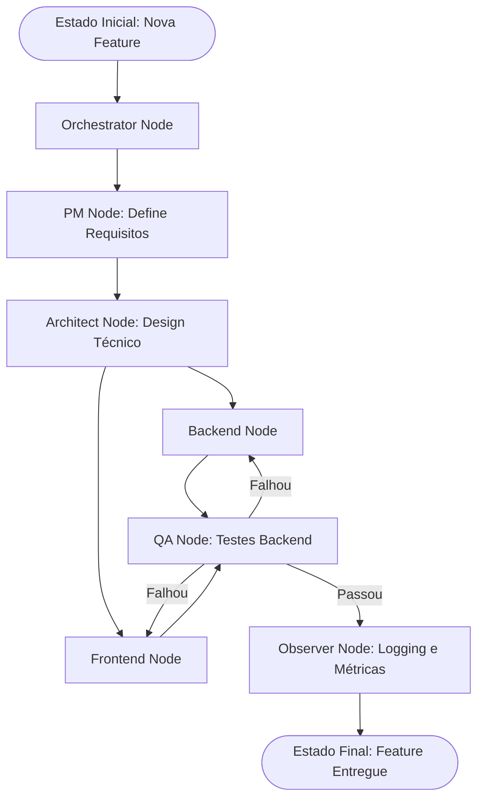
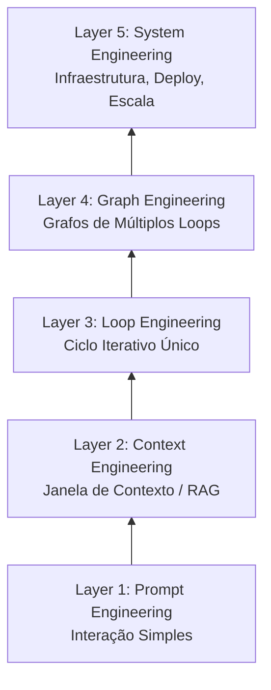

> "Are we still talking loops or did we shift to graphs yet?"
> — *Peter Steinberger*

**TL;DR:** Enquanto a Engenharia de Loop (*Loop Engineering*) define como um único agente itera até o sucesso, o *Graph Engineering* dita como múltiplos agentes se coordenam. Um grafo de agentes é composto por nós (agentes especializados), arestas (regras de roteamento) e estado compartilhado (fluxo de dados). É a evolução natural para resolver problemas complexos que extrapolam a capacidade de um único loop, marcando a transição de scripts isolados para "organogramas" de agentes autônomos.

## O Contexto

Nos capítulos anteriores, vimos como o [Loop Engineering (Capítulo 18)](/ebook-ai-native-developer/18-loop-engineering) permite que um agente critique e refine seu próprio trabalho de forma isolada. Em seguida, os [Workflows (Capítulo 19)](/ebook-ai-native-developer/19-workflows) nos mostraram como orquestrar essas tarefas de forma programática. Mas o que acontece quando você precisa de múltiplos loops especializados conversando entre si? O Graph Engineering é a resposta. Ele pega os conceitos de Loop e Workflow e introduz uma arquitetura onde cada agente é um nó com memória durável, compondo uma máquina de estados complexa, muito além de um simples loop `while`.

## Primeiro, o grafo em ação

Imagine o Squad do Domínio Orders que construímos no Capítulo 04. Não temos apenas um agente codificando; temos um arquiteto, um desenvolvedor backend, um desenvolvedor frontend e um QA.

Se modelarmos isso como um grafo:

Cada nó nesse diagrama é um agente independente executando seu próprio *loop*. A transição (aresta) entre eles é definida pelo estado compartilhado. Se o QA encontra um erro de backend, o estado é atualizado com o relatório de bug e roteado de volta para o nó Backend. O grafo garante que o processo tenha resiliência, contexto compartilhado e auditoria.

## O que é Graph Engineering

*Graph Engineering* é a disciplina de projetar, implementar e depurar sistemas multi-agentes orquestrados como grafos direcionados. 

Para Rohith, 'os agentes estão se graduando de loops *while* para organogramas'. 

Formalmente, podemos definir um grafo de agentes como $G = (N, E, S)$:
* **N (Nodes)**: Os nós. São os agentes especializados ou as funções de execução. Cada nó pode rodar um loop interno (ex: generate → critique → revise).
* **E (Edges)**: As arestas. É a lógica de roteamento condicional que dita para onde a execução deve ir com base no resultado de um nó.
* **S (Shared State)**: O estado compartilhado. É o "objeto" de memória persistente que viaja entre os nós, acumulando resultados, artefatos, histórico e decisões.

Um *loop* é apenas um caso particular e simplificado de um grafo: um nó com uma aresta apontando de volta para si mesmo.

### Topologias de Grafos

A maneira como você conecta seus nós define a capacidade do sistema. As topologias variam dependendo da natureza do problema.

| Topologia | Como Funciona | Quando Usar | Exemplo |
| :--- | :--- | :--- | :--- |
| **Sequential Pipeline** | Corrente simples: A → B → C. | Processos previsíveis e lineares. | Geração de relatórios (Coleta → Análise → Formatação). |
| **Fan-out / Fan-in** | Um nó gera N trabalhadores paralelos, agregando os resultados depois. | Tarefas massivamente paralelizáveis. | Pesquisa em 100 documentos ao mesmo tempo e consolidação das respostas. |
| **Conditional Branching** | O roteador avalia o estado e escolhe caminhos diferentes. | Fluxos de trabalho com exceções ou múltiplos domínios. | Triagem de tickets de suporte (Técnico vs Financeiro). |
| **Cycle / Loop** | Um nó com feedback direcionado a si mesmo. | Tarefas que exigem polimento iterativo. | O *AutoResearch* de Karpathy (Rascunho → Revisão → Rascunho). |
| **Hierarchical** | Orquestrador coordena sub-orquestradores, que gerenciam trabalhadores. | Sistemas de larga escala, squads multi-domínio. | O "Software 3.0" de desenvolvimento completo de produto. |
| **Adversarial** | Verificadores independentes desafiam o trabalho um do outro. | Quando a precisão é absolutamente crítica (zero alucinação). | Agente de Compliance Jurídico vs Agente de Contratos. |

### Task Graphs vs Knowledge Graphs

É crucial distinguir os dois principais tipos de grafos no mundo dos agentes:

1. **Task Graph (Grafo de Tarefas):** É a máquina de estados. Define *O QUE* roda e em *QUAL ORDEM*. (O workflow).
2. **Knowledge Graph (Grafo de Conhecimento):** É a camada de memória persistente. Nós são entidades (ex: "Usuário X", "Módulo Y") e as arestas são relacionamentos, com proveniência de dados clara.

Por que os agentes precisam de ambos? O Task Graph orquestra a execução, enquanto o Knowledge Graph (conectando-se aos Capítulos 11 e 13) serve como a memória de longo prazo (durable memory), garantindo que o agente recupere exatamente o estado das entidades que está manipulando.

## A Conexão Karpathy

A evolução do loop para o grafo ficou evidente no trabalho de Andrej Karpathy. Seu projeto *AutoResearch* demonstrou o incrível poder de um único loop ao refinar um artigo científico. A pergunta natural da comunidade foi: *o que acontece quando você precisa de múltiplos loops especializados?*

O padrão `agents.md` sugerido por Karpathy aponta para a arquitetura onde cada arquivo ou definição de agente funciona como um nó no grafo. O nosso Squad do Capítulo 04 *é* um grafo. No contexto do "Software 3.0", se a janela de contexto é a RAM e o modelo é a CPU, o Grafo de Tarefas atua como o Sistema Operacional orquestrando processos e *threads*.

## As 5 Camadas da Engenharia de IA

Podemos visualizar o Graph Engineering dentro da progressão natural do desenvolvimento nativo em IA:

## Frameworks e Ferramentas

O ecossistema se moveu rapidamente para formalizar a construção de grafos.

| Framework | Linguagem / Plataforma | Definição do Grafo | Melhor Para... |
| :--- | :--- | :--- | :--- |
| **LangGraph (LangChain)** | Python / JS | Máquina de estados explícita com persistência. | Controle granular de fluxo e estado altamente iterativo. |
| **Google ADK** | Agente-como-Nó | Protocolo A2A (Agent-to-Agent). | Ecossistema Google, integração pesada de ferramentas. |
| **Claude Code Workflows** | JavaScript (Cap 19) | Scripts imperativos como orquestradores de grafos. | Automação rápida e direta no editor. |
| **CrewAI** | Python | Agentes baseados em papéis colaborativos. | Simular times humanos, delegação rápida e "out-of-the-box". |

*Nota honesta:* A maioria dos frameworks implementa exatamente o mesmo padrão conceitual sob diferentes APIs. A escolha, muitas vezes, resume-se à sua preferência de linguagem e ecossistema.

## Quando usar Loop vs Quando usar Grafo?

O princípio *YAGNI* (You Aren't Gonna Need It) se aplica fortemente aqui: ****não construa um grafo até ter esgotado o que um único loop pode fazer.****

Ainda hoje, a maior parte do trabalho cognitivo é bem resolvida por um único agente iterando em um *loop*, não por uma organização inteira simulada. Use a seguinte matriz de decisão:

* **Domínio único / Foco único:** Loop.
* **Múltiplos domínios / Especialidades (ex: Front + Back):** Grafo.
* **Métrica única de sucesso:** Loop.
* **Necessidade de auditoria estrita / checkpoints:** Grafo.

## Como isso se conecta ao stack

* **Capítulo 04 (Squads):** O esqueleto organizacional que o Graph Engineering automatiza.
* **Capítulo 11 (Embeddings) e 13 (Memória):** Fornecem os dados para a camada de Knowledge Graph.
* **Capítulo 18 (Loop Engineering):** A fundação técnica; o motor interno de cada nó do grafo.
* **Capítulo 19 (Workflows):** A implementação pragmática (frequentemente imperativa) dessas transições de estado.

## Trade-offs e armadilhas

1. **Complexidade Prematura:** Usar um grafo quando um loop resolveria o problema cria overhead de estado e roteamento.
2. **Explosão de Estado:** Mais arestas significam mais caminhos possíveis e potenciais estados inconsistentes. Manter o estado imutável ou adicionar checkpoints é vital.
3. **Dificuldade de Debug:** Rastrear falhas em um pipeline distribuído (qual nó falhou? por que falhou?) é muito mais difícil do que debugar um loop isolado.
4. **Hype Terminology:** Céticos como @RhysSullivan e @DavidKPiano alertam que "Graph Engineering" é, em parte, um re-empacotamento de máquinas de estado finito. O rótulo é opcional, mas a arquitetura e a escalabilidade alcançadas são muito reais.

## Como saber se você entendeu

- [ ] Você sabe desenhar um grafo multi-agente mapeando nós, arestas e estado compartilhado?
- [ ] Você entende a diferença entre um Task Graph (execução) e um Knowledge Graph (memória/entidades)?
- [ ] Você sabe decidir quando um único loop iterativo é melhor do que um grafo orquestrado?
- [ ] Você reconhece os padrões de topologia (Fan-out, Hierarchical, etc.) e onde aplicá-los?

## Fontes

* Andrej Karpathy — AutoResearch: [GitHub](https://github.com/karpathy/autoresearch)
* Andrej Karpathy — agents.md: [GitHub](https://github.com/karpathy/agents.md)
* AI Builder Club — *Graph Engineering Guide (2026)*: [Link](https://www.aibuilderclub.com/blog/graph-engineering-guide-2026)
* Medium — *Graph Engineering: The Missing Memory Layer for Multi-Agent AI*: [Link](https://medium.com/@sdntechdemo/graph-engineering-the-missing-memory-layer-for-multi-agent-ai-b65975b38f44)
* LangGraph — Overview: [LangChain Docs](https://docs.langchain.com/oss/python/langgraph/overview)
* Google ADK: [adk.dev](https://adk.dev/)
* Anthropic — *Building effective agents*: [Anthropic Research](https://www.anthropic.com/research/building-effective-agents)
* Claude Code — Dynamic Workflows: [Claude Code Docs](https://code.claude.com/docs/en/workflows)
* Andrew Ng — *Agentic Design Patterns*
* Harrison Chase (@hwchase17) — X thread on graph engineering.

## Síntese

O **Graph Engineering** não é o fim dos loops; é a sua orquestração em larga escala. Ao modelar agentes especializados como nós em um grafo persistente e direcionado, podemos simular organizações inteiras, coordenar fluxos complexos de múltiplas etapas e garantir resiliência, estado compartilhado e modularidade. No final das contas, um grafo de tarefas bem desenhado é o verdadeiro "sistema operacional" de um sistema de software AI-Native.

---
Voltar ao [índice](/ebook-ai-native-developer/).
