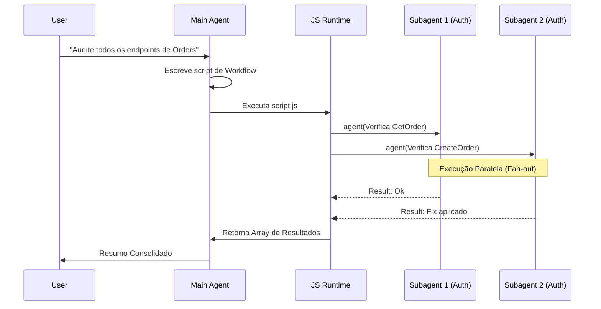

> "Enquanto subagents resolvem problemas isolados sob demanda, workflows transformam orquestração em código, permitindo que a AI controle paralelismo massivo, loops de verificação e consolidação de resultados de forma autônoma."

**TL;DR:** Workflows dinâmicos movem a orquestração de agentes do plano conceitual (ou da janela de chat) para um script JavaScript executável e determinístico. A IA gera um script que usa a API de orquestração — como `agent()` e `pipeline()` — para fazer *spawn* de dezenas ou centenas de subagents em paralelo, processar resultados intermediários em memória, executar loops de *fix-until-green* e consolidar um output final, operando em uma escala muito maior e mais confiável do que orquestrações manuais ou em texto plano.

**Como chegamos até aqui:** No [Capítulo 04](/ebook-ai-native-developer/04-subagents/), aprendemos a escalar e proteger o contexto usando subagents isolados para tarefas específicas. No [Capítulo 18](/ebook-ai-native-developer/18-loops/), vimos como estruturar interações cíclicas e iterativas. Agora, unimos esses conceitos: workflows usam scripts gerados dinamicamente (ou salvos) para orquestrar frotas inteiras de subagents em loops complexos e *fan-outs* massivos, resolvendo problemas em escala de repositório de maneira sistemática.

## Primeiro, o workflow em ação

Imagine que você precisa auditar todos os endpoints do domínio de `Orders` para garantir que as verificações de autorização (authZ) estão corretamente implementadas, e consertar os que não estiverem.

Em vez de abrir um prompt e pedir "verifique todos os arquivos de Orders e arrume a autorização", você invoca um workflow (ou pede no modo `/effort ultracode`). A engine gera um script parecido com isto nos bastidores:

```javascript
import { pipeline, agent } from '@claude/code-workflow';

async function run() {
  // 1. Encontra todos os endpoints
  const endpoints = await agent("Encontre e retorne uma lista JSON de todos os arquivos de endpoint de Orders");
  
  // 2. Fan-out paralelo: audita e corrige cada um
  const results = await pipeline(JSON.parse(endpoints), async (file) => {
    return await agent(`Audite ${file} para regras de AuthZ. 
      Se faltar, implemente usando o padrão de @AuthMiddleware. 
      Rode os testes para este endpoint até passarem.`);
  }, { concurrency: 8 });
  
  // 3. Consolida e reporta
  await agent(`Gere um relatório em markdown final resumindo as mudanças baseando-se nestes resultados: ${JSON.stringify(results)}`);
}
```

O ambiente então executa esse script. Ele levanta 8 subagents simultâneos (economizando tempo), cada um isolado em sua tarefa. O resultado intermediário (a lista de arquivos, o status de cada correção) fica armazenado nas variáveis do script JavaScript, não congestionando a janela principal de contexto.

## O que é um Workflow Dinâmico?

Um Workflow Dinâmico é uma **camada de orquestração baseada em código**. 

Normalmente, quando você pede algo complexo, a inteligência artificial (IA) tenta coordenar as etapas mentalmente no próprio prompt, gerando passos um após o outro. Em um Workflow, a AI *escreve um programa de computador* para realizar a orquestração. O runtime (como o Claude Code) executa esse código, que por sua vez chama a AI de volta através de funções de API (`agent()`).

Isso resolve problemas fundamentais de escala: o estado da operação inteira vive em variáveis do código, não em tokens da janela de contexto. Falhas em uma ponta podem ser tratadas por um `try/catch` nativo do JavaScript, e tarefas repetitivas, por loops nativos.

### O Ciclo de Vida do Workflow

1. **Ask:** O usuário solicita uma operação em larga escala.
2. **Generation:** O modelo (ex.: Claude) avalia a escala e decide gerar um script JavaScript de orquestração.
3. **Approval (opcional):** O desenvolvedor revisa e aprova o plano de execução.
4. **Execution:** O tempo de execução (runtime) JavaScript roda o script em segundo plano (background).
5. **Fan-out/Orchestration:** O script instancia (*faz spawn* de) dezenas ou centenas de agentes, respeitando limites de concorrência.
6. **Collection:** Os subagentes (*subagents*) retornam resultados limpos (como JSON ou textos curtos) para o script.
7. **Synthesis:** Um agente final ou função gera o relatório consolidado.



## A API do Workflow e Modos de Uso

A orquestração é feita através de primitivas simples expostas para o script:

- `agent(prompt, options)`: Cria um subagent isolado que tenta alcançar o objetivo do prompt e retorna o resultado. Pode incluir ferramentas específicas, arquivos de contexto e limites de iteração.
- `pipeline(items, callback, options)`: Utilitário para executar *fan-outs* paralelos com controle de concorrência (`options.concurrency`). Ideal para aplicar a mesma operação em centenas de arquivos.

### Modos de ativação

- **Automático (`/effort ultracode`)**: Diz à engine para não economizar e, se necessário, escrever scripts complexos para tarefas massivas.
- **Workflows Salvos (`.claude/workflows/`)**: Você pode salvar orquestrações comuns (ex: `review-pr.js`, `audit-security.js`) como *orchestration as code* no repositório. A equipe inteira pode invocá-los consistentemente.

## Quando usar cada abordagem?

Com a proliferação de termos, é vital saber qual padrão de orquestração escolher:

| Abordagem | Quem decide o próximo passo? | Onde vivem os resultados intermediários? | Escala Ideal | Exemplo de Caso de Uso |
| :--- | :--- | :--- | :--- | :--- |
| **Tool / Skill** | Agente principal (via Tool Call) | Janela de contexto principal | Micro (1 passo) | Formatar um arquivo, fazer um curl |
| **Subagent (Cap 04)** | Agente principal (prompt sequencial) | Janela de contexto principal (resumo) | Pequena (1 a 5 tarefas) | "Analise este arquivo enquanto eu faço outra coisa" |
| **Agent Teams** | Líder do time (roteamento semântico) | Contexto compartilhado ou sub-contextos | Média (Colaboração contínua) | "UX Agent cria o design, Dev Agent implementa" |
| **Dynamic Workflows** | Código JavaScript (Determinístico) | Memória do processo (Variáveis JS) | Massiva (Dezenas a Centenas) | Refatorar 500 arquivos, Auditoria paralela completa |

## Padrões Chave de Workflows

Os workflows viabilizam padrões arquiteturais que seriam muito caros ou impossíveis de coordenar apenas com texto:

1. **Fan-out, Fan-in (Map-Reduce):** Espalhar uma tarefa por todos os arquivos (`pipeline()`) e depois agregar. Extremamente rápido devido ao paralelismo. O Caching de Prompts brilha aqui: se todos os 50 agentes carregam o mesmo prefixo de contexto de sistema e regras de projeto, os *cache hits* despencam o custo.
2. **Fix-until-green (Loops Autônomos):** O script JavaScript pode conter um `while(!passed)` que invoca um agente para escrever código, invoca uma ferramenta de lint/teste, e repassa o erro para o agente consertar.
3. **Adversarial Verification:** Um script que levanta o "Agente A" para implementar e o "Agente B" para tentar quebrar a implementação (cross-checking). O script atua como o juiz.
4. **Deep Research Paralela:** Levantar agentes para explorar diferentes subdiretórios ou documentações simultaneamente e depois cruzar os achados.

## Limites, Custos e Retomada (Resume)

Operar frotas de agentes custa tokens e energia computacional. O ecossistema impõe limites protetivos:
- **Tamanhos sugeridos:** Pequenos (<5 agentes), Médios (<15), Grandes (<50). 
- **Concorrência:** Geralmente limitada a ~16 agentes simultâneos para evitar *rate limits* na API.
- **Limites Globais:** Um *run* pode ser limitado a ~1000 invocações de agente no total, com avisos de custo disparando perto de 1.5M a 2M de tokens processados.
- **Resume e Replay:** Se um workflow longo falhar ou for pausado, as execuções de `agent()` internas são frequentemente cacheadas. Ao reiniciar, o script avança instantaneamente até o ponto onde falhou, recuperando os retornos cacheados, o que economiza tokens valiosos.

## Como isso se conecta ao stack

* **Capítulo 02 (O Ambiente):** O *harness* (IDE/CLI) é o runtime que executa o script gerado, gerencia as credenciais da API e aplica os limites de segurança.
* **Capítulo 03 (O Agente):** Cada invocação de `agent()` no workflow levanta um modelo fresco, isolado, com um objetivo cristalino.
* **Capítulo 04 (Subagents):** Workflows são a evolução natural. Eles gerenciam *subagents workers* através de código, em vez de comandos de chat.
* **Capítulo 05 (Gerenciamento de Contexto):** O contexto intermediário sai do prompt e vai para a memória (variáveis JS). Isso previne a "amnésia" que ocorre quando a janela de chat fica sobrecarregada com os resultados de 50 tarefas.
* **Capítulo 15 (Evals):** Scripts de workflow podem atuar como *gates* complexos de CI, usando evals como condição de parada em um loop *fix-until-green*.
* **Capítulo 17 (Custo e Latência):** O padrão Map-Reduce com *Prompt Caching* permite que orquestrações massivas sejam surpreendentemente viáveis financeiramente.
* **Capítulo 18 (Loops):** Tira o peso do *Loop Engineering* do prompt e o coloca em controle de fluxo nativo (for/while).

## Trade-offs e armadilhas

> [!WARNING]
> Workflows não são balas de prata. Não use uma marreta para matar uma mosca.

1. **Complexidade Excessiva:** Se a tarefa pode ser resolvida pelo agente principal em 3 passos, não force um workflow. Gerar o script, aprová-lo e orquestrar a frota introduz latência inicial.
2. **Custo de Token Oculto:** Mesmo com cache, invocar 100 agentes consumirá um volume massivo de tokens de saída (output tokens não são cacheados). Fique de olho no custo de *fan-outs* não filtrados.
3. **Erros de Sintaxe no Script:** A AI pode gerar um script JavaScript com bugs (ex: loops infinitos ou tratamento de erro ruim). O runtime geralmente aborta e reporta, mas você perde tempo.
4. **Isolamento Rígido:** Diferente dos *Agent Teams*, em workflows puros no estilo map-reduce, os subagents não conversam entre si. Se a tarefa A depende criticamente de nuances dinâmicas descobertas na tarefa B, um *fan-out* paralelo vai falhar ou causar conflitos de *merge*.

## Como saber se você entendeu

1. Você consegue explicar a diferença estrutural entre coordenar subagents via chat versus via script (Workflow)?
2. Você entende por que variáveis JavaScript são melhores para armazenar resultados de 50 tarefas do que a janela de contexto principal do LLM?
3. Sabe identificar situações onde o padrão "Map-Reduce" paralelo seria ineficaz ou causaria conflitos?

## Fontes

* **Claude Code — Dynamic Workflows:** [code.claude.com/docs/en/workflows](https://code.claude.com/docs/en/workflows)
* **Anthropic — "Building effective agents":** [anthropic.com/research/building-effective-agents](https://www.anthropic.com/research/building-effective-agents)
* **Claude Code — Subagents:** [code.claude.com/docs/en/sub-agents](https://code.claude.com/docs/en/sub-agents)
* **Claude Code — Agent Teams:** [code.claude.com/docs/en/agent-teams](https://code.claude.com/docs/en/agent-teams)

## Síntese

Workflows Dinâmicos representam o ápice da delegação determinística. Ao transferir a lógica de orquestração — loops, mapeamentos, tratamentos de falha — da capacidade imperfeita de raciocínio verbal de um LLM para o determinismo rígido do código de script, liberamos a IA para focar no que ela faz de melhor: resolver o problema contido dentro de cada nó individual. É a infraestrutura como código (IaC) aplicada à força de trabalho de inteligência artificial.

Próximo: [Capítulo 19 — Graph Engineering](/ebook-ai-native-developer/19-graph-engineering/).
