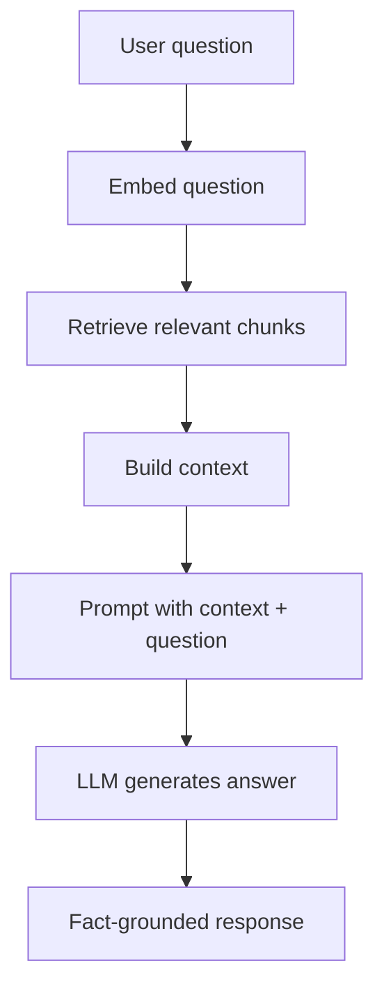

**TL;DR:** RAG combines retrieval (embeddings + search) with generation (LLM). The agent retrieves relevant documents *before* generating the answer, reducing hallucinations and keeping responses grounded in facts.

## The RAG pipeline



## RAG quality

Three metrics matter:

1. **Recall** — was the right chunk in the top-k retrieved?
2. **Precision** — how many retrieved chunks were actually relevant?
3. **Latency** — how long to retrieve, build context, and generate?

```typescript
async function rag(query: string) {
  const chunks = await semanticSearch(query, k: 5);
  const context = chunks.map(c => c.content).join("\n---\n");
  
  return await llm.generate({
    prompt: `Based on this context:\n${context}\n\nAnswer: ${query}`
  });
}
```