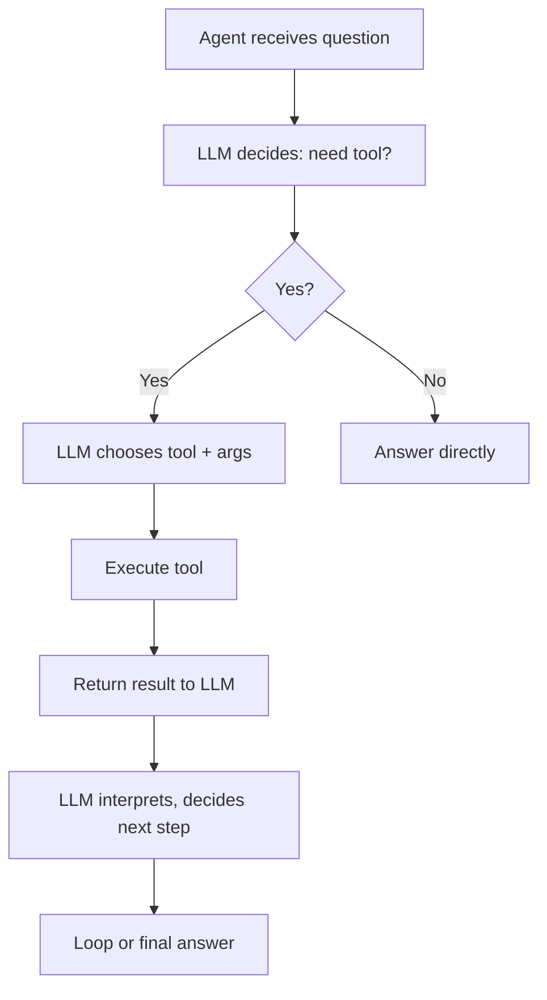

**TL;DR:** Tool calling allows the LLM to decide which tool to call, when, and with which arguments — turning the agent into an action orchestrator, not just a text generator.

## Tool calling loop



## Typed tools

```typescript
const tools = [
  {
    name: "get_order",
    description: "Fetch an order by ID",
    inputSchema: {
      type: "object",
      properties: {
        order_id: { type: "string" }
      },
      required: ["order_id"]
    },
    handler: async (args) => {
      return await db.orders.findOne({id: args.order_id});
    }
  }
];
```