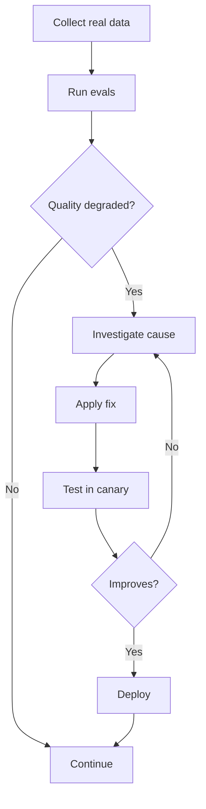

**TL;DR:** An agent is not built and forgotten. Automatic feedback loops measure quality, detect degradation, and guide optimizations.

## Loop structure

```mermaid
graph TD
    A[Collect real data] --> B[Run evals]
    B --> C{Quality degraded?}
    C -->|Yes| D[Investigate cause]
    D --> E[Apply fix]
    E --> F[Test in canary]
    F --> G{Improves?}
    G -->|Yes| H[Deploy]
    G -->|No| D
    C -->|No| I[Continue]
    H --> I
```

One full iteration takes hours, not days.