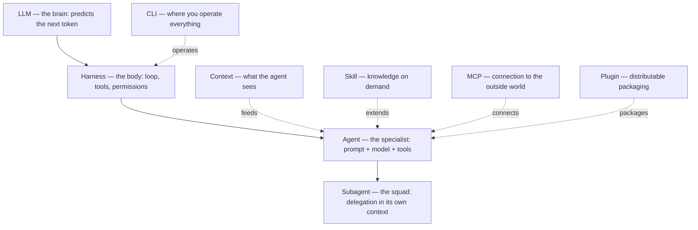

> An e-book for developers who want to become AI-native — not just use the chat, but understand and build the agentic systems underneath it.

<a class="pdf-download" href="/ebook-ai-native-developer/ai-native-developer.pdf" download>Download the full PDF</a>

You already code. You can read a stack trace, design a schema, argue an architecture trade-off. But the new vocabulary arrives too fast: *LLM*, *harness*, *agent*, *subagent*, *context*, *skill*, *plugin*, *MCP*, *CLI*. Everyone uses these terms as if they were obvious, and rarely does anyone show **where each one fits** and **how they connect**.

This e-book solves that in a specific way: instead of defining each word in isolation, it builds **one layer at a time** on top of a single concrete example, and every chapter ties back to the central layer — the `agent`.

## Who it's for

- Developers who already code and want to master agentic system architecture.
- Anyone who uses Claude Code (or similar tools) daily but treats it as a black box.
- Teams who want to standardize how they build, package, and share agents.

This isn't a "how to use the chat" tutorial. It's about **how the stack works underneath** and how you design on top of it.

## The throughline

Every chapter uses the same concrete task:

> **Build a universal Orders CRUD system.**

A real software engineering task, one every developer recognizes, with just the right complexity to demonstrate nearly every agentic layer. We'll see:

- why the **LLM** alone can describe an orders API but can't write the files or run the database;
- how the **harness** gives the model eyes and hands to create and change files;
- how an **agent** (`agent-order-orchestrator`) turns the generic model into a domain specialist;
- how a squad of **subagents** splits the task across product, architecture, backend, frontend, QA, and infra fronts;
- and how **context, skill, plugin, MCP, and CLI** come in to make that operation robust, reusable, safe, and efficient.

## The mental model

The layers aren't a rigid top-to-bottom stack — they compose. But there's a dependency order that helps you think about it:

Read it like this: the **LLM** is the brain. The **harness** is the body that gives it eyes, hands, and an action loop. The **agent** is a configuration of that set for a specific job. Everything else — subagent, context, skill, plugin, MCP, CLI — exists to make the agent more capable, more reliable, or easier to operate.

## Chapters

### Part I — The Agentic Stack

| # | Chapter | What you'll walk away knowing |
|---|----------|------------------------|
| 01 | [The LLM](/ebook-ai-native-developer/en/01-llm/) | What the model does and, crucially, what it **doesn't** do alone. |
| 02 | [The Harness](/ebook-ai-native-developer/en/02-harness/) | How the LLM gains a loop, tools (TypeScript), and deterministic security hooks. |
| 03 | [The Agent](/ebook-ai-native-developer/en/03-agent/) | **The anchor chapter.** How to structure and version the Orders specialist. |
| 04 | [The Subagent](/ebook-ai-native-developer/en/04-subagent/) | Delegation into squads with isolated context. Case study: the full `order` squad. |
| 05 | [The Context](/ebook-ai-native-developer/en/05-context/) | Context management, signal over noise, and working-memory control. |
| 06 | [The Skill](/ebook-ai-native-developer/en/06-skill/) | Progressive disclosure, self-improving skills, and the anti-token-explosion rule. |
| 07 | [The Plugin](/ebook-ai-native-developer/en/07-plugin/) | Distributable packaging with slash commands, hooks, and integrated MCP. |
| 08 | [The MCP](/ebook-ai-native-developer/en/08-mcp/) | MCP vs CLI: the unified protocol for external data and actions. |
| 09 | [The CLI](/ebook-ai-native-developer/en/09-cli/) | The terminal as a command cabin, custom commands, and Git Worktrees. |
| 10 | [Synthesis](/ebook-ai-native-developer/en/10-sintese/) | The complete agentic stack in action end to end, with best practices. |

### Part II — AI Native in Production

Real-world case study: [IgnitionStack](https://www.ignitionstack.pro/pt), a multi-tenant SaaS platform. From explaining the stack to building AI products that run, scale, and pay for themselves.

| # | Chapter | What you'll walk away knowing |
|---|----------|------------------------|
| 11 | [Embeddings & Semantic Search](/ebook-ai-native-developer/en/11-embeddings/) | How text becomes a vector and search shifts from words to meaning. |
| 12 | [RAG](/ebook-ai-native-developer/en/12-rag/) | Retrieving external knowledge to answer with current, citable facts. |
| 13 | [Memory](/ebook-ai-native-developer/en/13-memory/) | What the agent remembers across sessions — and what it must forget (GDPR included). |
| 14 | [Structured Outputs & Tool Calling](/ebook-ai-native-developer/en/14-tool-calling/) | Turning language into validated, deterministic actions in the system. |
| 15 | [Evals](/ebook-ai-native-developer/en/15-evals/) | The agents' CI: measuring quality and blocking regressions before deploy. |
| 16 | [Observability](/ebook-ai-native-developer/en/16-observability/) | Seeing what the agent did, why it decided that, what it cost, and where it failed. |
| 17 | [Cost Engineering](/ebook-ai-native-developer/en/17-cost-engineering/) | Making the AI product profitable without sacrificing quality. |

### Part III — Loop Engineering

The autonomous cycle of experimentation and improvement: metric, scope, verification, and rollback. We stop focusing only on the prompt and start designing robust iterative processes.

| # | Chapter | What you'll walk away knowing |
|---|----------|------------------------|
| 18 | [Loop Engineering](/ebook-ai-native-developer/en/18-loop-engineer/) | Cycles with metric, scope, and rollback: Autoresearch, bundle, spec-loop, Chrome QA, and loop maturity. |
| 19 | [Graph Engineering](/ebook-ai-native-developer/en/19-graph-engineering/) | From isolated loops to agent graphs with shared state and durable memory. |
| 20 | [Workflows with Subagents](/ebook-ai-native-developer/en/20-workflows/) | Dynamic workflows orchestrating hundreds of subagents via JavaScript scripts. |

## How to read it

Reading linearly, 01 through 20, is the recommended first pass. **Part I** (01-10) builds the agentic stack, **Part II** (11-17) puts that stack into production, and **Part III** explores the frontiers of Loop Engineering. But chapter 03 (`agent`) is the center of gravity: if you only have 20 minutes, read 01, 02, and 03 in that order and you'll already have the mental model that supports the rest.

Every chapter follows the same pedagogical discipline:

1. **Example first.** You see the concept in use before any definition.
2. **Definition second.** Only then do we formalize the term.
3. **Tie-back to the `agent`.** Every layer closes by showing how it connects to the anchor chapter.
4. **Real trade-offs.** What it costs, where it fails, when not to use it.
5. **Primary sources.** Official docs and papers, not third-party blogs.

## Conventions

- **Language**: Brazilian Portuguese is the source of truth for these `.md` files. Versions in other languages are generated afterward from the source — the source content is never duplicated per language.
- **Models cited**: the Claude 4.X family is used as a concrete reference — Opus 4.8 (`claude-opus-4-8`), Sonnet 4.6 (`claude-sonnet-4-6`), Haiku 4.5 (`claude-haiku-4-5`). The concepts apply to any modern LLM.
- **Voice**: the inspiration drawn from educators like Andrej Karpathy (code first) and engineering authors like Robert C. Martin and Martin Fowler (clarity of principles) is **tone**, not quotation. No sentence is put in the mouth of real people.

Start with [Chapter 01 — The LLM](/ebook-ai-native-developer/en/01-llm/).
