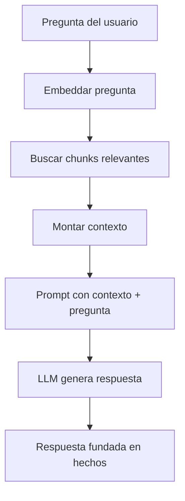

**TL;DR:** RAG combina recuperación (embeddings + búsqueda) con generación (LLM). El agente recupera documentos relevantes *antes* de generar la respuesta, reduciendo alucinaciones y manteniendo la respuesta anclada en hechos.

## El pipeline RAG



## Calidad del RAG

Tres métricas importan:

1. **Recall** — ¿estaba el chunk correcto en los top-k recuperados?
2. **Precision** — ¿cuántos chunks recuperados eran realmente relevantes?
3. **Latencia** — ¿cuánto tiempo tarda recuperar, montar contexto y generar?

```typescript
async function rag(query: string) {
  const chunks = await semanticSearch(query, k: 5);
  const context = chunks.map(c => c.content).join("\n---\n");
  
  return await llm.generate({
    prompt: `Basado en este contexto:\n${context}\n\nResponde: ${query}`
  });
}
```