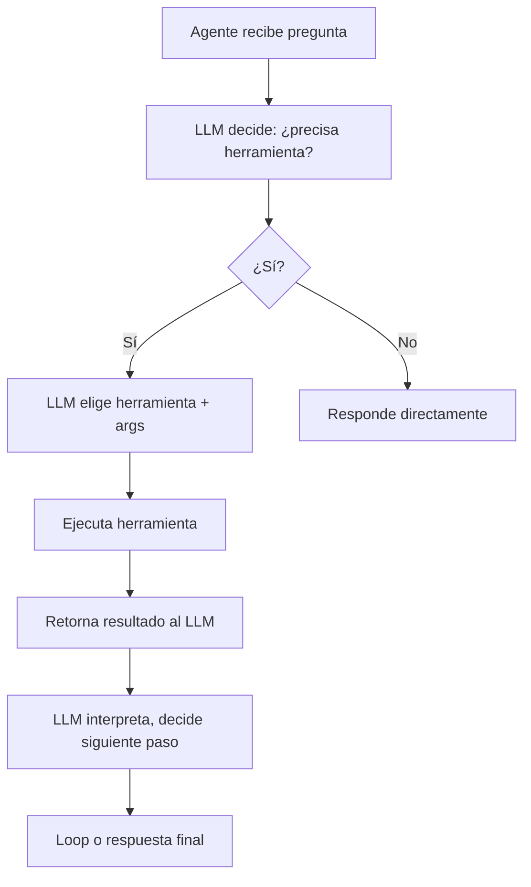

**TL;DR:** Tool calling permite que el LLM decida qué herramienta llamar, cuándo, y con qué argumentos — transformando el agente en un orquestrador de acciones, no solo generador de texto.

## Ciclo de llamada de herramientas



## Herramientas tipadas

```typescript
const tools = [
  {
    name: "get_order",
    description: "Busca un pedido por ID",
    inputSchema: {
      type: "object",
      properties: {
        order_id: { type: "string" }
      },
      required: ["order_id"]
    },
    handler: async (args) => {
      return await db.orders.findOne({id: args.order_id});
    }
  }
];
```