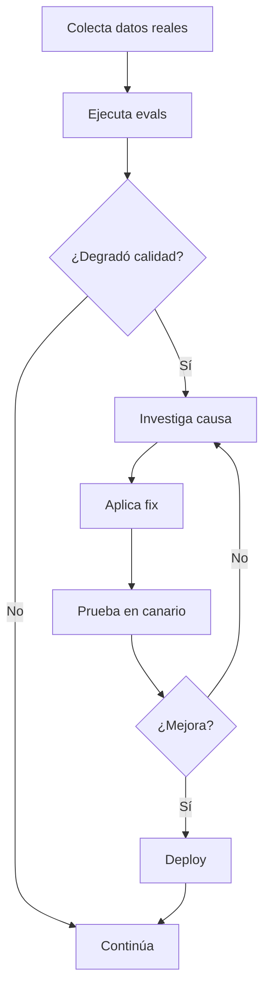

**TL;DR:** Un agente no se construye y se olvida. Los bucles de retroalimentación automática miden calidad, detectan degeneración y guían optimizaciones.

## Estructura de un bucle

Una iteración completa dura horas, no días.