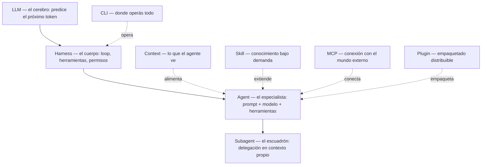

> Un e-book para desarrolladores que quieren volverse AI-native — no solo usar el chat, sino entender y construir los sistemas agénticos detrás de él.

<a class="pdf-download" href="/ebook-ai-native-developer/ai-native-developer.pdf" download>Descargar PDF completo</a>

Ya programás. Sabés leer un stack trace, diseñar un schema, discutir un trade-off de arquitectura. Pero el vocabulario nuevo llega demasiado rápido: *LLM*, *harness*, *agent*, *subagent*, *context*, *skill*, *plugin*, *MCP*, *CLI*. Todo el mundo usa estos términos como si fueran obvios, y rara vez alguien muestra **dónde encaja cada uno** y **cómo se conectan**.

Este e-book resuelve eso de una forma específica: en vez de definir cada palabra por separado, construye **una capa a la vez** sobre un único ejemplo concreto, y en cada capítulo vuelve a atar todo a la capa central — el `agent`.

## Para quién es

- Desarrolladores que ya programan y quieren dominar la arquitectura de sistemas agénticos.
- Quienes usan Claude Code (u otras herramientas similares) a diario pero tratan todo como una caja negra.
- Equipos que quieren estandarizar cómo construyen, empaquetan y comparten agentes.

No es un tutorial de "cómo usar el chat". Es sobre **cómo funciona el stack por dentro** y cómo diseñás sobre él.

## El hilo conductor

Todo capítulo usa la misma tarea concreta:

> **Construir un sistema universal de CRUD de Pedidos (Orders).**

Una tarea real de ingeniería de software, que cualquier desarrollador reconoce y que tiene la complejidad ideal para demostrar casi todas las capas agénticas. Vamos a ver:

- por qué el **LLM** solo sabe describir una API de pedidos, pero no puede escribir los archivos ni correr la base de datos;
- cómo el **harness** le da ojos y manos al modelo para crear y modificar archivos;
- cómo un **agent** (`agent-order-orchestrator`) transforma el modelo genérico en un especialista de dominio;
- cómo un escuadrón de **subagents** divide la tarea en frentes de producto, arquitectura, backend, frontend, QA e infra;
- y cómo **context, skill, plugin, MCP y CLI** entran en juego para volver esa operación robusta, reutilizable, segura y eficiente.

## El modelo mental

Las capas no son una pila rígida de arriba hacia abajo — se componen. Pero hay un orden de dependencia que ayuda a pensar:

Leelo así: el **LLM** es el cerebro. El **harness** es el cuerpo que le da ojos, manos y un loop de acción. El **agent** es una configuración de ese conjunto para un trabajo específico. Todo lo demás — subagent, context, skill, plugin, MCP, CLI — existe para que el agent sea más capaz, más confiable o más fácil de operar.

## Capítulos

### Parte I — El Stack Agéntico

| # | Capítulo | Qué te llevás sabiendo |
|---|----------|------------------------|
| 01 | [El LLM](/ebook-ai-native-developer/es/01-llm/) | Qué hace el modelo y, sobre todo, qué **no** hace solo. |
| 02 | [El Harness](/ebook-ai-native-developer/es/02-harness/) | Cómo el LLM gana loop, tools (TypeScript) y hooks de seguridad determinísticos. |
| 03 | [El Agent](/ebook-ai-native-developer/es/03-agent/) | **El capítulo-ancla.** Cómo estructurar y versionar el especialista de Orders. |
| 04 | [El Subagent](/ebook-ai-native-developer/es/04-subagent/) | Delegación en escuadrones de contexto aislado. Caso de estudio: escuadrón `order` completo. |
| 05 | [El Context](/ebook-ai-native-developer/es/05-context/) | Gestión de contexto, señal sobre ruido y control de memoria de trabajo. |
| 06 | [La Skill](/ebook-ai-native-developer/es/06-skill/) | Progressive disclosure, skills auto-mejorables y la regla anti-explosión de tokens. |
| 07 | [El Plugin](/ebook-ai-native-developer/es/07-plugin/) | Empaquetado distribuible con slash commands, hooks y MCP integrados. |
| 08 | [El MCP](/ebook-ai-native-developer/es/08-mcp/) | MCP vs CLI: el protocolo unificado de datos y acciones externas. |
| 09 | [El CLI](/ebook-ai-native-developer/es/09-cli/) | Terminal como cabina de comando, comandos personalizados y Git Worktrees. |
| 10 | [Síntesis](/ebook-ai-native-developer/es/10-sintese/) | El stack agéntico completo en acción de punta a punta, con mejores prácticas. |

### Parte II — AI Native en Producción

Caso de estudio real: [IgnitionStack](https://www.ignitionstack.pro/pt), plataforma SaaS multi-tenant. Desde la explicación del stack hasta la construcción de productos de IA que corren, escalan y cierran la cuenta.

| # | Capítulo | Qué te llevás sabiendo |
|---|----------|------------------------|
| 11 | [Embeddings & Semantic Search](/ebook-ai-native-developer/es/11-embeddings/) | Cómo el texto se vuelve vector y la búsqueda pasa a ser por significado, no por palabra. |
| 12 | [RAG](/ebook-ai-native-developer/es/12-rag/) | Recuperar conocimiento externo para responder con hechos actuales y citables. |
| 13 | [Memory](/ebook-ai-native-developer/es/13-memory/) | Qué recuerda el agente entre sesiones — y qué debe olvidar (RGPD incluido). |
| 14 | [Structured Outputs & Tool Calling](/ebook-ai-native-developer/es/14-tool-calling/) | Transformar lenguaje en acciones validadas y determinísticas en el sistema. |
| 15 | [Evals](/ebook-ai-native-developer/es/15-evals/) | El CI de los agentes: medir calidad y frenar regresiones antes del deploy. |
| 16 | [Observability](/ebook-ai-native-developer/es/16-observability/) | Ver qué hizo el agente, por qué decidió eso, cuánto costó y dónde falló. |
| 17 | [Cost Engineering](/ebook-ai-native-developer/es/17-cost-engineering/) | Volver rentable el producto de IA sin sacrificar calidad. |

### Parte III — Ingeniería de Loop

El ciclo autónomo de experimentación y mejora: métrica, alcance, verificación y rollback. Dejamos de enfocarnos solo en el prompt y pasamos a diseñar procesos iterativos robustos.

| # | Capítulo | Qué te llevás sabiendo |
|---|----------|------------------------|
| 18 | [Ingeniería de Loop](/ebook-ai-native-developer/es/18-loop-engineer/) | Ciclos con métrica, alcance y rollback: Autoresearch, bundle, spec-loop, Chrome QA y madurez del loop. |
| 19 | [Graph Engineering](/ebook-ai-native-developer/es/19-graph-engineering/) | De loops aislados a grafos de agentes con estado compartido y memoria durable. |
| 20 | [Workflows con Subagentes](/ebook-ai-native-developer/es/20-workflows/) | Workflows dinámicos que orquestan cientos de subagents vía scripts JavaScript. |

## Cómo leer

Lineal, del 01 al 20, es la forma recomendada la primera vez. La **Parte I** (01-10) arma el stack agéntico, la **Parte II** (11-17) pone ese stack en producción, y la **Parte III** explora las fronteras de la Ingeniería de Loop. Pero el capítulo 03 (`agent`) es el centro de gravedad: si solo tenés 20 minutos, leé el 01, el 02 y el 03 en ese orden y ya vas a tener el modelo mental que sostiene el resto.

Cada capítulo sigue la misma disciplina pedagógica:

1. **Ejemplo primero.** Ves el concepto en uso antes de cualquier definición.
2. **Definición después.** Recién ahí formalizamos el término.
3. **Vuelta al `agent`.** Cada capa cierra mostrando cómo se conecta al capítulo-ancla.
4. **Trade-offs reales.** Qué cuesta, dónde falla, cuándo no usarlo.
5. **Fuentes primarias.** Docs oficiales y papers, no blogs de terceros.

## Convenciones

- **Idioma**: portugués brasileño. Estos `.md` son la única fuente de verdad. Las versiones en otros idiomas se generan después, a partir del contenido fuente — el contenido fuente nunca se duplica por idioma.
- **Modelos citados**: la familia Claude 4.X se usa como referencia concreta — Opus 4.8 (`claude-opus-4-8`), Sonnet 4.6 (`claude-sonnet-4-6`), Haiku 4.5 (`claude-haiku-4-5`). Los conceptos valen para cualquier LLM moderno.
- **Voz**: la inspiración en educadores como Andrej Karpathy (código primero) y en autores de ingeniería como Robert C. Martin y Martin Fowler (claridad de principios) es **tono**, no cita. Ninguna frase se pone en boca de personas reales.

Empezá por el [Capítulo 01 — El LLM](/ebook-ai-native-developer/es/01-llm/).
