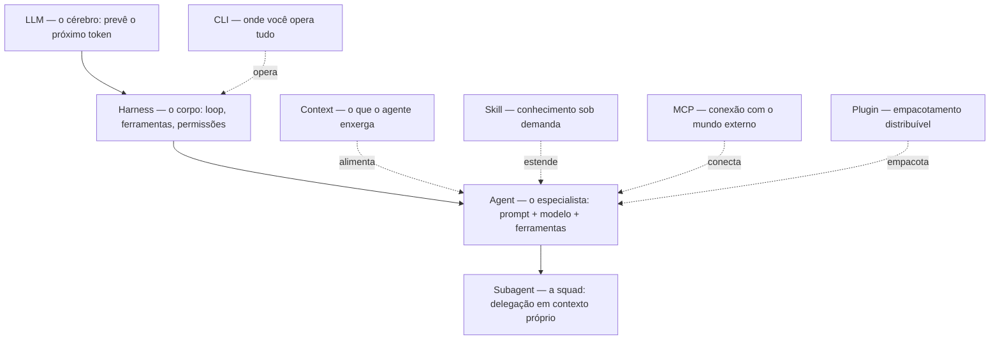

> Um e-book para desenvolvedores que querem se tornar AI-native — não só usar o chat, mas entender e construir os sistemas agênticos por baixo dele.

<a class="pdf-download" href="/ai-native-developer.pdf" download>Baixar PDF completo</a>

Você já programa. Sabe ler um stack trace, desenhar um schema, discutir um trade-off de arquitetura. Mas o vocabulário novo chega rápido demais: *LLM*, *harness*, *agent*, *subagent*, *context*, *skill*, *plugin*, *MCP*, *CLI*. Todo mundo usa esses termos como se fossem óbvios, e raramente alguém mostra **onde cada um encaixa** e **como se conectam**.

Este e-book resolve isso de um jeito específico: em vez de definir cada palavra isolada, ele constrói **uma camada de cada vez** em cima de um exemplo único e concreto, e a cada capítulo amarra de volta à camada central — o `agent`.

## Para quem é

- Desenvolvedores que já programam e querem dominar a arquitetura de sistemas agênticos.
- Quem usa Claude Code (ou ferramentas similares) no dia a dia mas trata tudo como caixa-preta.
- Times que querem padronizar como constroem, empacotam e compartilham agentes.

Não é um tutorial de "como usar o chat". É sobre **como o stack funciona por dentro** e como você projeta em cima dele.

## O fio condutor

Todo capítulo usa a mesma tarefa concreta:

> **Construir um sistema universal de CRUD de Pedidos (Orders).**

Uma tarefa real de engenharia de software, que qualquer desenvolvedor reconhece e que possui a complexidade ideal para demonstrar quase todas as camadas agênticas. Vamos ver:

- por que o **LLM** sozinho sabe descrever uma API de pedidos, mas não consegue escrever os arquivos ou rodar o banco;
- como o **harness** dá olhos e mãos ao modelo para criar e alterar arquivos;
- como um **agent** (`agent-order-orchestrator`) transforma o modelo genérico em um especialista de domínio;
- como uma squad de **subagents** divide a tarefa em frentes de produto, arquitetura, backend, frontend, QA e infra;
- e como **context, skill, plugin, MCP e CLI** entram para tornar essa operação robusta, reaproveitável, segura e eficiente.

## O modelo mental

As camadas não são uma pilha rígida de cima para baixo — elas se compõem. Mas há uma ordem de dependência que ajuda a pensar:

Leia assim: o **LLM** é o cérebro. O **harness** é o corpo que dá a ele olhos, mãos e um loop de ação. O **agent** é uma configuração desse conjunto para um trabalho específico. Tudo o mais — subagent, context, skill, plugin, MCP, CLI — existe para tornar o agent mais capaz, mais confiável ou mais fácil de operar.

## Capítulos

| # | Capítulo | O que você sai sabendo |
|---|----------|------------------------|
| 01 | [O LLM](/01-llm/) | O que o modelo faz e, principalmente, o que ele **não** faz sozinho. |
| 02 | [O Harness](/02-harness/) | Como o LLM ganha loop, tools (TypeScript) e hooks de segurança determinísticos. |
| 03 | [O Agent](/03-agent/) | **O capítulo-âncora.** Como estruturar e versionar o especialista de Orders. |
| 04 | [O Subagent](/04-subagent/) | Delegação em squads de contexto isolado. Estudo de caso: squad `order` completa. |
| 05 | [O Context](/05-context/) | Gestão de contexto, sinal sobre ruído e controle de memória de trabalho. |
| 06 | [A Skill](/06-skill/) | Progressive disclosure, skills auto-melhoráveis e a regra anti-explosão de tokens. |
| 07 | [O Plugin](/07-plugin/) | Empacotamento distribuível com slash commands, hooks e MCP integrados. |
| 08 | [O MCP](/08-mcp/) | MCP vs CLI: o protocolo unificado de dados e ações externas. |
| 09 | [O CLI](/09-cli/) | Terminal como cabine de comando, comandos customizados e Git Worktrees. |
| 10 | [Síntese](/10-sintese/) | O stack agêntico completo em ação de ponta a ponta, com melhores práticas. |

## Como ler

Linear, do 01 ao 10, é a forma recomendada na primeira vez — cada capítulo assume o anterior. Mas o capítulo 03 (`agent`) é o centro de gravidade: se você só tem 20 minutos, leia o 01, o 02 e o 03 nessa ordem e já terá o modelo mental que sustenta o resto.

Cada capítulo segue a mesma disciplina pedagógica:

1. **Exemplo primeiro.** Você vê o conceito em uso antes de qualquer definição.
2. **Definição depois.** Só então formalizamos o termo.
3. **Amarração com o `agent`.** Toda camada fecha mostrando como se conecta ao capítulo-âncora.
4. **Trade-offs reais.** O que custa, onde falha, quando não usar.
5. **Fontes primárias.** Docs oficiais e papers, não blogs de terceiros.

## Convenções

- **Idioma**: português brasileiro. Estes `.md` são a única fonte da verdade. Versões em outros idiomas são geradas depois, a partir do HTML — o conteúdo-fonte nunca é replicado por idioma.
- **Modelos citados**: a família Claude 4.X é usada como referência concreta — Opus 4.8 (`claude-opus-4-8`), Sonnet 4.6 (`claude-sonnet-4-6`), Haiku 4.5 (`claude-haiku-4-5`). Os conceitos valem para qualquer LLM moderno.
- **Voz**: a inspiração em educadores como Andrej Karpathy (código primeiro) e em autores de engenharia como Robert C. Martin e Martin Fowler (clareza de princípios) é **tom**, não citação. Nenhuma frase é colocada na boca de pessoas reais.

Comece pelo [Capítulo 01 — O LLM](/01-llm/).
